## Causal Modeling & Mediation Analysis

This chapter deals with a fundamental question of causal inference: **Which variables should be included in a causal model?** (see Cinelli et al. 2020) To answer this question two points need to be clear:

1. In general each causal model only investigates the causal effect of a single independent variable, $x_k$, on the dependent variable $y$. The coefficients associated with all other variables, $x_{j\neq k}$, cannot (automatically) be interpreted as causal relationships. As regression coefficients are commonly presented in a single table, it is often unclear to the reader which coefficients can be interpreted as causal (see Westreich et al. 2013).
2. Statistical significance (or any other statistical test) does not give us any idea about the causal model. To illustrate this, the following figure shows three statistically significant relationships between the variables $x$ and $y$ (all t-stats $> 9$). However, by construction there is no causal relationship between them in two of these examples. Even more concerning: In one case the _exclusion_ of a control variable leads to spurious correlation (leftmost plot) while in the other the _inclusion_ of the control variable does the same (rightmost plot).


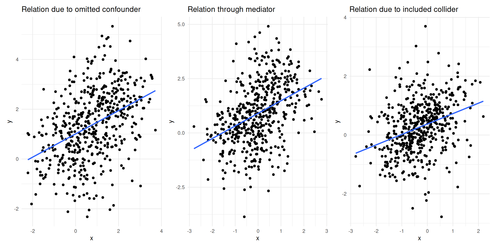

In order to learn about causal modeling we need to introduce a few concepts. First, we will talk about _Directed Acyclic Graphs_ (or DAGs). Then, we will introduce three types of scenarios, the fork, the pipe, and the collider, and relate those to the concepts of omitted variable bias and mediation. Finally, we will implement and interpret mediation analysis.

### Directed Acyclic Graphs (DAGs)

A _graph_ is a construct that consists of nodes, in our case variables, and edges connecting (some of) the nodes, in our case relationships between the variables. _Directed_ graphs have the additional property that the connections go in a particular direction. In the context of causal modeling, the causal relationship can only go in one direction. For example the direction would be from an influencer marketing campaign to subsequent sales. In general, we will not allow for any "cycles" of causality (i.e., starting from $X$ it must be impossible to end up at $X$ again when going in the direction of the edges) and thus call the graphs _acyclic_. In addition, we need the concept of _d-connection_. Variable $x$ is said to be d-connected to variable $y$ if it is possible to go from $x$ to $y$ in the direction of the edges (this might be a direct connection or there might be additional variables, i.e., mediators, inbetween; more on that later).

Let's start with the simple scenario in which an influencer marketing campaign has a positive influence on sales (assuming no other variables are relevant). The DAG would look as follows showing the d-connection between influencer marketing and sales:

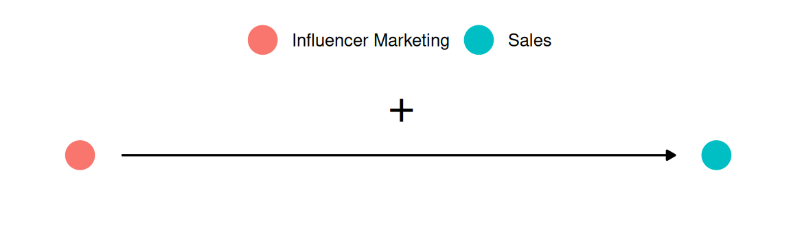

In this case a simple linear regression could be used to identify the marginal effect of spending an additional Euro on influencer marketing on sales. Looking at the following plot a log-log relationship seems appropriate.

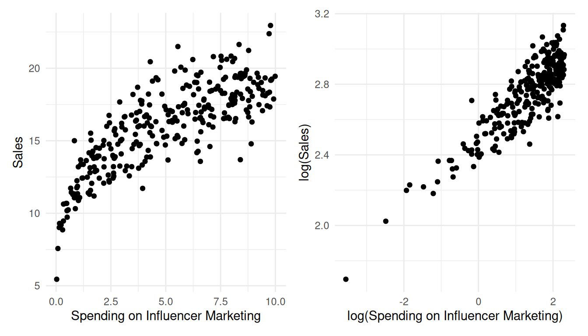


``` r
summary(lm(log(sales) ~ log(influencer_marketing)))
```

```
## 
## Call:
## lm(formula = log(sales) ~ log(influencer_marketing))
## 
## Residuals:
##       Min        1Q    Median        3Q       Max 
## -0.295432 -0.061417  0.001956  0.063951  0.260460 
## 
## Coefficients:
##                           Estimate Std. Error t value Pr(>|t|)    
## (Intercept)               2.483627   0.009835  252.52   <2e-16 ***
## log(influencer_marketing) 0.198591   0.006115   32.48   <2e-16 ***
## ---
## Signif. codes:  0 '***' 0.001 '**' 0.01 '*' 0.05 '.' 0.1 ' ' 1
## 
## Residual standard error: 0.09552 on 298 degrees of freedom
## Multiple R-squared:  0.7797,	Adjusted R-squared:  0.779 
## F-statistic:  1055 on 1 and 298 DF,  p-value: < 2.2e-16
```

Note that while the causal relationship only goes in one direction, the correlation is "symmetric" in the sense that we could als switch `sales` and `influencer_marketing` in the model and would still get "significant" results. 


``` r
summary(lm(log(influencer_marketing) ~ log(sales)))
```

```
## 
## Call:
## lm(formula = log(influencer_marketing) ~ log(sales))
## 
## Residuals:
##     Min      1Q  Median      3Q     Max 
## -1.3559 -0.3091  0.0122  0.2965  1.3120 
## 
## Coefficients:
##             Estimate Std. Error t value Pr(>|t|)    
## (Intercept)  -9.4579     0.3331  -28.39   <2e-16 ***
## log(sales)    3.9262     0.1209   32.48   <2e-16 ***
## ---
## Signif. codes:  0 '***' 0.001 '**' 0.01 '*' 0.05 '.' 0.1 ' ' 1
## 
## Residual standard error: 0.4247 on 298 degrees of freedom
## Multiple R-squared:  0.7797,	Adjusted R-squared:  0.779 
## F-statistic:  1055 on 1 and 298 DF,  p-value: < 2.2e-16
```


### The Fork (Good control)

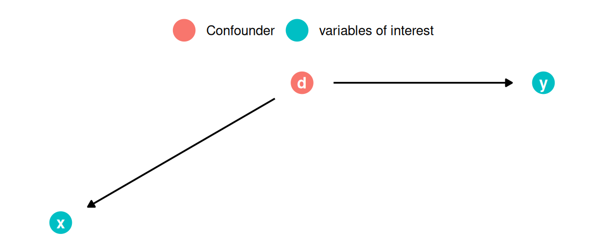

A typical dataset with a **confounder** will exhibit correlation between the treatment $X$ and outcome $y.$ This relationship is not causal! In the example below we have a binary confounder $d$ (Yes/No) that is d-connected with both $X$ and $y$ ($X$ and $y$ are not d-connected) 

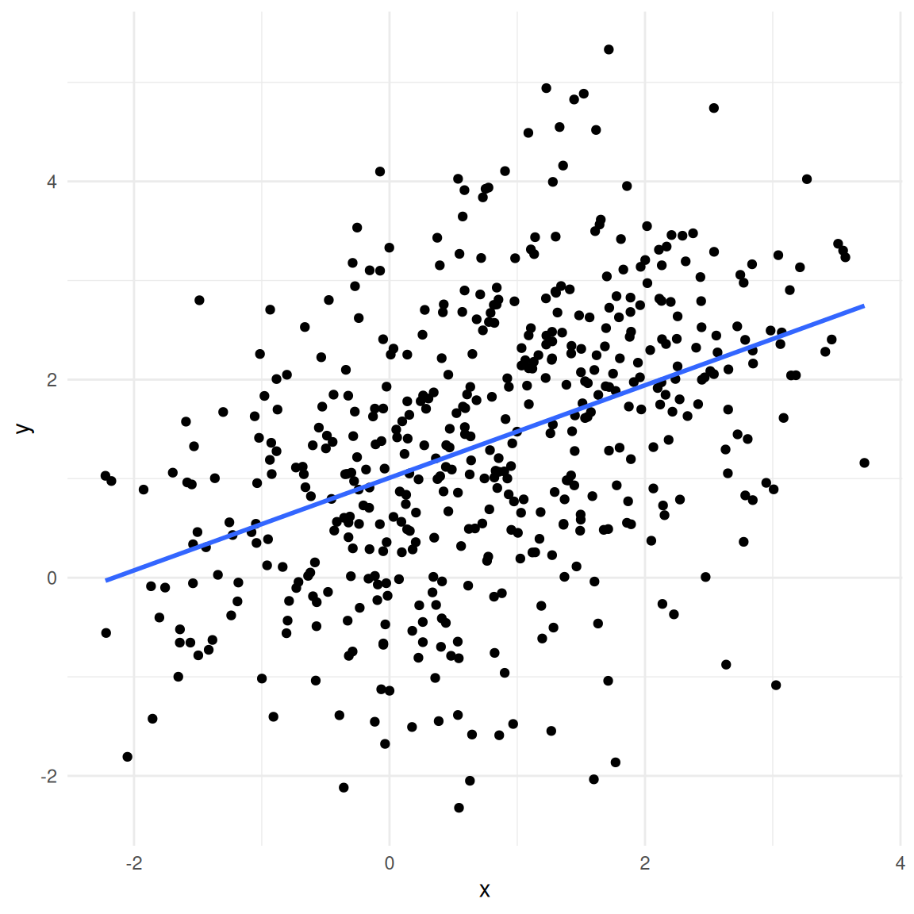
```{=html}
<div id="wwnszftome" style="padding-left:0px;padding-right:0px;padding-top:10px;padding-bottom:10px;overflow-x:auto;overflow-y:auto;width:auto;height:auto;">
<style>#wwnszftome table {
  font-family: system-ui, 'Segoe UI', Roboto, Helvetica, Arial, sans-serif, 'Apple Color Emoji', 'Segoe UI Emoji', 'Segoe UI Symbol', 'Noto Color Emoji';
  -webkit-font-smoothing: antialiased;
  -moz-osx-font-smoothing: grayscale;
}

#wwnszftome thead, #wwnszftome tbody, #wwnszftome tfoot, #wwnszftome tr, #wwnszftome td, #wwnszftome th {
  border-style: none;
}

#wwnszftome p {
  margin: 0;
  padding: 0;
}

#wwnszftome .gt_table {
  display: table;
  border-collapse: collapse;
  line-height: normal;
  margin-left: auto;
  margin-right: auto;
  color: #333333;
  font-size: 16px;
  font-weight: normal;
  font-style: normal;
  background-color: #FFFFFF;
  width: auto;
  border-top-style: solid;
  border-top-width: 2px;
  border-top-color: #A8A8A8;
  border-right-style: none;
  border-right-width: 2px;
  border-right-color: #D3D3D3;
  border-bottom-style: solid;
  border-bottom-width: 2px;
  border-bottom-color: #A8A8A8;
  border-left-style: none;
  border-left-width: 2px;
  border-left-color: #D3D3D3;
}

#wwnszftome .gt_caption {
  padding-top: 4px;
  padding-bottom: 4px;
}

#wwnszftome .gt_title {
  color: #333333;
  font-size: 125%;
  font-weight: initial;
  padding-top: 4px;
  padding-bottom: 4px;
  padding-left: 5px;
  padding-right: 5px;
  border-bottom-color: #FFFFFF;
  border-bottom-width: 0;
}

#wwnszftome .gt_subtitle {
  color: #333333;
  font-size: 85%;
  font-weight: initial;
  padding-top: 3px;
  padding-bottom: 5px;
  padding-left: 5px;
  padding-right: 5px;
  border-top-color: #FFFFFF;
  border-top-width: 0;
}

#wwnszftome .gt_heading {
  background-color: #FFFFFF;
  text-align: center;
  border-bottom-color: #FFFFFF;
  border-left-style: none;
  border-left-width: 1px;
  border-left-color: #D3D3D3;
  border-right-style: none;
  border-right-width: 1px;
  border-right-color: #D3D3D3;
}

#wwnszftome .gt_bottom_border {
  border-bottom-style: solid;
  border-bottom-width: 2px;
  border-bottom-color: #D3D3D3;
}

#wwnszftome .gt_col_headings {
  border-top-style: solid;
  border-top-width: 2px;
  border-top-color: #D3D3D3;
  border-bottom-style: solid;
  border-bottom-width: 2px;
  border-bottom-color: #D3D3D3;
  border-left-style: none;
  border-left-width: 1px;
  border-left-color: #D3D3D3;
  border-right-style: none;
  border-right-width: 1px;
  border-right-color: #D3D3D3;
}

#wwnszftome .gt_col_heading {
  color: #333333;
  background-color: #FFFFFF;
  font-size: 100%;
  font-weight: normal;
  text-transform: inherit;
  border-left-style: none;
  border-left-width: 1px;
  border-left-color: #D3D3D3;
  border-right-style: none;
  border-right-width: 1px;
  border-right-color: #D3D3D3;
  vertical-align: bottom;
  padding-top: 5px;
  padding-bottom: 6px;
  padding-left: 5px;
  padding-right: 5px;
  overflow-x: hidden;
}

#wwnszftome .gt_column_spanner_outer {
  color: #333333;
  background-color: #FFFFFF;
  font-size: 100%;
  font-weight: normal;
  text-transform: inherit;
  padding-top: 0;
  padding-bottom: 0;
  padding-left: 4px;
  padding-right: 4px;
}

#wwnszftome .gt_column_spanner_outer:first-child {
  padding-left: 0;
}

#wwnszftome .gt_column_spanner_outer:last-child {
  padding-right: 0;
}

#wwnszftome .gt_column_spanner {
  border-bottom-style: solid;
  border-bottom-width: 2px;
  border-bottom-color: #D3D3D3;
  vertical-align: bottom;
  padding-top: 5px;
  padding-bottom: 5px;
  overflow-x: hidden;
  display: inline-block;
  width: 100%;
}

#wwnszftome .gt_spanner_row {
  border-bottom-style: hidden;
}

#wwnszftome .gt_group_heading {
  padding-top: 8px;
  padding-bottom: 8px;
  padding-left: 5px;
  padding-right: 5px;
  color: #333333;
  background-color: #FFFFFF;
  font-size: 100%;
  font-weight: initial;
  text-transform: inherit;
  border-top-style: solid;
  border-top-width: 2px;
  border-top-color: #D3D3D3;
  border-bottom-style: solid;
  border-bottom-width: 2px;
  border-bottom-color: #D3D3D3;
  border-left-style: none;
  border-left-width: 1px;
  border-left-color: #D3D3D3;
  border-right-style: none;
  border-right-width: 1px;
  border-right-color: #D3D3D3;
  vertical-align: middle;
  text-align: left;
}

#wwnszftome .gt_empty_group_heading {
  padding: 0.5px;
  color: #333333;
  background-color: #FFFFFF;
  font-size: 100%;
  font-weight: initial;
  border-top-style: solid;
  border-top-width: 2px;
  border-top-color: #D3D3D3;
  border-bottom-style: solid;
  border-bottom-width: 2px;
  border-bottom-color: #D3D3D3;
  vertical-align: middle;
}

#wwnszftome .gt_from_md > :first-child {
  margin-top: 0;
}

#wwnszftome .gt_from_md > :last-child {
  margin-bottom: 0;
}

#wwnszftome .gt_row {
  padding-top: 8px;
  padding-bottom: 8px;
  padding-left: 5px;
  padding-right: 5px;
  margin: 10px;
  border-top-style: solid;
  border-top-width: 1px;
  border-top-color: #D3D3D3;
  border-left-style: none;
  border-left-width: 1px;
  border-left-color: #D3D3D3;
  border-right-style: none;
  border-right-width: 1px;
  border-right-color: #D3D3D3;
  vertical-align: middle;
  overflow-x: hidden;
}

#wwnszftome .gt_stub {
  color: #333333;
  background-color: #FFFFFF;
  font-size: 100%;
  font-weight: initial;
  text-transform: inherit;
  border-right-style: solid;
  border-right-width: 2px;
  border-right-color: #D3D3D3;
  padding-left: 5px;
  padding-right: 5px;
}

#wwnszftome .gt_stub_row_group {
  color: #333333;
  background-color: #FFFFFF;
  font-size: 100%;
  font-weight: initial;
  text-transform: inherit;
  border-right-style: solid;
  border-right-width: 2px;
  border-right-color: #D3D3D3;
  padding-left: 5px;
  padding-right: 5px;
  vertical-align: top;
}

#wwnszftome .gt_row_group_first td {
  border-top-width: 2px;
}

#wwnszftome .gt_row_group_first th {
  border-top-width: 2px;
}

#wwnszftome .gt_summary_row {
  color: #333333;
  background-color: #FFFFFF;
  text-transform: inherit;
  padding-top: 8px;
  padding-bottom: 8px;
  padding-left: 5px;
  padding-right: 5px;
}

#wwnszftome .gt_first_summary_row {
  border-top-style: solid;
  border-top-color: #D3D3D3;
}

#wwnszftome .gt_first_summary_row.thick {
  border-top-width: 2px;
}

#wwnszftome .gt_last_summary_row {
  padding-top: 8px;
  padding-bottom: 8px;
  padding-left: 5px;
  padding-right: 5px;
  border-bottom-style: solid;
  border-bottom-width: 2px;
  border-bottom-color: #D3D3D3;
}

#wwnszftome .gt_grand_summary_row {
  color: #333333;
  background-color: #FFFFFF;
  text-transform: inherit;
  padding-top: 8px;
  padding-bottom: 8px;
  padding-left: 5px;
  padding-right: 5px;
}

#wwnszftome .gt_first_grand_summary_row {
  padding-top: 8px;
  padding-bottom: 8px;
  padding-left: 5px;
  padding-right: 5px;
  border-top-style: double;
  border-top-width: 6px;
  border-top-color: #D3D3D3;
}

#wwnszftome .gt_last_grand_summary_row_top {
  padding-top: 8px;
  padding-bottom: 8px;
  padding-left: 5px;
  padding-right: 5px;
  border-bottom-style: double;
  border-bottom-width: 6px;
  border-bottom-color: #D3D3D3;
}

#wwnszftome .gt_striped {
  background-color: rgba(128, 128, 128, 0.05);
}

#wwnszftome .gt_table_body {
  border-top-style: solid;
  border-top-width: 2px;
  border-top-color: #D3D3D3;
  border-bottom-style: solid;
  border-bottom-width: 2px;
  border-bottom-color: #D3D3D3;
}

#wwnszftome .gt_footnotes {
  color: #333333;
  background-color: #FFFFFF;
  border-bottom-style: none;
  border-bottom-width: 2px;
  border-bottom-color: #D3D3D3;
  border-left-style: none;
  border-left-width: 2px;
  border-left-color: #D3D3D3;
  border-right-style: none;
  border-right-width: 2px;
  border-right-color: #D3D3D3;
}

#wwnszftome .gt_footnote {
  margin: 0px;
  font-size: 90%;
  padding-top: 4px;
  padding-bottom: 4px;
  padding-left: 5px;
  padding-right: 5px;
}

#wwnszftome .gt_sourcenotes {
  color: #333333;
  background-color: #FFFFFF;
  border-bottom-style: none;
  border-bottom-width: 2px;
  border-bottom-color: #D3D3D3;
  border-left-style: none;
  border-left-width: 2px;
  border-left-color: #D3D3D3;
  border-right-style: none;
  border-right-width: 2px;
  border-right-color: #D3D3D3;
}

#wwnszftome .gt_sourcenote {
  font-size: 90%;
  padding-top: 4px;
  padding-bottom: 4px;
  padding-left: 5px;
  padding-right: 5px;
}

#wwnszftome .gt_left {
  text-align: left;
}

#wwnszftome .gt_center {
  text-align: center;
}

#wwnszftome .gt_right {
  text-align: right;
  font-variant-numeric: tabular-nums;
}

#wwnszftome .gt_font_normal {
  font-weight: normal;
}

#wwnszftome .gt_font_bold {
  font-weight: bold;
}

#wwnszftome .gt_font_italic {
  font-style: italic;
}

#wwnszftome .gt_super {
  font-size: 65%;
}

#wwnszftome .gt_footnote_marks {
  font-size: 75%;
  vertical-align: 0.4em;
  position: initial;
}

#wwnszftome .gt_asterisk {
  font-size: 100%;
  vertical-align: 0;
}

#wwnszftome .gt_indent_1 {
  text-indent: 5px;
}

#wwnszftome .gt_indent_2 {
  text-indent: 10px;
}

#wwnszftome .gt_indent_3 {
  text-indent: 15px;
}

#wwnszftome .gt_indent_4 {
  text-indent: 20px;
}

#wwnszftome .gt_indent_5 {
  text-indent: 25px;
}

#wwnszftome .katex-display {
  display: inline-flex !important;
  margin-bottom: 0.75em !important;
}

#wwnszftome div.Reactable > div.rt-table > div.rt-thead > div.rt-tr.rt-tr-group-header > div.rt-th-group:after {
  height: 0px !important;
}
</style>
<table class="gt_table" data-quarto-disable-processing="false" data-quarto-bootstrap="false">
  <thead>
    <tr class="gt_col_headings">
      <th class="gt_col_heading gt_columns_bottom_border gt_left" rowspan="1" colspan="1" scope="col" id="term">term</th>
      <th class="gt_col_heading gt_columns_bottom_border gt_right" rowspan="1" colspan="1" scope="col" id="estimate">estimate</th>
      <th class="gt_col_heading gt_columns_bottom_border gt_right" rowspan="1" colspan="1" scope="col" id="std.error">std.error</th>
      <th class="gt_col_heading gt_columns_bottom_border gt_right" rowspan="1" colspan="1" scope="col" id="statistic">statistic</th>
      <th class="gt_col_heading gt_columns_bottom_border gt_right" rowspan="1" colspan="1" scope="col" id="p.value">p.value</th>
    </tr>
  </thead>
  <tbody class="gt_table_body">
    <tr><td headers="term" class="gt_row gt_left">(Intercept)</td>
<td headers="estimate" class="gt_row gt_right">1.0086</td>
<td headers="std.error" class="gt_row gt_right">0.0671</td>
<td headers="statistic" class="gt_row gt_right">15.0351</td>
<td headers="p.value" class="gt_row gt_right">0.0000</td></tr>
    <tr><td headers="term" class="gt_row gt_left">x</td>
<td headers="estimate" class="gt_row gt_right">0.4672</td>
<td headers="std.error" class="gt_row gt_right">0.0464</td>
<td headers="statistic" class="gt_row gt_right">10.0576</td>
<td headers="p.value" class="gt_row gt_right">0.0000</td></tr>
  </tbody>
  
  
</table>
</div>
```

However once we take the confounder into account the association vanishes which reflects the lack of a causal relationship in this case (note that for simplicity the regression lines in the plot are not the same as the model output shown). 

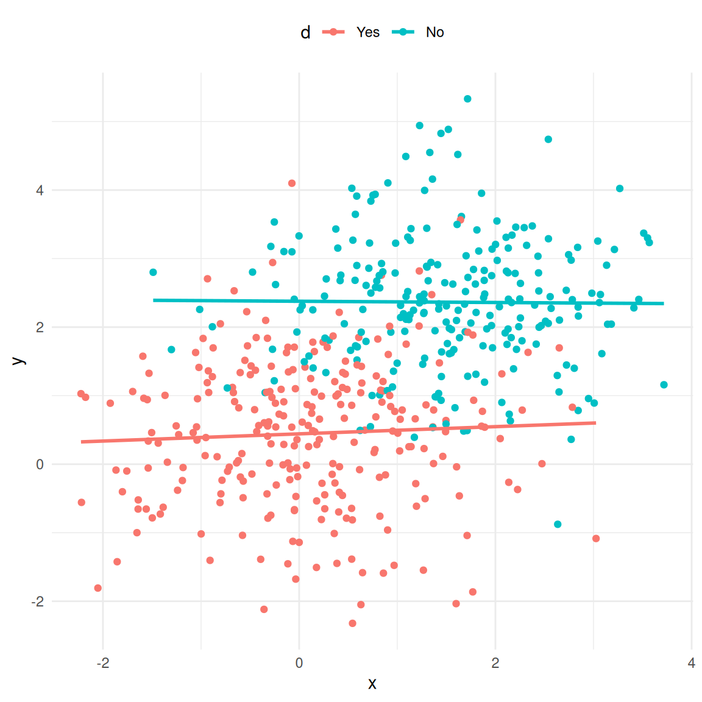
```{=html}
<div id="xnfyeflxox" style="padding-left:0px;padding-right:0px;padding-top:10px;padding-bottom:10px;overflow-x:auto;overflow-y:auto;width:auto;height:auto;">
<style>#xnfyeflxox table {
  font-family: system-ui, 'Segoe UI', Roboto, Helvetica, Arial, sans-serif, 'Apple Color Emoji', 'Segoe UI Emoji', 'Segoe UI Symbol', 'Noto Color Emoji';
  -webkit-font-smoothing: antialiased;
  -moz-osx-font-smoothing: grayscale;
}

#xnfyeflxox thead, #xnfyeflxox tbody, #xnfyeflxox tfoot, #xnfyeflxox tr, #xnfyeflxox td, #xnfyeflxox th {
  border-style: none;
}

#xnfyeflxox p {
  margin: 0;
  padding: 0;
}

#xnfyeflxox .gt_table {
  display: table;
  border-collapse: collapse;
  line-height: normal;
  margin-left: auto;
  margin-right: auto;
  color: #333333;
  font-size: 16px;
  font-weight: normal;
  font-style: normal;
  background-color: #FFFFFF;
  width: auto;
  border-top-style: solid;
  border-top-width: 2px;
  border-top-color: #A8A8A8;
  border-right-style: none;
  border-right-width: 2px;
  border-right-color: #D3D3D3;
  border-bottom-style: solid;
  border-bottom-width: 2px;
  border-bottom-color: #A8A8A8;
  border-left-style: none;
  border-left-width: 2px;
  border-left-color: #D3D3D3;
}

#xnfyeflxox .gt_caption {
  padding-top: 4px;
  padding-bottom: 4px;
}

#xnfyeflxox .gt_title {
  color: #333333;
  font-size: 125%;
  font-weight: initial;
  padding-top: 4px;
  padding-bottom: 4px;
  padding-left: 5px;
  padding-right: 5px;
  border-bottom-color: #FFFFFF;
  border-bottom-width: 0;
}

#xnfyeflxox .gt_subtitle {
  color: #333333;
  font-size: 85%;
  font-weight: initial;
  padding-top: 3px;
  padding-bottom: 5px;
  padding-left: 5px;
  padding-right: 5px;
  border-top-color: #FFFFFF;
  border-top-width: 0;
}

#xnfyeflxox .gt_heading {
  background-color: #FFFFFF;
  text-align: center;
  border-bottom-color: #FFFFFF;
  border-left-style: none;
  border-left-width: 1px;
  border-left-color: #D3D3D3;
  border-right-style: none;
  border-right-width: 1px;
  border-right-color: #D3D3D3;
}

#xnfyeflxox .gt_bottom_border {
  border-bottom-style: solid;
  border-bottom-width: 2px;
  border-bottom-color: #D3D3D3;
}

#xnfyeflxox .gt_col_headings {
  border-top-style: solid;
  border-top-width: 2px;
  border-top-color: #D3D3D3;
  border-bottom-style: solid;
  border-bottom-width: 2px;
  border-bottom-color: #D3D3D3;
  border-left-style: none;
  border-left-width: 1px;
  border-left-color: #D3D3D3;
  border-right-style: none;
  border-right-width: 1px;
  border-right-color: #D3D3D3;
}

#xnfyeflxox .gt_col_heading {
  color: #333333;
  background-color: #FFFFFF;
  font-size: 100%;
  font-weight: normal;
  text-transform: inherit;
  border-left-style: none;
  border-left-width: 1px;
  border-left-color: #D3D3D3;
  border-right-style: none;
  border-right-width: 1px;
  border-right-color: #D3D3D3;
  vertical-align: bottom;
  padding-top: 5px;
  padding-bottom: 6px;
  padding-left: 5px;
  padding-right: 5px;
  overflow-x: hidden;
}

#xnfyeflxox .gt_column_spanner_outer {
  color: #333333;
  background-color: #FFFFFF;
  font-size: 100%;
  font-weight: normal;
  text-transform: inherit;
  padding-top: 0;
  padding-bottom: 0;
  padding-left: 4px;
  padding-right: 4px;
}

#xnfyeflxox .gt_column_spanner_outer:first-child {
  padding-left: 0;
}

#xnfyeflxox .gt_column_spanner_outer:last-child {
  padding-right: 0;
}

#xnfyeflxox .gt_column_spanner {
  border-bottom-style: solid;
  border-bottom-width: 2px;
  border-bottom-color: #D3D3D3;
  vertical-align: bottom;
  padding-top: 5px;
  padding-bottom: 5px;
  overflow-x: hidden;
  display: inline-block;
  width: 100%;
}

#xnfyeflxox .gt_spanner_row {
  border-bottom-style: hidden;
}

#xnfyeflxox .gt_group_heading {
  padding-top: 8px;
  padding-bottom: 8px;
  padding-left: 5px;
  padding-right: 5px;
  color: #333333;
  background-color: #FFFFFF;
  font-size: 100%;
  font-weight: initial;
  text-transform: inherit;
  border-top-style: solid;
  border-top-width: 2px;
  border-top-color: #D3D3D3;
  border-bottom-style: solid;
  border-bottom-width: 2px;
  border-bottom-color: #D3D3D3;
  border-left-style: none;
  border-left-width: 1px;
  border-left-color: #D3D3D3;
  border-right-style: none;
  border-right-width: 1px;
  border-right-color: #D3D3D3;
  vertical-align: middle;
  text-align: left;
}

#xnfyeflxox .gt_empty_group_heading {
  padding: 0.5px;
  color: #333333;
  background-color: #FFFFFF;
  font-size: 100%;
  font-weight: initial;
  border-top-style: solid;
  border-top-width: 2px;
  border-top-color: #D3D3D3;
  border-bottom-style: solid;
  border-bottom-width: 2px;
  border-bottom-color: #D3D3D3;
  vertical-align: middle;
}

#xnfyeflxox .gt_from_md > :first-child {
  margin-top: 0;
}

#xnfyeflxox .gt_from_md > :last-child {
  margin-bottom: 0;
}

#xnfyeflxox .gt_row {
  padding-top: 8px;
  padding-bottom: 8px;
  padding-left: 5px;
  padding-right: 5px;
  margin: 10px;
  border-top-style: solid;
  border-top-width: 1px;
  border-top-color: #D3D3D3;
  border-left-style: none;
  border-left-width: 1px;
  border-left-color: #D3D3D3;
  border-right-style: none;
  border-right-width: 1px;
  border-right-color: #D3D3D3;
  vertical-align: middle;
  overflow-x: hidden;
}

#xnfyeflxox .gt_stub {
  color: #333333;
  background-color: #FFFFFF;
  font-size: 100%;
  font-weight: initial;
  text-transform: inherit;
  border-right-style: solid;
  border-right-width: 2px;
  border-right-color: #D3D3D3;
  padding-left: 5px;
  padding-right: 5px;
}

#xnfyeflxox .gt_stub_row_group {
  color: #333333;
  background-color: #FFFFFF;
  font-size: 100%;
  font-weight: initial;
  text-transform: inherit;
  border-right-style: solid;
  border-right-width: 2px;
  border-right-color: #D3D3D3;
  padding-left: 5px;
  padding-right: 5px;
  vertical-align: top;
}

#xnfyeflxox .gt_row_group_first td {
  border-top-width: 2px;
}

#xnfyeflxox .gt_row_group_first th {
  border-top-width: 2px;
}

#xnfyeflxox .gt_summary_row {
  color: #333333;
  background-color: #FFFFFF;
  text-transform: inherit;
  padding-top: 8px;
  padding-bottom: 8px;
  padding-left: 5px;
  padding-right: 5px;
}

#xnfyeflxox .gt_first_summary_row {
  border-top-style: solid;
  border-top-color: #D3D3D3;
}

#xnfyeflxox .gt_first_summary_row.thick {
  border-top-width: 2px;
}

#xnfyeflxox .gt_last_summary_row {
  padding-top: 8px;
  padding-bottom: 8px;
  padding-left: 5px;
  padding-right: 5px;
  border-bottom-style: solid;
  border-bottom-width: 2px;
  border-bottom-color: #D3D3D3;
}

#xnfyeflxox .gt_grand_summary_row {
  color: #333333;
  background-color: #FFFFFF;
  text-transform: inherit;
  padding-top: 8px;
  padding-bottom: 8px;
  padding-left: 5px;
  padding-right: 5px;
}

#xnfyeflxox .gt_first_grand_summary_row {
  padding-top: 8px;
  padding-bottom: 8px;
  padding-left: 5px;
  padding-right: 5px;
  border-top-style: double;
  border-top-width: 6px;
  border-top-color: #D3D3D3;
}

#xnfyeflxox .gt_last_grand_summary_row_top {
  padding-top: 8px;
  padding-bottom: 8px;
  padding-left: 5px;
  padding-right: 5px;
  border-bottom-style: double;
  border-bottom-width: 6px;
  border-bottom-color: #D3D3D3;
}

#xnfyeflxox .gt_striped {
  background-color: rgba(128, 128, 128, 0.05);
}

#xnfyeflxox .gt_table_body {
  border-top-style: solid;
  border-top-width: 2px;
  border-top-color: #D3D3D3;
  border-bottom-style: solid;
  border-bottom-width: 2px;
  border-bottom-color: #D3D3D3;
}

#xnfyeflxox .gt_footnotes {
  color: #333333;
  background-color: #FFFFFF;
  border-bottom-style: none;
  border-bottom-width: 2px;
  border-bottom-color: #D3D3D3;
  border-left-style: none;
  border-left-width: 2px;
  border-left-color: #D3D3D3;
  border-right-style: none;
  border-right-width: 2px;
  border-right-color: #D3D3D3;
}

#xnfyeflxox .gt_footnote {
  margin: 0px;
  font-size: 90%;
  padding-top: 4px;
  padding-bottom: 4px;
  padding-left: 5px;
  padding-right: 5px;
}

#xnfyeflxox .gt_sourcenotes {
  color: #333333;
  background-color: #FFFFFF;
  border-bottom-style: none;
  border-bottom-width: 2px;
  border-bottom-color: #D3D3D3;
  border-left-style: none;
  border-left-width: 2px;
  border-left-color: #D3D3D3;
  border-right-style: none;
  border-right-width: 2px;
  border-right-color: #D3D3D3;
}

#xnfyeflxox .gt_sourcenote {
  font-size: 90%;
  padding-top: 4px;
  padding-bottom: 4px;
  padding-left: 5px;
  padding-right: 5px;
}

#xnfyeflxox .gt_left {
  text-align: left;
}

#xnfyeflxox .gt_center {
  text-align: center;
}

#xnfyeflxox .gt_right {
  text-align: right;
  font-variant-numeric: tabular-nums;
}

#xnfyeflxox .gt_font_normal {
  font-weight: normal;
}

#xnfyeflxox .gt_font_bold {
  font-weight: bold;
}

#xnfyeflxox .gt_font_italic {
  font-style: italic;
}

#xnfyeflxox .gt_super {
  font-size: 65%;
}

#xnfyeflxox .gt_footnote_marks {
  font-size: 75%;
  vertical-align: 0.4em;
  position: initial;
}

#xnfyeflxox .gt_asterisk {
  font-size: 100%;
  vertical-align: 0;
}

#xnfyeflxox .gt_indent_1 {
  text-indent: 5px;
}

#xnfyeflxox .gt_indent_2 {
  text-indent: 10px;
}

#xnfyeflxox .gt_indent_3 {
  text-indent: 15px;
}

#xnfyeflxox .gt_indent_4 {
  text-indent: 20px;
}

#xnfyeflxox .gt_indent_5 {
  text-indent: 25px;
}

#xnfyeflxox .katex-display {
  display: inline-flex !important;
  margin-bottom: 0.75em !important;
}

#xnfyeflxox div.Reactable > div.rt-table > div.rt-thead > div.rt-tr.rt-tr-group-header > div.rt-th-group:after {
  height: 0px !important;
}
</style>
<table class="gt_table" data-quarto-disable-processing="false" data-quarto-bootstrap="false">
  <thead>
    <tr class="gt_col_headings">
      <th class="gt_col_heading gt_columns_bottom_border gt_left" rowspan="1" colspan="1" scope="col" id="term">term</th>
      <th class="gt_col_heading gt_columns_bottom_border gt_right" rowspan="1" colspan="1" scope="col" id="estimate">estimate</th>
      <th class="gt_col_heading gt_columns_bottom_border gt_right" rowspan="1" colspan="1" scope="col" id="std.error">std.error</th>
      <th class="gt_col_heading gt_columns_bottom_border gt_right" rowspan="1" colspan="1" scope="col" id="statistic">statistic</th>
      <th class="gt_col_heading gt_columns_bottom_border gt_right" rowspan="1" colspan="1" scope="col" id="p.value">p.value</th>
    </tr>
  </thead>
  <tbody class="gt_table_body">
    <tr><td headers="term" class="gt_row gt_left">(Intercept)</td>
<td headers="estimate" class="gt_row gt_right">0.4426</td>
<td headers="std.error" class="gt_row gt_right">0.0633</td>
<td headers="statistic" class="gt_row gt_right">6.9879</td>
<td headers="p.value" class="gt_row gt_right">0.0000</td></tr>
    <tr><td headers="term" class="gt_row gt_left">x</td>
<td headers="estimate" class="gt_row gt_right">0.0526</td>
<td headers="std.error" class="gt_row gt_right">0.0617</td>
<td headers="statistic" class="gt_row gt_right">0.8519</td>
<td headers="p.value" class="gt_row gt_right">0.3947</td></tr>
    <tr><td headers="term" class="gt_row gt_left">dNo</td>
<td headers="estimate" class="gt_row gt_right">1.9350</td>
<td headers="std.error" class="gt_row gt_right">0.1364</td>
<td headers="statistic" class="gt_row gt_right">14.1815</td>
<td headers="p.value" class="gt_row gt_right">0.0000</td></tr>
    <tr><td headers="term" class="gt_row gt_left">x:dNo</td>
<td headers="estimate" class="gt_row gt_right">−0.0616</td>
<td headers="std.error" class="gt_row gt_right">0.0914</td>
<td headers="statistic" class="gt_row gt_right">−0.6741</td>
<td headers="p.value" class="gt_row gt_right">0.5006</td></tr>
  </tbody>
  
  
</table>
</div>
```

Examples and ways to deal with confounders are shown [below](#omitted-variable-bias-confounders).

### The Pipe (Bad control)

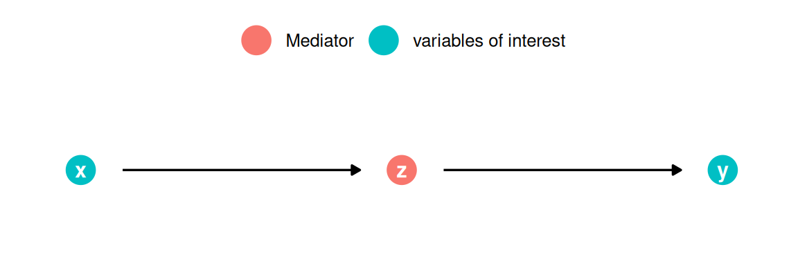

If we have a mediator in our data the picture looks very similar to the previous one. In addition, taking the mediator into account also has a similar effect: we remove the association between $X$ and $y$. However, in this case that is not what we want since $X$ and $y$ are d-connected. $X$ causes $y$ through $z$ (note that for simplicity the regression lines in the second plot are not the same as the model output shown). Examples of such relationships and the corresponding models are discussed in [Mediation analysis](#mediation-analysis).


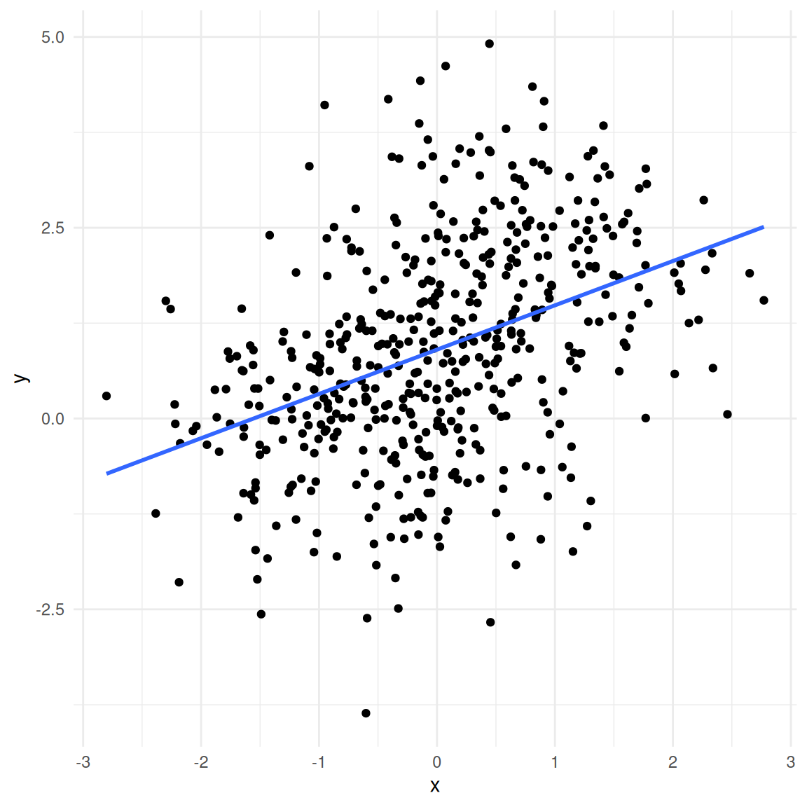
```{=html}
<div id="yddmpykkrx" style="padding-left:0px;padding-right:0px;padding-top:10px;padding-bottom:10px;overflow-x:auto;overflow-y:auto;width:auto;height:auto;">
<style>#yddmpykkrx table {
  font-family: system-ui, 'Segoe UI', Roboto, Helvetica, Arial, sans-serif, 'Apple Color Emoji', 'Segoe UI Emoji', 'Segoe UI Symbol', 'Noto Color Emoji';
  -webkit-font-smoothing: antialiased;
  -moz-osx-font-smoothing: grayscale;
}

#yddmpykkrx thead, #yddmpykkrx tbody, #yddmpykkrx tfoot, #yddmpykkrx tr, #yddmpykkrx td, #yddmpykkrx th {
  border-style: none;
}

#yddmpykkrx p {
  margin: 0;
  padding: 0;
}

#yddmpykkrx .gt_table {
  display: table;
  border-collapse: collapse;
  line-height: normal;
  margin-left: auto;
  margin-right: auto;
  color: #333333;
  font-size: 16px;
  font-weight: normal;
  font-style: normal;
  background-color: #FFFFFF;
  width: auto;
  border-top-style: solid;
  border-top-width: 2px;
  border-top-color: #A8A8A8;
  border-right-style: none;
  border-right-width: 2px;
  border-right-color: #D3D3D3;
  border-bottom-style: solid;
  border-bottom-width: 2px;
  border-bottom-color: #A8A8A8;
  border-left-style: none;
  border-left-width: 2px;
  border-left-color: #D3D3D3;
}

#yddmpykkrx .gt_caption {
  padding-top: 4px;
  padding-bottom: 4px;
}

#yddmpykkrx .gt_title {
  color: #333333;
  font-size: 125%;
  font-weight: initial;
  padding-top: 4px;
  padding-bottom: 4px;
  padding-left: 5px;
  padding-right: 5px;
  border-bottom-color: #FFFFFF;
  border-bottom-width: 0;
}

#yddmpykkrx .gt_subtitle {
  color: #333333;
  font-size: 85%;
  font-weight: initial;
  padding-top: 3px;
  padding-bottom: 5px;
  padding-left: 5px;
  padding-right: 5px;
  border-top-color: #FFFFFF;
  border-top-width: 0;
}

#yddmpykkrx .gt_heading {
  background-color: #FFFFFF;
  text-align: center;
  border-bottom-color: #FFFFFF;
  border-left-style: none;
  border-left-width: 1px;
  border-left-color: #D3D3D3;
  border-right-style: none;
  border-right-width: 1px;
  border-right-color: #D3D3D3;
}

#yddmpykkrx .gt_bottom_border {
  border-bottom-style: solid;
  border-bottom-width: 2px;
  border-bottom-color: #D3D3D3;
}

#yddmpykkrx .gt_col_headings {
  border-top-style: solid;
  border-top-width: 2px;
  border-top-color: #D3D3D3;
  border-bottom-style: solid;
  border-bottom-width: 2px;
  border-bottom-color: #D3D3D3;
  border-left-style: none;
  border-left-width: 1px;
  border-left-color: #D3D3D3;
  border-right-style: none;
  border-right-width: 1px;
  border-right-color: #D3D3D3;
}

#yddmpykkrx .gt_col_heading {
  color: #333333;
  background-color: #FFFFFF;
  font-size: 100%;
  font-weight: normal;
  text-transform: inherit;
  border-left-style: none;
  border-left-width: 1px;
  border-left-color: #D3D3D3;
  border-right-style: none;
  border-right-width: 1px;
  border-right-color: #D3D3D3;
  vertical-align: bottom;
  padding-top: 5px;
  padding-bottom: 6px;
  padding-left: 5px;
  padding-right: 5px;
  overflow-x: hidden;
}

#yddmpykkrx .gt_column_spanner_outer {
  color: #333333;
  background-color: #FFFFFF;
  font-size: 100%;
  font-weight: normal;
  text-transform: inherit;
  padding-top: 0;
  padding-bottom: 0;
  padding-left: 4px;
  padding-right: 4px;
}

#yddmpykkrx .gt_column_spanner_outer:first-child {
  padding-left: 0;
}

#yddmpykkrx .gt_column_spanner_outer:last-child {
  padding-right: 0;
}

#yddmpykkrx .gt_column_spanner {
  border-bottom-style: solid;
  border-bottom-width: 2px;
  border-bottom-color: #D3D3D3;
  vertical-align: bottom;
  padding-top: 5px;
  padding-bottom: 5px;
  overflow-x: hidden;
  display: inline-block;
  width: 100%;
}

#yddmpykkrx .gt_spanner_row {
  border-bottom-style: hidden;
}

#yddmpykkrx .gt_group_heading {
  padding-top: 8px;
  padding-bottom: 8px;
  padding-left: 5px;
  padding-right: 5px;
  color: #333333;
  background-color: #FFFFFF;
  font-size: 100%;
  font-weight: initial;
  text-transform: inherit;
  border-top-style: solid;
  border-top-width: 2px;
  border-top-color: #D3D3D3;
  border-bottom-style: solid;
  border-bottom-width: 2px;
  border-bottom-color: #D3D3D3;
  border-left-style: none;
  border-left-width: 1px;
  border-left-color: #D3D3D3;
  border-right-style: none;
  border-right-width: 1px;
  border-right-color: #D3D3D3;
  vertical-align: middle;
  text-align: left;
}

#yddmpykkrx .gt_empty_group_heading {
  padding: 0.5px;
  color: #333333;
  background-color: #FFFFFF;
  font-size: 100%;
  font-weight: initial;
  border-top-style: solid;
  border-top-width: 2px;
  border-top-color: #D3D3D3;
  border-bottom-style: solid;
  border-bottom-width: 2px;
  border-bottom-color: #D3D3D3;
  vertical-align: middle;
}

#yddmpykkrx .gt_from_md > :first-child {
  margin-top: 0;
}

#yddmpykkrx .gt_from_md > :last-child {
  margin-bottom: 0;
}

#yddmpykkrx .gt_row {
  padding-top: 8px;
  padding-bottom: 8px;
  padding-left: 5px;
  padding-right: 5px;
  margin: 10px;
  border-top-style: solid;
  border-top-width: 1px;
  border-top-color: #D3D3D3;
  border-left-style: none;
  border-left-width: 1px;
  border-left-color: #D3D3D3;
  border-right-style: none;
  border-right-width: 1px;
  border-right-color: #D3D3D3;
  vertical-align: middle;
  overflow-x: hidden;
}

#yddmpykkrx .gt_stub {
  color: #333333;
  background-color: #FFFFFF;
  font-size: 100%;
  font-weight: initial;
  text-transform: inherit;
  border-right-style: solid;
  border-right-width: 2px;
  border-right-color: #D3D3D3;
  padding-left: 5px;
  padding-right: 5px;
}

#yddmpykkrx .gt_stub_row_group {
  color: #333333;
  background-color: #FFFFFF;
  font-size: 100%;
  font-weight: initial;
  text-transform: inherit;
  border-right-style: solid;
  border-right-width: 2px;
  border-right-color: #D3D3D3;
  padding-left: 5px;
  padding-right: 5px;
  vertical-align: top;
}

#yddmpykkrx .gt_row_group_first td {
  border-top-width: 2px;
}

#yddmpykkrx .gt_row_group_first th {
  border-top-width: 2px;
}

#yddmpykkrx .gt_summary_row {
  color: #333333;
  background-color: #FFFFFF;
  text-transform: inherit;
  padding-top: 8px;
  padding-bottom: 8px;
  padding-left: 5px;
  padding-right: 5px;
}

#yddmpykkrx .gt_first_summary_row {
  border-top-style: solid;
  border-top-color: #D3D3D3;
}

#yddmpykkrx .gt_first_summary_row.thick {
  border-top-width: 2px;
}

#yddmpykkrx .gt_last_summary_row {
  padding-top: 8px;
  padding-bottom: 8px;
  padding-left: 5px;
  padding-right: 5px;
  border-bottom-style: solid;
  border-bottom-width: 2px;
  border-bottom-color: #D3D3D3;
}

#yddmpykkrx .gt_grand_summary_row {
  color: #333333;
  background-color: #FFFFFF;
  text-transform: inherit;
  padding-top: 8px;
  padding-bottom: 8px;
  padding-left: 5px;
  padding-right: 5px;
}

#yddmpykkrx .gt_first_grand_summary_row {
  padding-top: 8px;
  padding-bottom: 8px;
  padding-left: 5px;
  padding-right: 5px;
  border-top-style: double;
  border-top-width: 6px;
  border-top-color: #D3D3D3;
}

#yddmpykkrx .gt_last_grand_summary_row_top {
  padding-top: 8px;
  padding-bottom: 8px;
  padding-left: 5px;
  padding-right: 5px;
  border-bottom-style: double;
  border-bottom-width: 6px;
  border-bottom-color: #D3D3D3;
}

#yddmpykkrx .gt_striped {
  background-color: rgba(128, 128, 128, 0.05);
}

#yddmpykkrx .gt_table_body {
  border-top-style: solid;
  border-top-width: 2px;
  border-top-color: #D3D3D3;
  border-bottom-style: solid;
  border-bottom-width: 2px;
  border-bottom-color: #D3D3D3;
}

#yddmpykkrx .gt_footnotes {
  color: #333333;
  background-color: #FFFFFF;
  border-bottom-style: none;
  border-bottom-width: 2px;
  border-bottom-color: #D3D3D3;
  border-left-style: none;
  border-left-width: 2px;
  border-left-color: #D3D3D3;
  border-right-style: none;
  border-right-width: 2px;
  border-right-color: #D3D3D3;
}

#yddmpykkrx .gt_footnote {
  margin: 0px;
  font-size: 90%;
  padding-top: 4px;
  padding-bottom: 4px;
  padding-left: 5px;
  padding-right: 5px;
}

#yddmpykkrx .gt_sourcenotes {
  color: #333333;
  background-color: #FFFFFF;
  border-bottom-style: none;
  border-bottom-width: 2px;
  border-bottom-color: #D3D3D3;
  border-left-style: none;
  border-left-width: 2px;
  border-left-color: #D3D3D3;
  border-right-style: none;
  border-right-width: 2px;
  border-right-color: #D3D3D3;
}

#yddmpykkrx .gt_sourcenote {
  font-size: 90%;
  padding-top: 4px;
  padding-bottom: 4px;
  padding-left: 5px;
  padding-right: 5px;
}

#yddmpykkrx .gt_left {
  text-align: left;
}

#yddmpykkrx .gt_center {
  text-align: center;
}

#yddmpykkrx .gt_right {
  text-align: right;
  font-variant-numeric: tabular-nums;
}

#yddmpykkrx .gt_font_normal {
  font-weight: normal;
}

#yddmpykkrx .gt_font_bold {
  font-weight: bold;
}

#yddmpykkrx .gt_font_italic {
  font-style: italic;
}

#yddmpykkrx .gt_super {
  font-size: 65%;
}

#yddmpykkrx .gt_footnote_marks {
  font-size: 75%;
  vertical-align: 0.4em;
  position: initial;
}

#yddmpykkrx .gt_asterisk {
  font-size: 100%;
  vertical-align: 0;
}

#yddmpykkrx .gt_indent_1 {
  text-indent: 5px;
}

#yddmpykkrx .gt_indent_2 {
  text-indent: 10px;
}

#yddmpykkrx .gt_indent_3 {
  text-indent: 15px;
}

#yddmpykkrx .gt_indent_4 {
  text-indent: 20px;
}

#yddmpykkrx .gt_indent_5 {
  text-indent: 25px;
}

#yddmpykkrx .katex-display {
  display: inline-flex !important;
  margin-bottom: 0.75em !important;
}

#yddmpykkrx div.Reactable > div.rt-table > div.rt-thead > div.rt-tr.rt-tr-group-header > div.rt-th-group:after {
  height: 0px !important;
}
</style>
<table class="gt_table" data-quarto-disable-processing="false" data-quarto-bootstrap="false">
  <thead>
    <tr class="gt_col_headings">
      <th class="gt_col_heading gt_columns_bottom_border gt_left" rowspan="1" colspan="1" scope="col" id="term">term</th>
      <th class="gt_col_heading gt_columns_bottom_border gt_right" rowspan="1" colspan="1" scope="col" id="estimate">estimate</th>
      <th class="gt_col_heading gt_columns_bottom_border gt_right" rowspan="1" colspan="1" scope="col" id="std.error">std.error</th>
      <th class="gt_col_heading gt_columns_bottom_border gt_right" rowspan="1" colspan="1" scope="col" id="statistic">statistic</th>
      <th class="gt_col_heading gt_columns_bottom_border gt_right" rowspan="1" colspan="1" scope="col" id="p.value">p.value</th>
    </tr>
  </thead>
  <tbody class="gt_table_body">
    <tr><td headers="term" class="gt_row gt_left">(Intercept)</td>
<td headers="estimate" class="gt_row gt_right">0.9028</td>
<td headers="std.error" class="gt_row gt_right">0.0586</td>
<td headers="statistic" class="gt_row gt_right">15.4170</td>
<td headers="p.value" class="gt_row gt_right">0.0000</td></tr>
    <tr><td headers="term" class="gt_row gt_left">x</td>
<td headers="estimate" class="gt_row gt_right">0.5804</td>
<td headers="std.error" class="gt_row gt_right">0.0593</td>
<td headers="statistic" class="gt_row gt_right">9.7944</td>
<td headers="p.value" class="gt_row gt_right">0.0000</td></tr>
  </tbody>
  
  
</table>
</div>
```


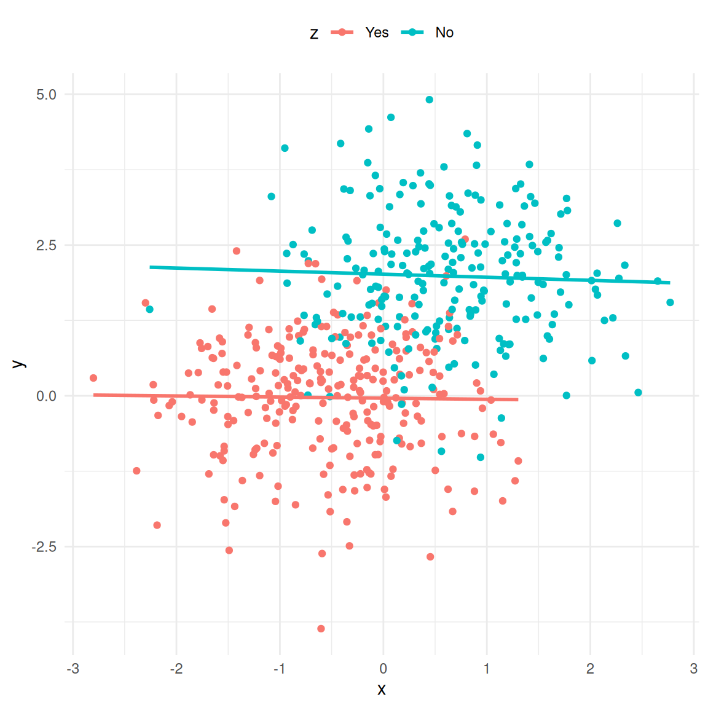
```{=html}
<div id="xbycoxbxjq" style="padding-left:0px;padding-right:0px;padding-top:10px;padding-bottom:10px;overflow-x:auto;overflow-y:auto;width:auto;height:auto;">
<style>#xbycoxbxjq table {
  font-family: system-ui, 'Segoe UI', Roboto, Helvetica, Arial, sans-serif, 'Apple Color Emoji', 'Segoe UI Emoji', 'Segoe UI Symbol', 'Noto Color Emoji';
  -webkit-font-smoothing: antialiased;
  -moz-osx-font-smoothing: grayscale;
}

#xbycoxbxjq thead, #xbycoxbxjq tbody, #xbycoxbxjq tfoot, #xbycoxbxjq tr, #xbycoxbxjq td, #xbycoxbxjq th {
  border-style: none;
}

#xbycoxbxjq p {
  margin: 0;
  padding: 0;
}

#xbycoxbxjq .gt_table {
  display: table;
  border-collapse: collapse;
  line-height: normal;
  margin-left: auto;
  margin-right: auto;
  color: #333333;
  font-size: 16px;
  font-weight: normal;
  font-style: normal;
  background-color: #FFFFFF;
  width: auto;
  border-top-style: solid;
  border-top-width: 2px;
  border-top-color: #A8A8A8;
  border-right-style: none;
  border-right-width: 2px;
  border-right-color: #D3D3D3;
  border-bottom-style: solid;
  border-bottom-width: 2px;
  border-bottom-color: #A8A8A8;
  border-left-style: none;
  border-left-width: 2px;
  border-left-color: #D3D3D3;
}

#xbycoxbxjq .gt_caption {
  padding-top: 4px;
  padding-bottom: 4px;
}

#xbycoxbxjq .gt_title {
  color: #333333;
  font-size: 125%;
  font-weight: initial;
  padding-top: 4px;
  padding-bottom: 4px;
  padding-left: 5px;
  padding-right: 5px;
  border-bottom-color: #FFFFFF;
  border-bottom-width: 0;
}

#xbycoxbxjq .gt_subtitle {
  color: #333333;
  font-size: 85%;
  font-weight: initial;
  padding-top: 3px;
  padding-bottom: 5px;
  padding-left: 5px;
  padding-right: 5px;
  border-top-color: #FFFFFF;
  border-top-width: 0;
}

#xbycoxbxjq .gt_heading {
  background-color: #FFFFFF;
  text-align: center;
  border-bottom-color: #FFFFFF;
  border-left-style: none;
  border-left-width: 1px;
  border-left-color: #D3D3D3;
  border-right-style: none;
  border-right-width: 1px;
  border-right-color: #D3D3D3;
}

#xbycoxbxjq .gt_bottom_border {
  border-bottom-style: solid;
  border-bottom-width: 2px;
  border-bottom-color: #D3D3D3;
}

#xbycoxbxjq .gt_col_headings {
  border-top-style: solid;
  border-top-width: 2px;
  border-top-color: #D3D3D3;
  border-bottom-style: solid;
  border-bottom-width: 2px;
  border-bottom-color: #D3D3D3;
  border-left-style: none;
  border-left-width: 1px;
  border-left-color: #D3D3D3;
  border-right-style: none;
  border-right-width: 1px;
  border-right-color: #D3D3D3;
}

#xbycoxbxjq .gt_col_heading {
  color: #333333;
  background-color: #FFFFFF;
  font-size: 100%;
  font-weight: normal;
  text-transform: inherit;
  border-left-style: none;
  border-left-width: 1px;
  border-left-color: #D3D3D3;
  border-right-style: none;
  border-right-width: 1px;
  border-right-color: #D3D3D3;
  vertical-align: bottom;
  padding-top: 5px;
  padding-bottom: 6px;
  padding-left: 5px;
  padding-right: 5px;
  overflow-x: hidden;
}

#xbycoxbxjq .gt_column_spanner_outer {
  color: #333333;
  background-color: #FFFFFF;
  font-size: 100%;
  font-weight: normal;
  text-transform: inherit;
  padding-top: 0;
  padding-bottom: 0;
  padding-left: 4px;
  padding-right: 4px;
}

#xbycoxbxjq .gt_column_spanner_outer:first-child {
  padding-left: 0;
}

#xbycoxbxjq .gt_column_spanner_outer:last-child {
  padding-right: 0;
}

#xbycoxbxjq .gt_column_spanner {
  border-bottom-style: solid;
  border-bottom-width: 2px;
  border-bottom-color: #D3D3D3;
  vertical-align: bottom;
  padding-top: 5px;
  padding-bottom: 5px;
  overflow-x: hidden;
  display: inline-block;
  width: 100%;
}

#xbycoxbxjq .gt_spanner_row {
  border-bottom-style: hidden;
}

#xbycoxbxjq .gt_group_heading {
  padding-top: 8px;
  padding-bottom: 8px;
  padding-left: 5px;
  padding-right: 5px;
  color: #333333;
  background-color: #FFFFFF;
  font-size: 100%;
  font-weight: initial;
  text-transform: inherit;
  border-top-style: solid;
  border-top-width: 2px;
  border-top-color: #D3D3D3;
  border-bottom-style: solid;
  border-bottom-width: 2px;
  border-bottom-color: #D3D3D3;
  border-left-style: none;
  border-left-width: 1px;
  border-left-color: #D3D3D3;
  border-right-style: none;
  border-right-width: 1px;
  border-right-color: #D3D3D3;
  vertical-align: middle;
  text-align: left;
}

#xbycoxbxjq .gt_empty_group_heading {
  padding: 0.5px;
  color: #333333;
  background-color: #FFFFFF;
  font-size: 100%;
  font-weight: initial;
  border-top-style: solid;
  border-top-width: 2px;
  border-top-color: #D3D3D3;
  border-bottom-style: solid;
  border-bottom-width: 2px;
  border-bottom-color: #D3D3D3;
  vertical-align: middle;
}

#xbycoxbxjq .gt_from_md > :first-child {
  margin-top: 0;
}

#xbycoxbxjq .gt_from_md > :last-child {
  margin-bottom: 0;
}

#xbycoxbxjq .gt_row {
  padding-top: 8px;
  padding-bottom: 8px;
  padding-left: 5px;
  padding-right: 5px;
  margin: 10px;
  border-top-style: solid;
  border-top-width: 1px;
  border-top-color: #D3D3D3;
  border-left-style: none;
  border-left-width: 1px;
  border-left-color: #D3D3D3;
  border-right-style: none;
  border-right-width: 1px;
  border-right-color: #D3D3D3;
  vertical-align: middle;
  overflow-x: hidden;
}

#xbycoxbxjq .gt_stub {
  color: #333333;
  background-color: #FFFFFF;
  font-size: 100%;
  font-weight: initial;
  text-transform: inherit;
  border-right-style: solid;
  border-right-width: 2px;
  border-right-color: #D3D3D3;
  padding-left: 5px;
  padding-right: 5px;
}

#xbycoxbxjq .gt_stub_row_group {
  color: #333333;
  background-color: #FFFFFF;
  font-size: 100%;
  font-weight: initial;
  text-transform: inherit;
  border-right-style: solid;
  border-right-width: 2px;
  border-right-color: #D3D3D3;
  padding-left: 5px;
  padding-right: 5px;
  vertical-align: top;
}

#xbycoxbxjq .gt_row_group_first td {
  border-top-width: 2px;
}

#xbycoxbxjq .gt_row_group_first th {
  border-top-width: 2px;
}

#xbycoxbxjq .gt_summary_row {
  color: #333333;
  background-color: #FFFFFF;
  text-transform: inherit;
  padding-top: 8px;
  padding-bottom: 8px;
  padding-left: 5px;
  padding-right: 5px;
}

#xbycoxbxjq .gt_first_summary_row {
  border-top-style: solid;
  border-top-color: #D3D3D3;
}

#xbycoxbxjq .gt_first_summary_row.thick {
  border-top-width: 2px;
}

#xbycoxbxjq .gt_last_summary_row {
  padding-top: 8px;
  padding-bottom: 8px;
  padding-left: 5px;
  padding-right: 5px;
  border-bottom-style: solid;
  border-bottom-width: 2px;
  border-bottom-color: #D3D3D3;
}

#xbycoxbxjq .gt_grand_summary_row {
  color: #333333;
  background-color: #FFFFFF;
  text-transform: inherit;
  padding-top: 8px;
  padding-bottom: 8px;
  padding-left: 5px;
  padding-right: 5px;
}

#xbycoxbxjq .gt_first_grand_summary_row {
  padding-top: 8px;
  padding-bottom: 8px;
  padding-left: 5px;
  padding-right: 5px;
  border-top-style: double;
  border-top-width: 6px;
  border-top-color: #D3D3D3;
}

#xbycoxbxjq .gt_last_grand_summary_row_top {
  padding-top: 8px;
  padding-bottom: 8px;
  padding-left: 5px;
  padding-right: 5px;
  border-bottom-style: double;
  border-bottom-width: 6px;
  border-bottom-color: #D3D3D3;
}

#xbycoxbxjq .gt_striped {
  background-color: rgba(128, 128, 128, 0.05);
}

#xbycoxbxjq .gt_table_body {
  border-top-style: solid;
  border-top-width: 2px;
  border-top-color: #D3D3D3;
  border-bottom-style: solid;
  border-bottom-width: 2px;
  border-bottom-color: #D3D3D3;
}

#xbycoxbxjq .gt_footnotes {
  color: #333333;
  background-color: #FFFFFF;
  border-bottom-style: none;
  border-bottom-width: 2px;
  border-bottom-color: #D3D3D3;
  border-left-style: none;
  border-left-width: 2px;
  border-left-color: #D3D3D3;
  border-right-style: none;
  border-right-width: 2px;
  border-right-color: #D3D3D3;
}

#xbycoxbxjq .gt_footnote {
  margin: 0px;
  font-size: 90%;
  padding-top: 4px;
  padding-bottom: 4px;
  padding-left: 5px;
  padding-right: 5px;
}

#xbycoxbxjq .gt_sourcenotes {
  color: #333333;
  background-color: #FFFFFF;
  border-bottom-style: none;
  border-bottom-width: 2px;
  border-bottom-color: #D3D3D3;
  border-left-style: none;
  border-left-width: 2px;
  border-left-color: #D3D3D3;
  border-right-style: none;
  border-right-width: 2px;
  border-right-color: #D3D3D3;
}

#xbycoxbxjq .gt_sourcenote {
  font-size: 90%;
  padding-top: 4px;
  padding-bottom: 4px;
  padding-left: 5px;
  padding-right: 5px;
}

#xbycoxbxjq .gt_left {
  text-align: left;
}

#xbycoxbxjq .gt_center {
  text-align: center;
}

#xbycoxbxjq .gt_right {
  text-align: right;
  font-variant-numeric: tabular-nums;
}

#xbycoxbxjq .gt_font_normal {
  font-weight: normal;
}

#xbycoxbxjq .gt_font_bold {
  font-weight: bold;
}

#xbycoxbxjq .gt_font_italic {
  font-style: italic;
}

#xbycoxbxjq .gt_super {
  font-size: 65%;
}

#xbycoxbxjq .gt_footnote_marks {
  font-size: 75%;
  vertical-align: 0.4em;
  position: initial;
}

#xbycoxbxjq .gt_asterisk {
  font-size: 100%;
  vertical-align: 0;
}

#xbycoxbxjq .gt_indent_1 {
  text-indent: 5px;
}

#xbycoxbxjq .gt_indent_2 {
  text-indent: 10px;
}

#xbycoxbxjq .gt_indent_3 {
  text-indent: 15px;
}

#xbycoxbxjq .gt_indent_4 {
  text-indent: 20px;
}

#xbycoxbxjq .gt_indent_5 {
  text-indent: 25px;
}

#xbycoxbxjq .katex-display {
  display: inline-flex !important;
  margin-bottom: 0.75em !important;
}

#xbycoxbxjq div.Reactable > div.rt-table > div.rt-thead > div.rt-tr.rt-tr-group-header > div.rt-th-group:after {
  height: 0px !important;
}
</style>
<table class="gt_table" data-quarto-disable-processing="false" data-quarto-bootstrap="false">
  <thead>
    <tr class="gt_col_headings">
      <th class="gt_col_heading gt_columns_bottom_border gt_left" rowspan="1" colspan="1" scope="col" id="term">term</th>
      <th class="gt_col_heading gt_columns_bottom_border gt_right" rowspan="1" colspan="1" scope="col" id="estimate">estimate</th>
      <th class="gt_col_heading gt_columns_bottom_border gt_right" rowspan="1" colspan="1" scope="col" id="std.error">std.error</th>
      <th class="gt_col_heading gt_columns_bottom_border gt_right" rowspan="1" colspan="1" scope="col" id="statistic">statistic</th>
      <th class="gt_col_heading gt_columns_bottom_border gt_right" rowspan="1" colspan="1" scope="col" id="p.value">p.value</th>
    </tr>
  </thead>
  <tbody class="gt_table_body">
    <tr><td headers="term" class="gt_row gt_left">(Intercept)</td>
<td headers="estimate" class="gt_row gt_right">−0.0393</td>
<td headers="std.error" class="gt_row gt_right">0.0755</td>
<td headers="statistic" class="gt_row gt_right">−0.5205</td>
<td headers="p.value" class="gt_row gt_right">0.6029</td></tr>
    <tr><td headers="term" class="gt_row gt_left">x</td>
<td headers="estimate" class="gt_row gt_right">−0.0185</td>
<td headers="std.error" class="gt_row gt_right">0.0787</td>
<td headers="statistic" class="gt_row gt_right">−0.2349</td>
<td headers="p.value" class="gt_row gt_right">0.8143</td></tr>
    <tr><td headers="term" class="gt_row gt_left">z</td>
<td headers="estimate" class="gt_row gt_right">2.0562</td>
<td headers="std.error" class="gt_row gt_right">0.1137</td>
<td headers="statistic" class="gt_row gt_right">18.0855</td>
<td headers="p.value" class="gt_row gt_right">0.0000</td></tr>
    <tr><td headers="term" class="gt_row gt_left">x:z</td>
<td headers="estimate" class="gt_row gt_right">−0.0324</td>
<td headers="std.error" class="gt_row gt_right">0.1146</td>
<td headers="statistic" class="gt_row gt_right">−0.2826</td>
<td headers="p.value" class="gt_row gt_right">0.7776</td></tr>
  </tbody>
  
  
</table>
</div>
```

### The Collider (Bad control)

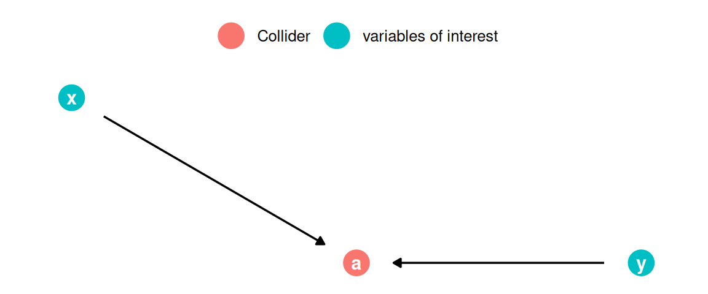

The collider is a special case. There is no association between $X$ and $y$ as long as we do **not** account for the collider in the model. However, by accounting for the collider we implicitly learn about $y$ as well (we use $X$ as the predictor). Since the collider is caused by $X$ and $y$, we can figure out what $y$ must be once we know $X$ and the collider similar to solving a simple equation you would see in high-school.

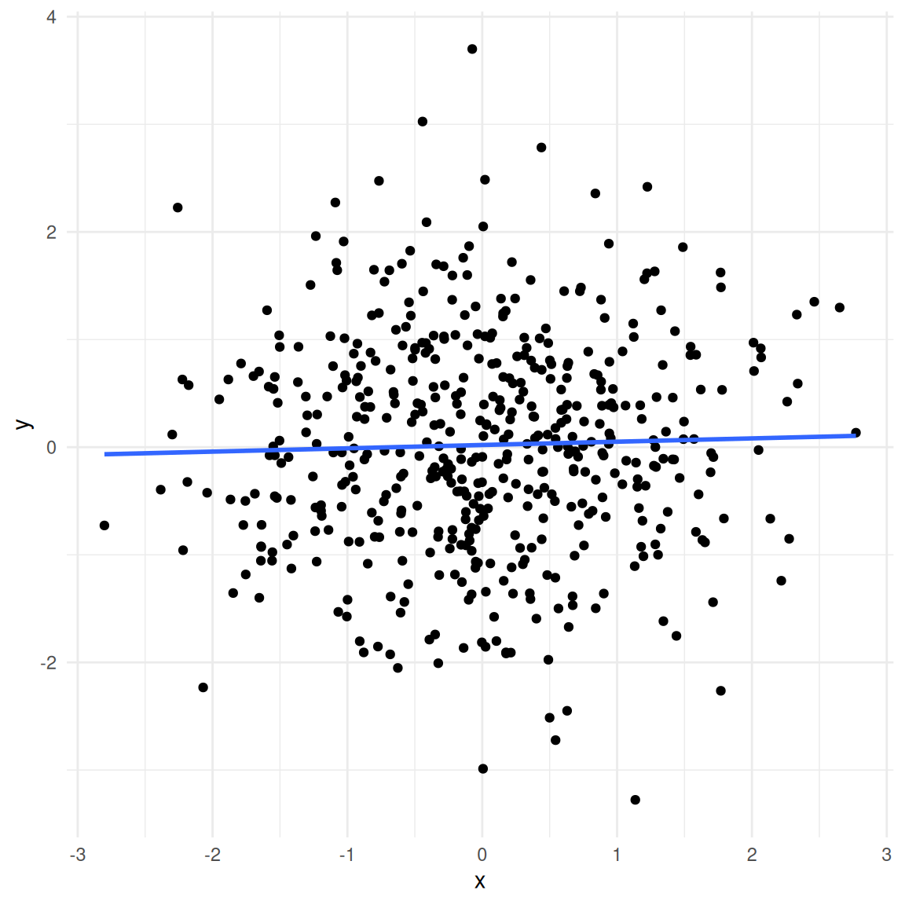
```{=html}
<div id="pyddmpykkr" style="padding-left:0px;padding-right:0px;padding-top:10px;padding-bottom:10px;overflow-x:auto;overflow-y:auto;width:auto;height:auto;">
<style>#pyddmpykkr table {
  font-family: system-ui, 'Segoe UI', Roboto, Helvetica, Arial, sans-serif, 'Apple Color Emoji', 'Segoe UI Emoji', 'Segoe UI Symbol', 'Noto Color Emoji';
  -webkit-font-smoothing: antialiased;
  -moz-osx-font-smoothing: grayscale;
}

#pyddmpykkr thead, #pyddmpykkr tbody, #pyddmpykkr tfoot, #pyddmpykkr tr, #pyddmpykkr td, #pyddmpykkr th {
  border-style: none;
}

#pyddmpykkr p {
  margin: 0;
  padding: 0;
}

#pyddmpykkr .gt_table {
  display: table;
  border-collapse: collapse;
  line-height: normal;
  margin-left: auto;
  margin-right: auto;
  color: #333333;
  font-size: 16px;
  font-weight: normal;
  font-style: normal;
  background-color: #FFFFFF;
  width: auto;
  border-top-style: solid;
  border-top-width: 2px;
  border-top-color: #A8A8A8;
  border-right-style: none;
  border-right-width: 2px;
  border-right-color: #D3D3D3;
  border-bottom-style: solid;
  border-bottom-width: 2px;
  border-bottom-color: #A8A8A8;
  border-left-style: none;
  border-left-width: 2px;
  border-left-color: #D3D3D3;
}

#pyddmpykkr .gt_caption {
  padding-top: 4px;
  padding-bottom: 4px;
}

#pyddmpykkr .gt_title {
  color: #333333;
  font-size: 125%;
  font-weight: initial;
  padding-top: 4px;
  padding-bottom: 4px;
  padding-left: 5px;
  padding-right: 5px;
  border-bottom-color: #FFFFFF;
  border-bottom-width: 0;
}

#pyddmpykkr .gt_subtitle {
  color: #333333;
  font-size: 85%;
  font-weight: initial;
  padding-top: 3px;
  padding-bottom: 5px;
  padding-left: 5px;
  padding-right: 5px;
  border-top-color: #FFFFFF;
  border-top-width: 0;
}

#pyddmpykkr .gt_heading {
  background-color: #FFFFFF;
  text-align: center;
  border-bottom-color: #FFFFFF;
  border-left-style: none;
  border-left-width: 1px;
  border-left-color: #D3D3D3;
  border-right-style: none;
  border-right-width: 1px;
  border-right-color: #D3D3D3;
}

#pyddmpykkr .gt_bottom_border {
  border-bottom-style: solid;
  border-bottom-width: 2px;
  border-bottom-color: #D3D3D3;
}

#pyddmpykkr .gt_col_headings {
  border-top-style: solid;
  border-top-width: 2px;
  border-top-color: #D3D3D3;
  border-bottom-style: solid;
  border-bottom-width: 2px;
  border-bottom-color: #D3D3D3;
  border-left-style: none;
  border-left-width: 1px;
  border-left-color: #D3D3D3;
  border-right-style: none;
  border-right-width: 1px;
  border-right-color: #D3D3D3;
}

#pyddmpykkr .gt_col_heading {
  color: #333333;
  background-color: #FFFFFF;
  font-size: 100%;
  font-weight: normal;
  text-transform: inherit;
  border-left-style: none;
  border-left-width: 1px;
  border-left-color: #D3D3D3;
  border-right-style: none;
  border-right-width: 1px;
  border-right-color: #D3D3D3;
  vertical-align: bottom;
  padding-top: 5px;
  padding-bottom: 6px;
  padding-left: 5px;
  padding-right: 5px;
  overflow-x: hidden;
}

#pyddmpykkr .gt_column_spanner_outer {
  color: #333333;
  background-color: #FFFFFF;
  font-size: 100%;
  font-weight: normal;
  text-transform: inherit;
  padding-top: 0;
  padding-bottom: 0;
  padding-left: 4px;
  padding-right: 4px;
}

#pyddmpykkr .gt_column_spanner_outer:first-child {
  padding-left: 0;
}

#pyddmpykkr .gt_column_spanner_outer:last-child {
  padding-right: 0;
}

#pyddmpykkr .gt_column_spanner {
  border-bottom-style: solid;
  border-bottom-width: 2px;
  border-bottom-color: #D3D3D3;
  vertical-align: bottom;
  padding-top: 5px;
  padding-bottom: 5px;
  overflow-x: hidden;
  display: inline-block;
  width: 100%;
}

#pyddmpykkr .gt_spanner_row {
  border-bottom-style: hidden;
}

#pyddmpykkr .gt_group_heading {
  padding-top: 8px;
  padding-bottom: 8px;
  padding-left: 5px;
  padding-right: 5px;
  color: #333333;
  background-color: #FFFFFF;
  font-size: 100%;
  font-weight: initial;
  text-transform: inherit;
  border-top-style: solid;
  border-top-width: 2px;
  border-top-color: #D3D3D3;
  border-bottom-style: solid;
  border-bottom-width: 2px;
  border-bottom-color: #D3D3D3;
  border-left-style: none;
  border-left-width: 1px;
  border-left-color: #D3D3D3;
  border-right-style: none;
  border-right-width: 1px;
  border-right-color: #D3D3D3;
  vertical-align: middle;
  text-align: left;
}

#pyddmpykkr .gt_empty_group_heading {
  padding: 0.5px;
  color: #333333;
  background-color: #FFFFFF;
  font-size: 100%;
  font-weight: initial;
  border-top-style: solid;
  border-top-width: 2px;
  border-top-color: #D3D3D3;
  border-bottom-style: solid;
  border-bottom-width: 2px;
  border-bottom-color: #D3D3D3;
  vertical-align: middle;
}

#pyddmpykkr .gt_from_md > :first-child {
  margin-top: 0;
}

#pyddmpykkr .gt_from_md > :last-child {
  margin-bottom: 0;
}

#pyddmpykkr .gt_row {
  padding-top: 8px;
  padding-bottom: 8px;
  padding-left: 5px;
  padding-right: 5px;
  margin: 10px;
  border-top-style: solid;
  border-top-width: 1px;
  border-top-color: #D3D3D3;
  border-left-style: none;
  border-left-width: 1px;
  border-left-color: #D3D3D3;
  border-right-style: none;
  border-right-width: 1px;
  border-right-color: #D3D3D3;
  vertical-align: middle;
  overflow-x: hidden;
}

#pyddmpykkr .gt_stub {
  color: #333333;
  background-color: #FFFFFF;
  font-size: 100%;
  font-weight: initial;
  text-transform: inherit;
  border-right-style: solid;
  border-right-width: 2px;
  border-right-color: #D3D3D3;
  padding-left: 5px;
  padding-right: 5px;
}

#pyddmpykkr .gt_stub_row_group {
  color: #333333;
  background-color: #FFFFFF;
  font-size: 100%;
  font-weight: initial;
  text-transform: inherit;
  border-right-style: solid;
  border-right-width: 2px;
  border-right-color: #D3D3D3;
  padding-left: 5px;
  padding-right: 5px;
  vertical-align: top;
}

#pyddmpykkr .gt_row_group_first td {
  border-top-width: 2px;
}

#pyddmpykkr .gt_row_group_first th {
  border-top-width: 2px;
}

#pyddmpykkr .gt_summary_row {
  color: #333333;
  background-color: #FFFFFF;
  text-transform: inherit;
  padding-top: 8px;
  padding-bottom: 8px;
  padding-left: 5px;
  padding-right: 5px;
}

#pyddmpykkr .gt_first_summary_row {
  border-top-style: solid;
  border-top-color: #D3D3D3;
}

#pyddmpykkr .gt_first_summary_row.thick {
  border-top-width: 2px;
}

#pyddmpykkr .gt_last_summary_row {
  padding-top: 8px;
  padding-bottom: 8px;
  padding-left: 5px;
  padding-right: 5px;
  border-bottom-style: solid;
  border-bottom-width: 2px;
  border-bottom-color: #D3D3D3;
}

#pyddmpykkr .gt_grand_summary_row {
  color: #333333;
  background-color: #FFFFFF;
  text-transform: inherit;
  padding-top: 8px;
  padding-bottom: 8px;
  padding-left: 5px;
  padding-right: 5px;
}

#pyddmpykkr .gt_first_grand_summary_row {
  padding-top: 8px;
  padding-bottom: 8px;
  padding-left: 5px;
  padding-right: 5px;
  border-top-style: double;
  border-top-width: 6px;
  border-top-color: #D3D3D3;
}

#pyddmpykkr .gt_last_grand_summary_row_top {
  padding-top: 8px;
  padding-bottom: 8px;
  padding-left: 5px;
  padding-right: 5px;
  border-bottom-style: double;
  border-bottom-width: 6px;
  border-bottom-color: #D3D3D3;
}

#pyddmpykkr .gt_striped {
  background-color: rgba(128, 128, 128, 0.05);
}

#pyddmpykkr .gt_table_body {
  border-top-style: solid;
  border-top-width: 2px;
  border-top-color: #D3D3D3;
  border-bottom-style: solid;
  border-bottom-width: 2px;
  border-bottom-color: #D3D3D3;
}

#pyddmpykkr .gt_footnotes {
  color: #333333;
  background-color: #FFFFFF;
  border-bottom-style: none;
  border-bottom-width: 2px;
  border-bottom-color: #D3D3D3;
  border-left-style: none;
  border-left-width: 2px;
  border-left-color: #D3D3D3;
  border-right-style: none;
  border-right-width: 2px;
  border-right-color: #D3D3D3;
}

#pyddmpykkr .gt_footnote {
  margin: 0px;
  font-size: 90%;
  padding-top: 4px;
  padding-bottom: 4px;
  padding-left: 5px;
  padding-right: 5px;
}

#pyddmpykkr .gt_sourcenotes {
  color: #333333;
  background-color: #FFFFFF;
  border-bottom-style: none;
  border-bottom-width: 2px;
  border-bottom-color: #D3D3D3;
  border-left-style: none;
  border-left-width: 2px;
  border-left-color: #D3D3D3;
  border-right-style: none;
  border-right-width: 2px;
  border-right-color: #D3D3D3;
}

#pyddmpykkr .gt_sourcenote {
  font-size: 90%;
  padding-top: 4px;
  padding-bottom: 4px;
  padding-left: 5px;
  padding-right: 5px;
}

#pyddmpykkr .gt_left {
  text-align: left;
}

#pyddmpykkr .gt_center {
  text-align: center;
}

#pyddmpykkr .gt_right {
  text-align: right;
  font-variant-numeric: tabular-nums;
}

#pyddmpykkr .gt_font_normal {
  font-weight: normal;
}

#pyddmpykkr .gt_font_bold {
  font-weight: bold;
}

#pyddmpykkr .gt_font_italic {
  font-style: italic;
}

#pyddmpykkr .gt_super {
  font-size: 65%;
}

#pyddmpykkr .gt_footnote_marks {
  font-size: 75%;
  vertical-align: 0.4em;
  position: initial;
}

#pyddmpykkr .gt_asterisk {
  font-size: 100%;
  vertical-align: 0;
}

#pyddmpykkr .gt_indent_1 {
  text-indent: 5px;
}

#pyddmpykkr .gt_indent_2 {
  text-indent: 10px;
}

#pyddmpykkr .gt_indent_3 {
  text-indent: 15px;
}

#pyddmpykkr .gt_indent_4 {
  text-indent: 20px;
}

#pyddmpykkr .gt_indent_5 {
  text-indent: 25px;
}

#pyddmpykkr .katex-display {
  display: inline-flex !important;
  margin-bottom: 0.75em !important;
}

#pyddmpykkr div.Reactable > div.rt-table > div.rt-thead > div.rt-tr.rt-tr-group-header > div.rt-th-group:after {
  height: 0px !important;
}
</style>
<table class="gt_table" data-quarto-disable-processing="false" data-quarto-bootstrap="false">
  <thead>
    <tr class="gt_col_headings">
      <th class="gt_col_heading gt_columns_bottom_border gt_left" rowspan="1" colspan="1" scope="col" id="term">term</th>
      <th class="gt_col_heading gt_columns_bottom_border gt_right" rowspan="1" colspan="1" scope="col" id="estimate">estimate</th>
      <th class="gt_col_heading gt_columns_bottom_border gt_right" rowspan="1" colspan="1" scope="col" id="std.error">std.error</th>
      <th class="gt_col_heading gt_columns_bottom_border gt_right" rowspan="1" colspan="1" scope="col" id="statistic">statistic</th>
      <th class="gt_col_heading gt_columns_bottom_border gt_right" rowspan="1" colspan="1" scope="col" id="p.value">p.value</th>
    </tr>
  </thead>
  <tbody class="gt_table_body">
    <tr><td headers="term" class="gt_row gt_left">(Intercept)</td>
<td headers="estimate" class="gt_row gt_right">0.0203</td>
<td headers="std.error" class="gt_row gt_right">0.0449</td>
<td headers="statistic" class="gt_row gt_right">0.4519</td>
<td headers="p.value" class="gt_row gt_right">0.6515</td></tr>
    <tr><td headers="term" class="gt_row gt_left">x</td>
<td headers="estimate" class="gt_row gt_right">0.0307</td>
<td headers="std.error" class="gt_row gt_right">0.0455</td>
<td headers="statistic" class="gt_row gt_right">0.6754</td>
<td headers="p.value" class="gt_row gt_right">0.4997</td></tr>
  </tbody>
  
  
</table>
</div>
```

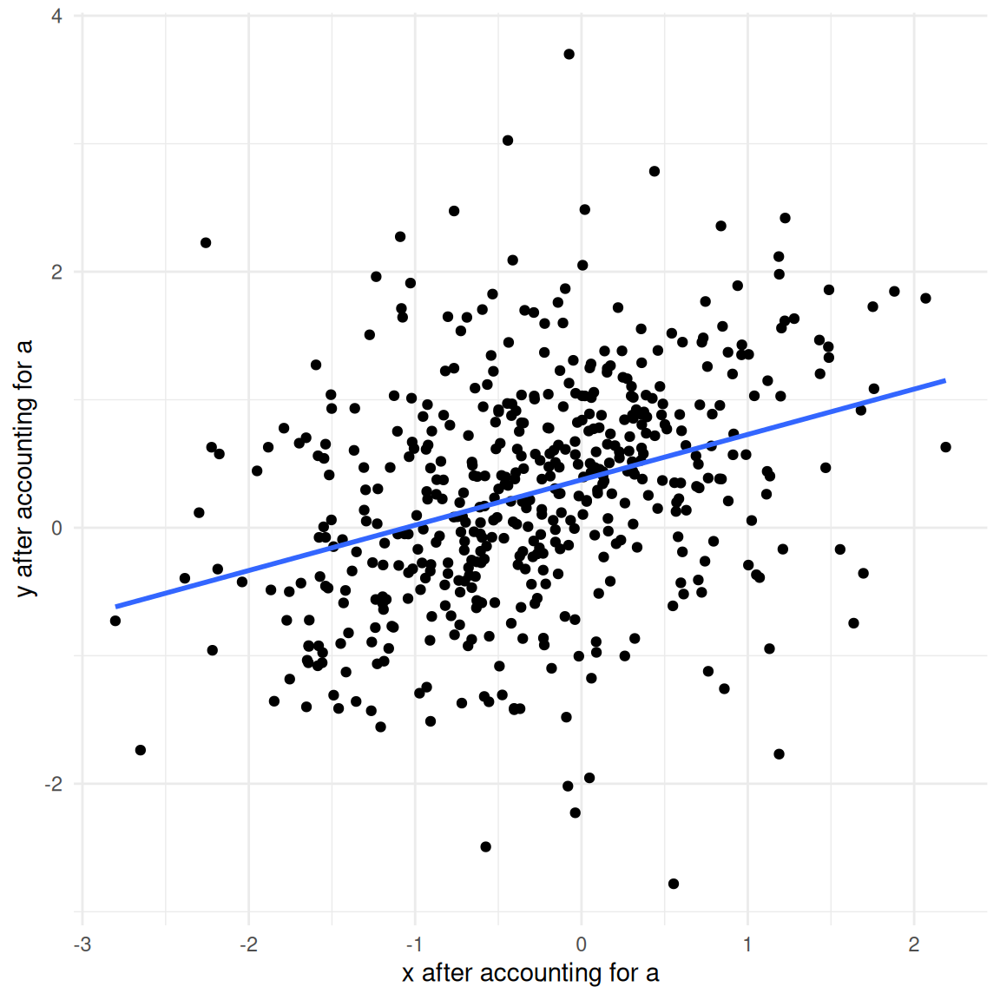
```{=html}
<div id="xxbycoxbxj" style="padding-left:0px;padding-right:0px;padding-top:10px;padding-bottom:10px;overflow-x:auto;overflow-y:auto;width:auto;height:auto;">
<style>#xxbycoxbxj table {
  font-family: system-ui, 'Segoe UI', Roboto, Helvetica, Arial, sans-serif, 'Apple Color Emoji', 'Segoe UI Emoji', 'Segoe UI Symbol', 'Noto Color Emoji';
  -webkit-font-smoothing: antialiased;
  -moz-osx-font-smoothing: grayscale;
}

#xxbycoxbxj thead, #xxbycoxbxj tbody, #xxbycoxbxj tfoot, #xxbycoxbxj tr, #xxbycoxbxj td, #xxbycoxbxj th {
  border-style: none;
}

#xxbycoxbxj p {
  margin: 0;
  padding: 0;
}

#xxbycoxbxj .gt_table {
  display: table;
  border-collapse: collapse;
  line-height: normal;
  margin-left: auto;
  margin-right: auto;
  color: #333333;
  font-size: 16px;
  font-weight: normal;
  font-style: normal;
  background-color: #FFFFFF;
  width: auto;
  border-top-style: solid;
  border-top-width: 2px;
  border-top-color: #A8A8A8;
  border-right-style: none;
  border-right-width: 2px;
  border-right-color: #D3D3D3;
  border-bottom-style: solid;
  border-bottom-width: 2px;
  border-bottom-color: #A8A8A8;
  border-left-style: none;
  border-left-width: 2px;
  border-left-color: #D3D3D3;
}

#xxbycoxbxj .gt_caption {
  padding-top: 4px;
  padding-bottom: 4px;
}

#xxbycoxbxj .gt_title {
  color: #333333;
  font-size: 125%;
  font-weight: initial;
  padding-top: 4px;
  padding-bottom: 4px;
  padding-left: 5px;
  padding-right: 5px;
  border-bottom-color: #FFFFFF;
  border-bottom-width: 0;
}

#xxbycoxbxj .gt_subtitle {
  color: #333333;
  font-size: 85%;
  font-weight: initial;
  padding-top: 3px;
  padding-bottom: 5px;
  padding-left: 5px;
  padding-right: 5px;
  border-top-color: #FFFFFF;
  border-top-width: 0;
}

#xxbycoxbxj .gt_heading {
  background-color: #FFFFFF;
  text-align: center;
  border-bottom-color: #FFFFFF;
  border-left-style: none;
  border-left-width: 1px;
  border-left-color: #D3D3D3;
  border-right-style: none;
  border-right-width: 1px;
  border-right-color: #D3D3D3;
}

#xxbycoxbxj .gt_bottom_border {
  border-bottom-style: solid;
  border-bottom-width: 2px;
  border-bottom-color: #D3D3D3;
}

#xxbycoxbxj .gt_col_headings {
  border-top-style: solid;
  border-top-width: 2px;
  border-top-color: #D3D3D3;
  border-bottom-style: solid;
  border-bottom-width: 2px;
  border-bottom-color: #D3D3D3;
  border-left-style: none;
  border-left-width: 1px;
  border-left-color: #D3D3D3;
  border-right-style: none;
  border-right-width: 1px;
  border-right-color: #D3D3D3;
}

#xxbycoxbxj .gt_col_heading {
  color: #333333;
  background-color: #FFFFFF;
  font-size: 100%;
  font-weight: normal;
  text-transform: inherit;
  border-left-style: none;
  border-left-width: 1px;
  border-left-color: #D3D3D3;
  border-right-style: none;
  border-right-width: 1px;
  border-right-color: #D3D3D3;
  vertical-align: bottom;
  padding-top: 5px;
  padding-bottom: 6px;
  padding-left: 5px;
  padding-right: 5px;
  overflow-x: hidden;
}

#xxbycoxbxj .gt_column_spanner_outer {
  color: #333333;
  background-color: #FFFFFF;
  font-size: 100%;
  font-weight: normal;
  text-transform: inherit;
  padding-top: 0;
  padding-bottom: 0;
  padding-left: 4px;
  padding-right: 4px;
}

#xxbycoxbxj .gt_column_spanner_outer:first-child {
  padding-left: 0;
}

#xxbycoxbxj .gt_column_spanner_outer:last-child {
  padding-right: 0;
}

#xxbycoxbxj .gt_column_spanner {
  border-bottom-style: solid;
  border-bottom-width: 2px;
  border-bottom-color: #D3D3D3;
  vertical-align: bottom;
  padding-top: 5px;
  padding-bottom: 5px;
  overflow-x: hidden;
  display: inline-block;
  width: 100%;
}

#xxbycoxbxj .gt_spanner_row {
  border-bottom-style: hidden;
}

#xxbycoxbxj .gt_group_heading {
  padding-top: 8px;
  padding-bottom: 8px;
  padding-left: 5px;
  padding-right: 5px;
  color: #333333;
  background-color: #FFFFFF;
  font-size: 100%;
  font-weight: initial;
  text-transform: inherit;
  border-top-style: solid;
  border-top-width: 2px;
  border-top-color: #D3D3D3;
  border-bottom-style: solid;
  border-bottom-width: 2px;
  border-bottom-color: #D3D3D3;
  border-left-style: none;
  border-left-width: 1px;
  border-left-color: #D3D3D3;
  border-right-style: none;
  border-right-width: 1px;
  border-right-color: #D3D3D3;
  vertical-align: middle;
  text-align: left;
}

#xxbycoxbxj .gt_empty_group_heading {
  padding: 0.5px;
  color: #333333;
  background-color: #FFFFFF;
  font-size: 100%;
  font-weight: initial;
  border-top-style: solid;
  border-top-width: 2px;
  border-top-color: #D3D3D3;
  border-bottom-style: solid;
  border-bottom-width: 2px;
  border-bottom-color: #D3D3D3;
  vertical-align: middle;
}

#xxbycoxbxj .gt_from_md > :first-child {
  margin-top: 0;
}

#xxbycoxbxj .gt_from_md > :last-child {
  margin-bottom: 0;
}

#xxbycoxbxj .gt_row {
  padding-top: 8px;
  padding-bottom: 8px;
  padding-left: 5px;
  padding-right: 5px;
  margin: 10px;
  border-top-style: solid;
  border-top-width: 1px;
  border-top-color: #D3D3D3;
  border-left-style: none;
  border-left-width: 1px;
  border-left-color: #D3D3D3;
  border-right-style: none;
  border-right-width: 1px;
  border-right-color: #D3D3D3;
  vertical-align: middle;
  overflow-x: hidden;
}

#xxbycoxbxj .gt_stub {
  color: #333333;
  background-color: #FFFFFF;
  font-size: 100%;
  font-weight: initial;
  text-transform: inherit;
  border-right-style: solid;
  border-right-width: 2px;
  border-right-color: #D3D3D3;
  padding-left: 5px;
  padding-right: 5px;
}

#xxbycoxbxj .gt_stub_row_group {
  color: #333333;
  background-color: #FFFFFF;
  font-size: 100%;
  font-weight: initial;
  text-transform: inherit;
  border-right-style: solid;
  border-right-width: 2px;
  border-right-color: #D3D3D3;
  padding-left: 5px;
  padding-right: 5px;
  vertical-align: top;
}

#xxbycoxbxj .gt_row_group_first td {
  border-top-width: 2px;
}

#xxbycoxbxj .gt_row_group_first th {
  border-top-width: 2px;
}

#xxbycoxbxj .gt_summary_row {
  color: #333333;
  background-color: #FFFFFF;
  text-transform: inherit;
  padding-top: 8px;
  padding-bottom: 8px;
  padding-left: 5px;
  padding-right: 5px;
}

#xxbycoxbxj .gt_first_summary_row {
  border-top-style: solid;
  border-top-color: #D3D3D3;
}

#xxbycoxbxj .gt_first_summary_row.thick {
  border-top-width: 2px;
}

#xxbycoxbxj .gt_last_summary_row {
  padding-top: 8px;
  padding-bottom: 8px;
  padding-left: 5px;
  padding-right: 5px;
  border-bottom-style: solid;
  border-bottom-width: 2px;
  border-bottom-color: #D3D3D3;
}

#xxbycoxbxj .gt_grand_summary_row {
  color: #333333;
  background-color: #FFFFFF;
  text-transform: inherit;
  padding-top: 8px;
  padding-bottom: 8px;
  padding-left: 5px;
  padding-right: 5px;
}

#xxbycoxbxj .gt_first_grand_summary_row {
  padding-top: 8px;
  padding-bottom: 8px;
  padding-left: 5px;
  padding-right: 5px;
  border-top-style: double;
  border-top-width: 6px;
  border-top-color: #D3D3D3;
}

#xxbycoxbxj .gt_last_grand_summary_row_top {
  padding-top: 8px;
  padding-bottom: 8px;
  padding-left: 5px;
  padding-right: 5px;
  border-bottom-style: double;
  border-bottom-width: 6px;
  border-bottom-color: #D3D3D3;
}

#xxbycoxbxj .gt_striped {
  background-color: rgba(128, 128, 128, 0.05);
}

#xxbycoxbxj .gt_table_body {
  border-top-style: solid;
  border-top-width: 2px;
  border-top-color: #D3D3D3;
  border-bottom-style: solid;
  border-bottom-width: 2px;
  border-bottom-color: #D3D3D3;
}

#xxbycoxbxj .gt_footnotes {
  color: #333333;
  background-color: #FFFFFF;
  border-bottom-style: none;
  border-bottom-width: 2px;
  border-bottom-color: #D3D3D3;
  border-left-style: none;
  border-left-width: 2px;
  border-left-color: #D3D3D3;
  border-right-style: none;
  border-right-width: 2px;
  border-right-color: #D3D3D3;
}

#xxbycoxbxj .gt_footnote {
  margin: 0px;
  font-size: 90%;
  padding-top: 4px;
  padding-bottom: 4px;
  padding-left: 5px;
  padding-right: 5px;
}

#xxbycoxbxj .gt_sourcenotes {
  color: #333333;
  background-color: #FFFFFF;
  border-bottom-style: none;
  border-bottom-width: 2px;
  border-bottom-color: #D3D3D3;
  border-left-style: none;
  border-left-width: 2px;
  border-left-color: #D3D3D3;
  border-right-style: none;
  border-right-width: 2px;
  border-right-color: #D3D3D3;
}

#xxbycoxbxj .gt_sourcenote {
  font-size: 90%;
  padding-top: 4px;
  padding-bottom: 4px;
  padding-left: 5px;
  padding-right: 5px;
}

#xxbycoxbxj .gt_left {
  text-align: left;
}

#xxbycoxbxj .gt_center {
  text-align: center;
}

#xxbycoxbxj .gt_right {
  text-align: right;
  font-variant-numeric: tabular-nums;
}

#xxbycoxbxj .gt_font_normal {
  font-weight: normal;
}

#xxbycoxbxj .gt_font_bold {
  font-weight: bold;
}

#xxbycoxbxj .gt_font_italic {
  font-style: italic;
}

#xxbycoxbxj .gt_super {
  font-size: 65%;
}

#xxbycoxbxj .gt_footnote_marks {
  font-size: 75%;
  vertical-align: 0.4em;
  position: initial;
}

#xxbycoxbxj .gt_asterisk {
  font-size: 100%;
  vertical-align: 0;
}

#xxbycoxbxj .gt_indent_1 {
  text-indent: 5px;
}

#xxbycoxbxj .gt_indent_2 {
  text-indent: 10px;
}

#xxbycoxbxj .gt_indent_3 {
  text-indent: 15px;
}

#xxbycoxbxj .gt_indent_4 {
  text-indent: 20px;
}

#xxbycoxbxj .gt_indent_5 {
  text-indent: 25px;
}

#xxbycoxbxj .katex-display {
  display: inline-flex !important;
  margin-bottom: 0.75em !important;
}

#xxbycoxbxj div.Reactable > div.rt-table > div.rt-thead > div.rt-tr.rt-tr-group-header > div.rt-th-group:after {
  height: 0px !important;
}
</style>
<table class="gt_table" data-quarto-disable-processing="false" data-quarto-bootstrap="false">
  <thead>
    <tr class="gt_col_headings">
      <th class="gt_col_heading gt_columns_bottom_border gt_left" rowspan="1" colspan="1" scope="col" id="term">term</th>
      <th class="gt_col_heading gt_columns_bottom_border gt_right" rowspan="1" colspan="1" scope="col" id="estimate">estimate</th>
      <th class="gt_col_heading gt_columns_bottom_border gt_right" rowspan="1" colspan="1" scope="col" id="std.error">std.error</th>
      <th class="gt_col_heading gt_columns_bottom_border gt_right" rowspan="1" colspan="1" scope="col" id="statistic">statistic</th>
      <th class="gt_col_heading gt_columns_bottom_border gt_right" rowspan="1" colspan="1" scope="col" id="p.value">p.value</th>
    </tr>
  </thead>
  <tbody class="gt_table_body">
    <tr><td headers="term" class="gt_row gt_left">(Intercept)</td>
<td headers="estimate" class="gt_row gt_right">0.8614</td>
<td headers="std.error" class="gt_row gt_right">0.0538</td>
<td headers="statistic" class="gt_row gt_right">16.0142</td>
<td headers="p.value" class="gt_row gt_right">0.0000</td></tr>
    <tr><td headers="term" class="gt_row gt_left">x</td>
<td headers="estimate" class="gt_row gt_right">0.5328</td>
<td headers="std.error" class="gt_row gt_right">0.0422</td>
<td headers="statistic" class="gt_row gt_right">12.6293</td>
<td headers="p.value" class="gt_row gt_right">0.0000</td></tr>
    <tr><td headers="term" class="gt_row gt_left">aYes</td>
<td headers="estimate" class="gt_row gt_right">−1.6663</td>
<td headers="std.error" class="gt_row gt_right">0.0834</td>
<td headers="statistic" class="gt_row gt_right">−19.9822</td>
<td headers="p.value" class="gt_row gt_right">0.0000</td></tr>
  </tbody>
  
  
</table>
</div>
```

To illustrate the concept of a collider let's look at an example:

**Does product quality have an effect on marketing effectiveness?**

Imagine a scenario in which product quality and marketing effectiveness are actually unrelated but both contribute to product success.


```{=html}
<div class="DiagrammeR html-widget html-fill-item" id="htmlwidget-f0dff5e20bbda6f2a82c" style="width:576px;height:240px;"></div>
<script type="application/json" data-for="htmlwidget-f0dff5e20bbda6f2a82c">{"x":{"diagram":"\ngraph LR\n    A[Product Quality] --> C[Product Success]\n    B[Marketing Effectiveness] --> C\n"},"evals":[],"jsHooks":[]}</script>
```


We might estimate the following models. Model (1) is correctly specified, and model (2) includes the collider. Note that neither $R^2$ nor the p-values would lead us to choose the correct model. Including the collider leads to a spurious negative correlation between product quality and marketing effectiveness. Based on this result a marketing manager could incorrectly conclude that only low-quality products should be advertised.


``` r
mod_correct <- lm(marketing_effectiveness ~ prod_qual, data_effectiveness)
mod_collider <-  lm(marketing_effectiveness ~ prod_qual + success, data_effectiveness)
stargazer::stargazer(
  mod_correct, mod_collider,
  type = "html"
)
```


<table style="text-align:center"><tr><td colspan="3" style="border-bottom: 1px solid black"></td></tr><tr><td style="text-align:left"></td><td colspan="2"><em>Dependent variable:</em></td></tr>
<tr><td></td><td colspan="2" style="border-bottom: 1px solid black"></td></tr>
<tr><td style="text-align:left"></td><td colspan="2">marketing_effectiveness</td></tr>
<tr><td style="text-align:left"></td><td>(1)</td><td>(2)</td></tr>
<tr><td colspan="3" style="border-bottom: 1px solid black"></td></tr><tr><td style="text-align:left">prod_qual</td><td>0.031</td><td>-0.470<sup>***</sup></td></tr>
<tr><td style="text-align:left"></td><td>(0.045)</td><td>(0.042)</td></tr>
<tr><td style="text-align:left"></td><td></td><td></td></tr>
<tr><td style="text-align:left">successYes</td><td></td><td>1.676<sup>***</sup></td></tr>
<tr><td style="text-align:left"></td><td></td><td>(0.082)</td></tr>
<tr><td style="text-align:left"></td><td></td><td></td></tr>
<tr><td style="text-align:left">Constant</td><td>0.020</td><td>-0.839<sup>***</sup></td></tr>
<tr><td style="text-align:left"></td><td>(0.045)</td><td>(0.054)</td></tr>
<tr><td style="text-align:left"></td><td></td><td></td></tr>
<tr><td colspan="3" style="border-bottom: 1px solid black"></td></tr><tr><td style="text-align:left">Observations</td><td>500</td><td>500</td></tr>
<tr><td style="text-align:left">R<sup>2</sup></td><td>0.001</td><td>0.455</td></tr>
<tr><td style="text-align:left">Adjusted R<sup>2</sup></td><td>-0.001</td><td>0.453</td></tr>
<tr><td style="text-align:left">Residual Std. Error</td><td>1.005 (df = 498)</td><td>0.743 (df = 497)</td></tr>
<tr><td style="text-align:left">F Statistic</td><td>0.456 (df = 1; 498)</td><td>207.705<sup>***</sup> (df = 2; 497)</td></tr>
<tr><td colspan="3" style="border-bottom: 1px solid black"></td></tr><tr><td style="text-align:left"><em>Note:</em></td><td colspan="2" style="text-align:right"><sup>*</sup>p<0.1; <sup>**</sup>p<0.05; <sup>***</sup>p<0.01</td></tr>
</table>


### Omitted Variable Bias (Confounders)

[Recall](https://wu-rds.github.io/MA2024/regression.html#omitted-variables) that variables that influence both the outcome and other independent variables will bias the coefficients of those other independent variables if left out of a model. This bias is referred to as "Omitted Variable Bias" (short OVB) since it occurs due to the omission of a crucial variable. OVB occurs whenever a confounder (see [The Fork](#the-fork-good-control)) is left out of the model and constitutes a serious threat to causal interpretation of the coefficients. The good news is that OVB (typically) only occurs with observational data and can be mitigated by manipulating the focal variable $x$ in an experiment. If done correctly, the variation in $x$ is completely controlled by the marketing manager, e.g., through multiple conditions in a randomized experiment. Therefore, the (potentially unobserved) confounder is no longer responsible for the variation in $x$. In other words, the path from the confounder to $x$ is eliminated and OVB is no longer present. To illustrate this, imagine two scenarios in which we try to estimate the effectiveness of a nike shoe ad. In the first scenario we simply compare consumers that were shown the ad with those who were not shown the ad. However, we omit the fact that the ad was shown to users that searched for the term "nike running shoes" and not to others. This will bias the lower path (Ad -> Purchase) in the following DAG:

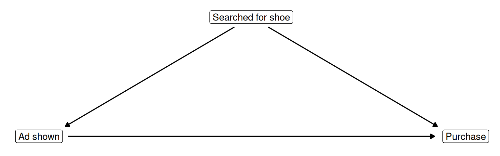

In a second scenario we randomly assign each consumer to be shown the ad (treated) or not (control). In this case the confounder is no longer responsible for the variation in $x$, i.e., searching for the shoe did not cause the ad to be shown, since each person was randomly assigned to be shown the ad. The DAG becomes

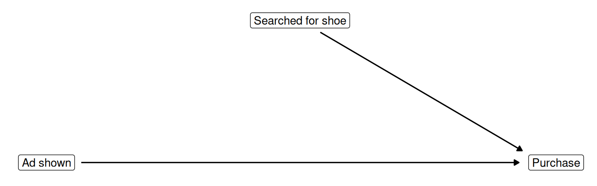

Note that if we omit the variable indicating whether someone has searched for a shoe or not it is still part of the error term, i.e., we likely increase the error variance, but our causal effect of the ad on purchase is now unbiased (and consistent). If we do observe whether someone searched for the shoe or not we can still add it as a control variable, potentially decreasing the standard error of our estimate.

The bad news is that we are unable to run randomized experiments in many situations. Therefore, it is valuable to understand the magnitude of the OVB. The magnitude of the OVB depends on how strongly correlated the confounder is with the included variable $x$. To illustrate this take a look at the equations representing the situation in [The Fork](#the-fork-good-control):

$$
\begin{aligned}
x &= \alpha_0 + \alpha_1 d + \varepsilon_x \\
y &= \beta_0 + \beta_1 d + \varepsilon_y
\end{aligned}
$$

However, we might be unaware of the confounder $d$ but still be interested in the causal effect of $x$ on $y$. Therefore, we might be inclined to estimate the following (misspecified) model

$$
y = \gamma_0 + \gamma_1 x + \epsilon_y
$$

We know (based on the equations above) that the true effect of $x$ on $y$ is $0$ as it is entirely caused by $d$. In order to investigate the magnitude of the OVB we mistakenly view $d$ as a function of $x$ (see [Mediation analysis](#mediation-analysis)):

$$
d = \theta_0 + \theta_1 x + \varepsilon_d,
$$

plug the incorrectly specified model for $d$ into the correctly specified model for $y$, and take the derivative with respect to $x$:

$$
\begin{aligned}
y &= \tilde \beta_0 + \beta_1 (\theta_0 + \theta_1 x + \varepsilon_d) + \epsilon_y \\
  &= \tilde \beta_0 + \beta_1 \theta_0 + \beta_1 \theta_1 x + \beta_1 \varepsilon_d + \epsilon_y \\
{\delta \over \delta x}  &= \beta_1 \theta_1
\end{aligned}
$$

Note that $\gamma_1 = \beta_1 \theta_1$. 


``` r
library(stargazer)
set.seed(11)
d <- 100 * rnorm(n)
x <- -4 + 0.5 * d + 10 * rnorm(n)
y <- 25 + 10 * d + 10 * rnorm(n)
stargazer(
  lm(y ~ d + x),
  lm(y ~ x), ## gamma
  lm(y ~ d), ## beta
  lm(d ~ x), ## theta
  type = 'html')
```


<table style="text-align:center"><tr><td colspan="5" style="border-bottom: 1px solid black"></td></tr><tr><td style="text-align:left"></td><td colspan="4"><em>Dependent variable:</em></td></tr>
<tr><td></td><td colspan="4" style="border-bottom: 1px solid black"></td></tr>
<tr><td style="text-align:left"></td><td colspan="3">y</td><td>d</td></tr>
<tr><td style="text-align:left"></td><td>(1)</td><td>(2)</td><td>(3)</td><td>(4)</td></tr>
<tr><td colspan="5" style="border-bottom: 1px solid black"></td></tr><tr><td style="text-align:left">d</td><td>9.996<sup>***</sup></td><td></td><td>9.997<sup>***</sup></td><td></td></tr>
<tr><td style="text-align:left"></td><td>(0.023)</td><td></td><td>(0.005)</td><td></td></tr>
<tr><td style="text-align:left"></td><td></td><td></td><td></td><td></td></tr>
<tr><td style="text-align:left">x</td><td>0.003</td><td>19.096<sup>***</sup></td><td></td><td>1.910<sup>***</sup></td></tr>
<tr><td style="text-align:left"></td><td>(0.046)</td><td>(0.173)</td><td></td><td>(0.017)</td></tr>
<tr><td style="text-align:left"></td><td></td><td></td><td></td><td></td></tr>
<tr><td style="text-align:left">Constant</td><td>24.889<sup>***</sup></td><td>97.282<sup>***</sup></td><td>24.878<sup>***</sup></td><td>7.242<sup>***</sup></td></tr>
<tr><td style="text-align:left"></td><td>(0.488)</td><td>(8.789)</td><td>(0.456)</td><td>(0.878)</td></tr>
<tr><td style="text-align:left"></td><td></td><td></td><td></td><td></td></tr>
<tr><td colspan="5" style="border-bottom: 1px solid black"></td></tr><tr><td style="text-align:left">Observations</td><td>500</td><td>500</td><td>500</td><td>500</td></tr>
<tr><td style="text-align:left">R<sup>2</sup></td><td>1.000</td><td>0.961</td><td>1.000</td><td>0.961</td></tr>
<tr><td style="text-align:left">Adjusted R<sup>2</sup></td><td>1.000</td><td>0.961</td><td>1.000</td><td>0.961</td></tr>
<tr><td style="text-align:left">Residual Std. Error</td><td>10.204 (df = 497)</td><td>195.949 (df = 498)</td><td>10.193 (df = 498)</td><td>19.576 (df = 498)</td></tr>
<tr><td style="text-align:left">F Statistic</td><td>2,343,560.000<sup>***</sup> (df = 2; 497)</td><td>12,212.740<sup>***</sup> (df = 1; 498)</td><td>4,696,511.000<sup>***</sup> (df = 1; 498)</td><td>12,242.150<sup>***</sup> (df = 1; 498)</td></tr>
<tr><td colspan="5" style="border-bottom: 1px solid black"></td></tr><tr><td style="text-align:left"><em>Note:</em></td><td colspan="4" style="text-align:right"><sup>*</sup>p<0.1; <sup>**</sup>p<0.05; <sup>***</sup>p<0.01</td></tr>
</table>

``` r
## See coef of regression y ~ x
beta1 <- coef(lm(y~d))['d']
theta1 <- coef(lm(d~x))['x']
beta1 * theta1
```

       d 
19.09598 

Notice that without theoretical knowledge about the data it is not clear which variable should be the "outcome" and which the "independent" variable since we could estimate either direction using OLS. In the example above we know ("from theory") that $d$ causes $x$ and $y$ but we estimate models where $x$ is the explanatory variable. As one might guess there is a clear relationship between coefficients estimated with one or the other variable on the left hand side. 


``` r
theta_1 <- coef(lm(d~x))['x']
alpha_1 <- coef(lm(x~d))['d']
```

To be exact we have to adjust for the respective variances of the variables:


``` r
alpha_1 * var(d)/var(x)
```

```
##        d 
## 1.910091
```

``` r
theta_1
```

```
##        x 
## 1.910091
```

### Mediation analysis

Mediation analysis is often used to show a causal process. A company might, for example, run an influencer campaign aimed at changing consumers' perceptions of a brand being "old fashioned". In order to assess the effectiveness of the influencer, they run two separate campaigns. The "control group" is simply shown the product (without the influencer) while the "treated group" is shown the influencer campaign. In both cases they ask the consumers about their perception of the brand (modern vs. old fashioned) and about their purchase intention. 


```{=html}
<div class="DiagrammeR html-widget html-fill-item" id="htmlwidget-6a9facf4abbd24cd04ab" style="width:576px;height:192px;"></div>
<script type="application/json" data-for="htmlwidget-6a9facf4abbd24cd04ab">{"x":{"diagram":"\ngraph LR\n    Influencer-->Modern[Perceived as Modern]\n    Modern-->Purchase\n    Influencer-->Purchase\n"},"evals":[],"jsHooks":[]}</script>
```

The first arrow in the upper path represents the effectiveness of the influencer to change consumers' minds about the brand. The second arrow in the upper path represents the additional purchases that happen because consumers perceive the brand as more modern. The lower path represents a (possible) direct effect of the influencer campaign on purchases (without changing consumers' minds). These are consumers who still perceive the brand as old fashioned but nonetheless purchase the product as a result of the campaign. Note that these are hypothesized paths. The "existence" (non-zero relationship) of those arrows and the relative magnitude of these effects is what we are trying to test! 

As the total causal effect a variable $x$ has on the outcome $y$ can be (partly) mediated through another variable $m$, we cannot just include $m$ in the model. However, we can decompose the effect into a direct and mediated part. Either of part can be $0$ but we can easily test whether that is the case. The decomposition has two parts: First, calculate the effect the variable of interest ($x$) has on the mediator ($m$):

$$
m = \alpha_0 + \alpha_1 x + \varepsilon_m
$$

Note that we use "alpha" ($\alpha$) for the regression coefficients to distinguish them from the parameters below. They can nonetheless be estimated using OLS.

Second, calculate the full model for the outcome ($y$) including both $x$ and $m$:

$$
y = \beta_0 + \beta_1 x + \beta_2 m + \varepsilon_y
$$

Now $\beta_1$ is the _average direct effect_ (ADE) of $x$ on $y$. That is the part that is not mediated through $m$. In [The Pipe](#the-pipe-bad-control), $\beta_1=0$ since there is no direct connection from $x$ to $y$. The _average causal mediation effect_ (ACME) can be calculated as $\alpha_1 * \beta_2$. Intuitively, "how much would a unit increase in $x$ change $m$" times "how much would an increase in $m$ change $y$". The total effect of $x$ on $y$ can be seen more clearly by plugging in the model for $m$ in the second equation and taking the derivative with respect to $x$:


$$
\begin{aligned}
y &= \beta_0 + \beta_1 x + \beta_2 m + \varepsilon_y \\
  &= \beta_0 + \beta_1 x + \beta_2 (\alpha_0 + \alpha_1 x + \varepsilon_m) + \varepsilon_y \\
  &= \beta_0 + \beta_1 x + \beta_2 \alpha_0 + \beta_2 \alpha_1 x + \beta_2 \varepsilon_m + \varepsilon_y \\
\text{total effect} := \frac{\delta y}{\delta x} &= \underbrace{\beta_1}_{\text{ADE}} + \underbrace{\beta_2 \alpha_1}_{\text{ACME}}
\end{aligned}
$$

Note that if we are only interested in the _total effect_ we can omit the mediator $m$ from the model and estimate:

$$
y = \gamma_0 + \gamma_1 x + \epsilon_y
$$
where $\gamma_1 = \beta_1 + \beta_2 \alpha_1$ (again: all these equations can be estimated using OLS). In that case we are using OVB in our favor: By omitting $m$ its effect on $y$ is picked up by $x$ to exactly the degree that $x$ and $m$ are correlated. However, in contrast to the previous example that is exactly what we want since $m$ is caused by $x$ as well!


Notable changes to [The Pipe](#the-pipe-bad-control): 

- We have both direct and indirect effects of $x$ on $y$
- The mediator $m$ is continuous instead of binary


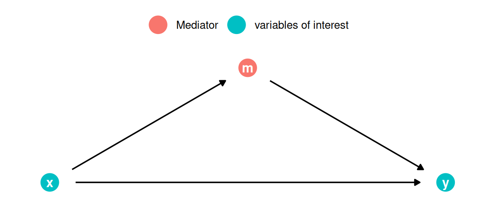


``` r
set.seed(11)
X <- 100 * rnorm(n)
M <- 10 + 0.5 * X + 5 * rnorm(n)
Y <- -25 + 0.2 * X + 3 * M + 10 * rnorm(n)
X_on_M <- lm(M ~ X)
avg_direct_effect <- lm(Y ~ X + M)
total_effect <- lm(Y ~ X)
stargazer(
  X_on_M, 
  avg_direct_effect, 
  total_effect, 
  type = 'html')
```


<table style="text-align:center"><tr><td colspan="4" style="border-bottom: 1px solid black"></td></tr><tr><td style="text-align:left"></td><td colspan="3"><em>Dependent variable:</em></td></tr>
<tr><td></td><td colspan="3" style="border-bottom: 1px solid black"></td></tr>
<tr><td style="text-align:left"></td><td>M</td><td colspan="2">Y</td></tr>
<tr><td style="text-align:left"></td><td>(1)</td><td>(2)</td><td>(3)</td></tr>
<tr><td colspan="4" style="border-bottom: 1px solid black"></td></tr><tr><td style="text-align:left">X</td><td>0.502<sup>***</sup></td><td>0.195<sup>***</sup></td><td>1.702<sup>***</sup></td></tr>
<tr><td style="text-align:left"></td><td>(0.002)</td><td>(0.046)</td><td>(0.008)</td></tr>
<tr><td style="text-align:left"></td><td></td><td></td><td></td></tr>
<tr><td style="text-align:left">M</td><td></td><td>3.006<sup>***</sup></td><td></td></tr>
<tr><td style="text-align:left"></td><td></td><td>(0.091)</td><td></td></tr>
<tr><td style="text-align:left"></td><td></td><td></td><td></td></tr>
<tr><td style="text-align:left">Constant</td><td>10.102<sup>***</sup></td><td>-25.181<sup>***</sup></td><td>5.182<sup>***</sup></td></tr>
<tr><td style="text-align:left"></td><td>(0.225)</td><td>(1.026)</td><td>(0.815)</td></tr>
<tr><td style="text-align:left"></td><td></td><td></td><td></td></tr>
<tr><td colspan="4" style="border-bottom: 1px solid black"></td></tr><tr><td style="text-align:left">Observations</td><td>500</td><td>500</td><td>500</td></tr>
<tr><td style="text-align:left">R<sup>2</sup></td><td>0.990</td><td>0.996</td><td>0.988</td></tr>
<tr><td style="text-align:left">Adjusted R<sup>2</sup></td><td>0.990</td><td>0.996</td><td>0.988</td></tr>
<tr><td style="text-align:left">Residual Std. Error</td><td>5.023 (df = 498)</td><td>10.204 (df = 497)</td><td>18.218 (df = 498)</td></tr>
<tr><td style="text-align:left">F Statistic</td><td>48,670.140<sup>***</sup> (df = 1; 498)</td><td>68,470.640<sup>***</sup> (df = 2; 497)</td><td>42,616.510<sup>***</sup> (df = 1; 498)</td></tr>
<tr><td colspan="4" style="border-bottom: 1px solid black"></td></tr><tr><td style="text-align:left"><em>Note:</em></td><td colspan="3" style="text-align:right"><sup>*</sup>p<0.1; <sup>**</sup>p<0.05; <sup>***</sup>p<0.01</td></tr>
</table>


``` r
avg_causal_mediation_effect <- coef(X_on_M)['X'] * coef(avg_direct_effect)['M']
total_effect_alternative <- coef(avg_direct_effect)['X'] + avg_causal_mediation_effect
proportion_mediated <- avg_causal_mediation_effect / total_effect_alternative
```


```{=html}
<div id="ysvncaouxv" style="padding-left:0px;padding-right:0px;padding-top:10px;padding-bottom:10px;overflow-x:auto;overflow-y:auto;width:auto;height:auto;">
<style>#ysvncaouxv table {
  font-family: system-ui, 'Segoe UI', Roboto, Helvetica, Arial, sans-serif, 'Apple Color Emoji', 'Segoe UI Emoji', 'Segoe UI Symbol', 'Noto Color Emoji';
  -webkit-font-smoothing: antialiased;
  -moz-osx-font-smoothing: grayscale;
}

#ysvncaouxv thead, #ysvncaouxv tbody, #ysvncaouxv tfoot, #ysvncaouxv tr, #ysvncaouxv td, #ysvncaouxv th {
  border-style: none;
}

#ysvncaouxv p {
  margin: 0;
  padding: 0;
}

#ysvncaouxv .gt_table {
  display: table;
  border-collapse: collapse;
  line-height: normal;
  margin-left: auto;
  margin-right: auto;
  color: #333333;
  font-size: 16px;
  font-weight: normal;
  font-style: normal;
  background-color: #FFFFFF;
  width: auto;
  border-top-style: solid;
  border-top-width: 2px;
  border-top-color: #A8A8A8;
  border-right-style: none;
  border-right-width: 2px;
  border-right-color: #D3D3D3;
  border-bottom-style: solid;
  border-bottom-width: 2px;
  border-bottom-color: #A8A8A8;
  border-left-style: none;
  border-left-width: 2px;
  border-left-color: #D3D3D3;
}

#ysvncaouxv .gt_caption {
  padding-top: 4px;
  padding-bottom: 4px;
}

#ysvncaouxv .gt_title {
  color: #333333;
  font-size: 125%;
  font-weight: initial;
  padding-top: 4px;
  padding-bottom: 4px;
  padding-left: 5px;
  padding-right: 5px;
  border-bottom-color: #FFFFFF;
  border-bottom-width: 0;
}

#ysvncaouxv .gt_subtitle {
  color: #333333;
  font-size: 85%;
  font-weight: initial;
  padding-top: 3px;
  padding-bottom: 5px;
  padding-left: 5px;
  padding-right: 5px;
  border-top-color: #FFFFFF;
  border-top-width: 0;
}

#ysvncaouxv .gt_heading {
  background-color: #FFFFFF;
  text-align: center;
  border-bottom-color: #FFFFFF;
  border-left-style: none;
  border-left-width: 1px;
  border-left-color: #D3D3D3;
  border-right-style: none;
  border-right-width: 1px;
  border-right-color: #D3D3D3;
}

#ysvncaouxv .gt_bottom_border {
  border-bottom-style: solid;
  border-bottom-width: 2px;
  border-bottom-color: #D3D3D3;
}

#ysvncaouxv .gt_col_headings {
  border-top-style: solid;
  border-top-width: 2px;
  border-top-color: #D3D3D3;
  border-bottom-style: solid;
  border-bottom-width: 2px;
  border-bottom-color: #D3D3D3;
  border-left-style: none;
  border-left-width: 1px;
  border-left-color: #D3D3D3;
  border-right-style: none;
  border-right-width: 1px;
  border-right-color: #D3D3D3;
}

#ysvncaouxv .gt_col_heading {
  color: #333333;
  background-color: #FFFFFF;
  font-size: 100%;
  font-weight: normal;
  text-transform: inherit;
  border-left-style: none;
  border-left-width: 1px;
  border-left-color: #D3D3D3;
  border-right-style: none;
  border-right-width: 1px;
  border-right-color: #D3D3D3;
  vertical-align: bottom;
  padding-top: 5px;
  padding-bottom: 6px;
  padding-left: 5px;
  padding-right: 5px;
  overflow-x: hidden;
}

#ysvncaouxv .gt_column_spanner_outer {
  color: #333333;
  background-color: #FFFFFF;
  font-size: 100%;
  font-weight: normal;
  text-transform: inherit;
  padding-top: 0;
  padding-bottom: 0;
  padding-left: 4px;
  padding-right: 4px;
}

#ysvncaouxv .gt_column_spanner_outer:first-child {
  padding-left: 0;
}

#ysvncaouxv .gt_column_spanner_outer:last-child {
  padding-right: 0;
}

#ysvncaouxv .gt_column_spanner {
  border-bottom-style: solid;
  border-bottom-width: 2px;
  border-bottom-color: #D3D3D3;
  vertical-align: bottom;
  padding-top: 5px;
  padding-bottom: 5px;
  overflow-x: hidden;
  display: inline-block;
  width: 100%;
}

#ysvncaouxv .gt_spanner_row {
  border-bottom-style: hidden;
}

#ysvncaouxv .gt_group_heading {
  padding-top: 8px;
  padding-bottom: 8px;
  padding-left: 5px;
  padding-right: 5px;
  color: #333333;
  background-color: #FFFFFF;
  font-size: 100%;
  font-weight: initial;
  text-transform: inherit;
  border-top-style: solid;
  border-top-width: 2px;
  border-top-color: #D3D3D3;
  border-bottom-style: solid;
  border-bottom-width: 2px;
  border-bottom-color: #D3D3D3;
  border-left-style: none;
  border-left-width: 1px;
  border-left-color: #D3D3D3;
  border-right-style: none;
  border-right-width: 1px;
  border-right-color: #D3D3D3;
  vertical-align: middle;
  text-align: left;
}

#ysvncaouxv .gt_empty_group_heading {
  padding: 0.5px;
  color: #333333;
  background-color: #FFFFFF;
  font-size: 100%;
  font-weight: initial;
  border-top-style: solid;
  border-top-width: 2px;
  border-top-color: #D3D3D3;
  border-bottom-style: solid;
  border-bottom-width: 2px;
  border-bottom-color: #D3D3D3;
  vertical-align: middle;
}

#ysvncaouxv .gt_from_md > :first-child {
  margin-top: 0;
}

#ysvncaouxv .gt_from_md > :last-child {
  margin-bottom: 0;
}

#ysvncaouxv .gt_row {
  padding-top: 8px;
  padding-bottom: 8px;
  padding-left: 5px;
  padding-right: 5px;
  margin: 10px;
  border-top-style: solid;
  border-top-width: 1px;
  border-top-color: #D3D3D3;
  border-left-style: none;
  border-left-width: 1px;
  border-left-color: #D3D3D3;
  border-right-style: none;
  border-right-width: 1px;
  border-right-color: #D3D3D3;
  vertical-align: middle;
  overflow-x: hidden;
}

#ysvncaouxv .gt_stub {
  color: #333333;
  background-color: #FFFFFF;
  font-size: 100%;
  font-weight: initial;
  text-transform: inherit;
  border-right-style: solid;
  border-right-width: 2px;
  border-right-color: #D3D3D3;
  padding-left: 5px;
  padding-right: 5px;
}

#ysvncaouxv .gt_stub_row_group {
  color: #333333;
  background-color: #FFFFFF;
  font-size: 100%;
  font-weight: initial;
  text-transform: inherit;
  border-right-style: solid;
  border-right-width: 2px;
  border-right-color: #D3D3D3;
  padding-left: 5px;
  padding-right: 5px;
  vertical-align: top;
}

#ysvncaouxv .gt_row_group_first td {
  border-top-width: 2px;
}

#ysvncaouxv .gt_row_group_first th {
  border-top-width: 2px;
}

#ysvncaouxv .gt_summary_row {
  color: #333333;
  background-color: #FFFFFF;
  text-transform: inherit;
  padding-top: 8px;
  padding-bottom: 8px;
  padding-left: 5px;
  padding-right: 5px;
}

#ysvncaouxv .gt_first_summary_row {
  border-top-style: solid;
  border-top-color: #D3D3D3;
}

#ysvncaouxv .gt_first_summary_row.thick {
  border-top-width: 2px;
}

#ysvncaouxv .gt_last_summary_row {
  padding-top: 8px;
  padding-bottom: 8px;
  padding-left: 5px;
  padding-right: 5px;
  border-bottom-style: solid;
  border-bottom-width: 2px;
  border-bottom-color: #D3D3D3;
}

#ysvncaouxv .gt_grand_summary_row {
  color: #333333;
  background-color: #FFFFFF;
  text-transform: inherit;
  padding-top: 8px;
  padding-bottom: 8px;
  padding-left: 5px;
  padding-right: 5px;
}

#ysvncaouxv .gt_first_grand_summary_row {
  padding-top: 8px;
  padding-bottom: 8px;
  padding-left: 5px;
  padding-right: 5px;
  border-top-style: double;
  border-top-width: 6px;
  border-top-color: #D3D3D3;
}

#ysvncaouxv .gt_last_grand_summary_row_top {
  padding-top: 8px;
  padding-bottom: 8px;
  padding-left: 5px;
  padding-right: 5px;
  border-bottom-style: double;
  border-bottom-width: 6px;
  border-bottom-color: #D3D3D3;
}

#ysvncaouxv .gt_striped {
  background-color: rgba(128, 128, 128, 0.05);
}

#ysvncaouxv .gt_table_body {
  border-top-style: solid;
  border-top-width: 2px;
  border-top-color: #D3D3D3;
  border-bottom-style: solid;
  border-bottom-width: 2px;
  border-bottom-color: #D3D3D3;
}

#ysvncaouxv .gt_footnotes {
  color: #333333;
  background-color: #FFFFFF;
  border-bottom-style: none;
  border-bottom-width: 2px;
  border-bottom-color: #D3D3D3;
  border-left-style: none;
  border-left-width: 2px;
  border-left-color: #D3D3D3;
  border-right-style: none;
  border-right-width: 2px;
  border-right-color: #D3D3D3;
}

#ysvncaouxv .gt_footnote {
  margin: 0px;
  font-size: 90%;
  padding-top: 4px;
  padding-bottom: 4px;
  padding-left: 5px;
  padding-right: 5px;
}

#ysvncaouxv .gt_sourcenotes {
  color: #333333;
  background-color: #FFFFFF;
  border-bottom-style: none;
  border-bottom-width: 2px;
  border-bottom-color: #D3D3D3;
  border-left-style: none;
  border-left-width: 2px;
  border-left-color: #D3D3D3;
  border-right-style: none;
  border-right-width: 2px;
  border-right-color: #D3D3D3;
}

#ysvncaouxv .gt_sourcenote {
  font-size: 90%;
  padding-top: 4px;
  padding-bottom: 4px;
  padding-left: 5px;
  padding-right: 5px;
}

#ysvncaouxv .gt_left {
  text-align: left;
}

#ysvncaouxv .gt_center {
  text-align: center;
}

#ysvncaouxv .gt_right {
  text-align: right;
  font-variant-numeric: tabular-nums;
}

#ysvncaouxv .gt_font_normal {
  font-weight: normal;
}

#ysvncaouxv .gt_font_bold {
  font-weight: bold;
}

#ysvncaouxv .gt_font_italic {
  font-style: italic;
}

#ysvncaouxv .gt_super {
  font-size: 65%;
}

#ysvncaouxv .gt_footnote_marks {
  font-size: 75%;
  vertical-align: 0.4em;
  position: initial;
}

#ysvncaouxv .gt_asterisk {
  font-size: 100%;
  vertical-align: 0;
}

#ysvncaouxv .gt_indent_1 {
  text-indent: 5px;
}

#ysvncaouxv .gt_indent_2 {
  text-indent: 10px;
}

#ysvncaouxv .gt_indent_3 {
  text-indent: 15px;
}

#ysvncaouxv .gt_indent_4 {
  text-indent: 20px;
}

#ysvncaouxv .gt_indent_5 {
  text-indent: 25px;
}

#ysvncaouxv .katex-display {
  display: inline-flex !important;
  margin-bottom: 0.75em !important;
}

#ysvncaouxv div.Reactable > div.rt-table > div.rt-thead > div.rt-tr.rt-tr-group-header > div.rt-th-group:after {
  height: 0px !important;
}
</style>
<table class="gt_table" data-quarto-disable-processing="false" data-quarto-bootstrap="false">
  <thead>
    <tr class="gt_heading">
      <td colspan="2" class="gt_heading gt_title gt_font_normal gt_bottom_border" style>Causal Mediation Analysis</td>
    </tr>
    
  </thead>
  <tbody class="gt_table_body">
    <tr><th id="stub_1_1" scope="row" class="gt_row gt_left gt_stub">Average Causal Mediation Effect (ACME):</th>
<td headers="stub_1_1 value" class="gt_row gt_right">1.508</td></tr>
    <tr><th id="stub_1_2" scope="row" class="gt_row gt_left gt_stub">Average Direct Effect (ADE):</th>
<td headers="stub_1_2 value" class="gt_row gt_right">0.195</td></tr>
    <tr><th id="stub_1_3" scope="row" class="gt_row gt_left gt_stub">Total Effect:</th>
<td headers="stub_1_3 value" class="gt_row gt_right">1.702</td></tr>
    <tr><th id="stub_1_4" scope="row" class="gt_row gt_left gt_stub">Total Effect (alternative):</th>
<td headers="stub_1_4 value" class="gt_row gt_right">1.702</td></tr>
    <tr><th id="stub_1_5" scope="row" class="gt_row gt_left gt_stub">Proportion Mediated:</th>
<td headers="stub_1_5 value" class="gt_row gt_right">0.886</td></tr>
  </tbody>
  
  
</table>
</div>
```

#### Estimation using PROCESS

In research settings the PROCESS macro by Andrew Hayes is very popular. 
The following code _should_ download and source the macro for you but will definitely break in the future (try changing the `v43` part of the link to `v44` or `v45` etc. or obtain a new link from [the website](https://haskayne.ucalgary.ca/CCRAM/resource-hub) if it does):


``` r
## Download and source the PROCESS macro by Andrew F. Hayes
temp <- tempfile()
process_macro_dl <- "https://www.afhayes.com/public/processv43.zip"
download.file(process_macro_dl,temp)
files <- unzip(temp, list = TRUE)
fname <- files$Name[endsWith(files$Name, "process.R")]
source(unz(temp, fname))
```

```
## 
## ********************* PROCESS for R Version 4.3.1 ********************* 
##  
##            Written by Andrew F. Hayes, Ph.D.  www.afhayes.com              
##    Documentation available in Hayes (2022). www.guilford.com/p/hayes3   
##  
## *********************************************************************** 
##  
## PROCESS is now ready for use.
## Copyright 2020-2023 by Andrew F. Hayes ALL RIGHTS RESERVED
## Workshop schedule at http://haskayne.ucalgary.ca/CCRAM
## 
```

``` r
unlink(temp)
rm(files)
rm(fname)
rm(process_macro_dl)
rm(temp)
```

Alternatively download the program from [here](https://haskayne.ucalgary.ca/CCRAM/resource-hub) and source the `process.R` file manually. 

PROCESS model 4:


``` r
process(
  data.frame(Y, X, M), y = 'Y', x = 'X', m = 'M', model = 4,
  progress = 0, seed = 1, plot = 1
  )
```

```
## 
## ********************* PROCESS for R Version 4.3.1 ********************* 
##  
##            Written by Andrew F. Hayes, Ph.D.  www.afhayes.com              
##    Documentation available in Hayes (2022). www.guilford.com/p/hayes3   
##  
## *********************************************************************** 
##          
## Model : 4
##     Y : Y
##     X : X
##     M : M
## 
## Sample size: 500
## 
## Custom seed: 1
## 
## 
## *********************************************************************** 
## Outcome Variable: M
## 
## Model Summary: 
##           R      R-sq       MSE          F       df1       df2         p
##      0.9949    0.9899   25.2333 48670.1431    1.0000  498.0000    0.0000
## 
## Model: 
##              coeff        se         t         p      LLCI      ULCI
## constant   10.1015    0.2246   44.9659    0.0000    9.6601   10.5429
## X           0.5015    0.0023  220.6131    0.0000    0.4971    0.5060
## 
## *********************************************************************** 
## Outcome Variable: Y
## 
## Model Summary: 
##           R      R-sq       MSE          F       df1       df2         p
##      0.9982    0.9964  104.1125 68470.6372    2.0000  497.0000    0.0000
## 
## Model: 
##              coeff        se         t         p      LLCI      ULCI
## constant  -25.1811    1.0265  -24.5317    0.0000  -27.1979  -23.1643
## X           0.1945    0.0459    4.2390    0.0000    0.1044    0.2847
## M           3.0058    0.0910   33.0227    0.0000    2.8270    3.1847
## 
## *********************************************************************** 
## Bootstrapping in progress. Please wait.
## 
## **************** DIRECT AND INDIRECT EFFECTS OF X ON Y ****************
## 
## Direct effect of X on Y:
##      effect        se         t         p      LLCI      ULCI
##      0.1945    0.0459    4.2390    0.0000    0.1044    0.2847
## 
## Indirect effect(s) of X on Y:
##      Effect    BootSE  BootLLCI  BootULCI
## M    1.5075    0.0483    1.4151    1.6050
## 
## ******************** ANALYSIS NOTES AND ERRORS ************************ 
## 
## Level of confidence for all confidence intervals in output: 95
## 
## Number of bootstraps for percentile bootstrap confidence intervals: 5000
```

Let's assume the $x$ in this case is the influencer campaign, $m$ is consumers' brand perceptionm, and $y$ is their purchase intention. We can present the results as follows


``` r
library(DiagrammeR)

mermaid("
graph LR
    Influencer-->|0.5***|Modern[Perceived as Modern]
    Modern-->|3.0***|Purchase
    Influencer-->|0.2***|Purchase
")
```

```{=html}
<div class="DiagrammeR html-widget html-fill-item" id="htmlwidget-f6827287a18a74508d93" style="width:576px;height:192px;"></div>
<script type="application/json" data-for="htmlwidget-f6827287a18a74508d93">{"x":{"diagram":"\ngraph LR\n    Influencer-->|0.5***|Modern[Perceived as Modern]\n    Modern-->|3.0***|Purchase\n    Influencer-->|0.2***|Purchase\n"},"evals":[],"jsHooks":[]}</script>
```


### Effect Moderation (Interactions)

In mediation there are causal relationships between the focal variable $x$ and the mediator $m$, as well as, between $m$ and the outcome $y$. In contrast, moderation describes a situation in which the relationship between the focal variable $x$ and the outcome $y$ is changed (e.g., in magnitude and/or direction) depending on the value of a moderator variable $w$. For example, the effectiveness of a marketing campaign highlighting the ecological benefits of a product might depend on consumers' perception of the brand's environmental footprint. If it is in line with consumers' perceptions the campaign might be very effective, but if they perceive the campaign as "green-washing" they might even start to boycott the product.

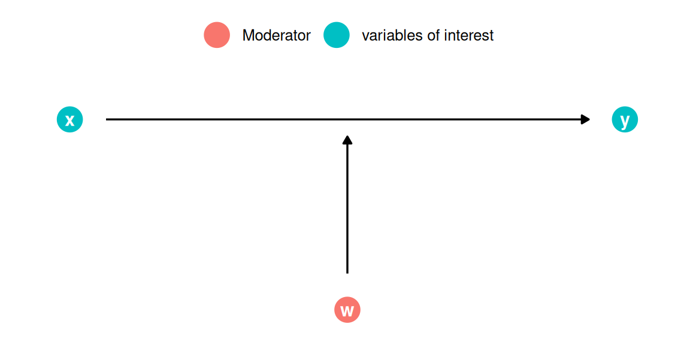


To understand the different effects $x$ has on $y$ we can plot regression lines for different values of the moderator. Note for example, that the effect of $x$ is negative for negative values of the moderator and positive for large positive values (e.g., in the range $(103, 131]$) of the moderator.


``` r
moderation_df <- data.frame(y = Y_mod, x = X_mod - mean(X_mod), w = Moderator - mean(Moderator))
ggplot(moderation_df, aes(x = x, y = y, color = cut(w, 10))) + 
  geom_point(size = 0.1, alpha = 0.8) +
  geom_smooth(method = "lm", se = FALSE) +
  theme_minimal() +
  guides(color = guide_legend(title = "Moderator", nrow = 2)) +
  theme(legend.position = "top")
```

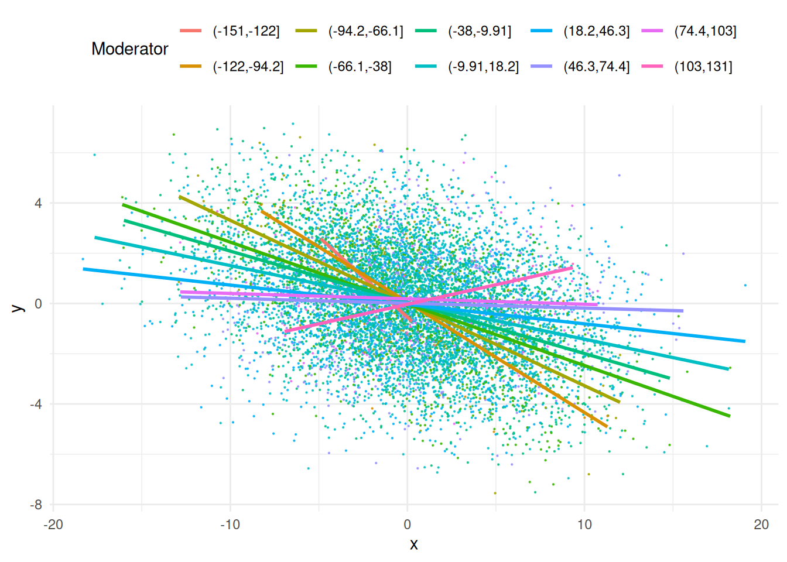

To understand for which values of the moderator the slope is significant (and in which direction) we can use the so-called Johnson-Neyman intervals.


``` r
moderated_ols <- lm(y ~ x*w, data = moderation_df)
pred_resp <- predict_response(moderated_ols, c("x", "w"))
plot(johnson_neyman(pred_resp)) 
```

```
## The association between `x` and `y` is negative for values of `w` lower
##   than 63 and positive for values higher than 80. Inside the interval of
##   [63.00, 80.00], there were no clear associations.
```

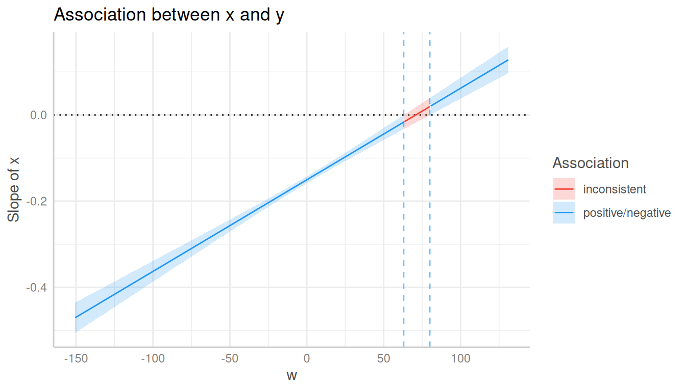

In PROCESS the simple moderation model is `model=1`. `jn=1` will give us the Johnson-Neyman intervals.


``` r
process(moderation_df, y = "y", x = "x", w="w", model=1, jn=1, seed=123)
```

```
## 
## ********************* PROCESS for R Version 4.3.1 ********************* 
##  
##            Written by Andrew F. Hayes, Ph.D.  www.afhayes.com              
##    Documentation available in Hayes (2022). www.guilford.com/p/hayes3   
##  
## *********************************************************************** 
##          
## Model : 1
##     Y : y
##     X : x
##     W : w
## 
## Sample size: 10000
## 
## Custom seed: 123
## 
## 
## *********************************************************************** 
## Outcome Variable: y
## 
## Model Summary: 
##           R      R-sq       MSE         F       df1       df2         p
##      0.3872    0.1499    4.0626  587.5743    3.0000 9996.0000    0.0000
## 
## Model: 
##              coeff        se         t         p      LLCI      ULCI
## constant    0.0199    0.0202    0.9880    0.3232   -0.0196    0.0594
## x          -0.1506    0.0040  -37.8143    0.0000   -0.1584   -0.1428
## w          -0.0000    0.0006   -0.0306    0.9756   -0.0012    0.0011
## Int_1       0.0021    0.0001   18.2215    0.0000    0.0019    0.0024
## 
## Product terms key:
## Int_1  :  x  x  w      
## 
## Test(s) of highest order unconditional interaction(s):
##       R2-chng         F       df1       df2         p
## X*W    0.0282  332.0221    1.0000 9996.0000    0.0000
## ----------
## Focal predictor: x (X)
##       Moderator: w (W)
## 
## Conditional effects of the focal predictor at values of the moderator(s):
##           w    effect        se         t         p      LLCI      ULCI
##    -34.4241   -0.2238    0.0057  -39.5735    0.0000   -0.2349   -0.2127
##     -0.5204   -0.1517    0.0040  -38.0881    0.0000   -0.1595   -0.1439
##     34.5525   -0.0771    0.0057  -13.6031    0.0000   -0.0882   -0.0660
## 
## Moderator value(s) defining Johnson-Neyman significance region(s):
##       Value   % below   % above
##     63.0982   96.2500    3.7500
##     80.1945   98.7300    1.2700
## 
## Conditional effect of focal predictor at values of the moderator:
##           w    effect        se         t         p      LLCI      ULCI
##   -150.4507   -0.4705    0.0180  -26.1377    0.0000   -0.5058   -0.4352
##   -135.6572   -0.4390    0.0163  -26.8993    0.0000   -0.4710   -0.4071
##   -120.8638   -0.4076    0.0147  -27.8148    0.0000   -0.4363   -0.3789
##   -106.0703   -0.3761    0.0130  -28.9315    0.0000   -0.4016   -0.3506
##    -91.2768   -0.3447    0.0114  -30.3153    0.0000   -0.3670   -0.3224
##    -76.4833   -0.3132    0.0098  -32.0546    0.0000   -0.3324   -0.2941
##    -61.6899   -0.2818    0.0082  -34.2565    0.0000   -0.2979   -0.2656
##    -46.8964   -0.2503    0.0068  -36.9926    0.0000   -0.2636   -0.2370
##    -32.1029   -0.2188    0.0055  -40.0388    0.0000   -0.2296   -0.2081
##    -17.3094   -0.1874    0.0045  -41.9763    0.0000   -0.1961   -0.1786
##     -2.5160   -0.1559    0.0040  -39.0534    0.0000   -0.1638   -0.1481
##     12.2775   -0.1245    0.0042  -29.4074    0.0000   -0.1328   -0.1162
##     27.0710   -0.0930    0.0051  -18.2950    0.0000   -0.1030   -0.0831
##     41.8644   -0.0616    0.0063   -9.7650    0.0000   -0.0739   -0.0492
##     56.6579   -0.0301    0.0077   -3.8998    0.0001   -0.0452   -0.0150
##     63.0982   -0.0164    0.0084   -1.9602    0.0500   -0.0328    0.0000
##     71.4514    0.0013    0.0092    0.1460    0.8840   -0.0168    0.0195
##     80.1945    0.0199    0.0102    1.9602    0.0500    0.0000    0.0399
##     86.2449    0.0328    0.0108    3.0303    0.0024    0.0116    0.0540
##    101.0383    0.0643    0.0124    5.1628    0.0000    0.0399    0.0887
##    115.8318    0.0957    0.0141    6.7916    0.0000    0.0681    0.1233
##    130.6253    0.1272    0.0158    8.0709    0.0000    0.0963    0.1581
## 
## ******************** ANALYSIS NOTES AND ERRORS ************************ 
## 
## Level of confidence for all confidence intervals in output: 95
## 
## W values in conditional tables are the 16th, 50th, and 84th percentiles.
```

Comparison to the standard `lm` output:


<table style="text-align:center"><tr><td colspan="2" style="border-bottom: 1px solid black"></td></tr><tr><td style="text-align:left"></td><td><em>Dependent variable:</em></td></tr>
<tr><td></td><td colspan="1" style="border-bottom: 1px solid black"></td></tr>
<tr><td style="text-align:left"></td><td>y</td></tr>
<tr><td colspan="2" style="border-bottom: 1px solid black"></td></tr><tr><td style="text-align:left">x</td><td>-0.151<sup>***</sup></td></tr>
<tr><td style="text-align:left"></td><td>(0.004)</td></tr>
<tr><td style="text-align:left"></td><td></td></tr>
<tr><td style="text-align:left">w</td><td>-0.00002</td></tr>
<tr><td style="text-align:left"></td><td>(0.001)</td></tr>
<tr><td style="text-align:left"></td><td></td></tr>
<tr><td style="text-align:left">x:w</td><td>0.002<sup>***</sup></td></tr>
<tr><td style="text-align:left"></td><td>(0.0001)</td></tr>
<tr><td style="text-align:left"></td><td></td></tr>
<tr><td style="text-align:left">Constant</td><td>0.020</td></tr>
<tr><td style="text-align:left"></td><td>(0.020)</td></tr>
<tr><td style="text-align:left"></td><td></td></tr>
<tr><td colspan="2" style="border-bottom: 1px solid black"></td></tr><tr><td style="text-align:left">Observations</td><td>10,000</td></tr>
<tr><td style="text-align:left">R<sup>2</sup></td><td>0.150</td></tr>
<tr><td style="text-align:left">Adjusted R<sup>2</sup></td><td>0.150</td></tr>
<tr><td style="text-align:left">Residual Std. Error</td><td>2.016 (df = 9996)</td></tr>
<tr><td style="text-align:left">F Statistic</td><td>587.574<sup>***</sup> (df = 3; 9996)</td></tr>
<tr><td colspan="2" style="border-bottom: 1px solid black"></td></tr><tr><td style="text-align:left"><em>Note:</em></td><td style="text-align:right"><sup>*</sup>p<0.1; <sup>**</sup>p<0.05; <sup>***</sup>p<0.01</td></tr>
</table>

### Summary

In this chapter we learned about causal modeling. There are four types of relationships we need to handle differently when trying to identify causal effects:

- Confounders $\Rightarrow$ control variables or [randomized experiments](#omitted-variable-bias-confounders)
- Mediators $\Rightarrow$ [mediation analysis](#mediation-analysis) or omit from model (if we are only interested in the total effect)
- Colliders $\Rightarrow$ always omit from model
- Moderators $\Rightarrow$ [interactions](#effect-moderation-interactions) or omit from model (if we are not interested in effect heterogeneity)

## Learning check {-}

**(LC7.1) What is a correlation coefficient?**

- [ ] It describes the difference in means of two variables
- [ ] It describes the causal relation between two variables
- [ ] It is the standardized covariance
- [ ] It describes the degree to which the variation in one variable is related to the variation in another variable
- [ ] None of the above 

**(LC7.2) Which line through a scatterplot produces the best fit in a linear regression model?**

- [ ] The line associated with the steepest slope parameter
- [ ] The line that minimizes the sum of the squared deviations of the predicted values (regression line) from the observed values
- [ ] The line that minimizes the sum of the squared residuals
- [ ] The line that maximizes the sum of the squared residuals
- [ ] None of the above 

**(LC7.3) What is the interpretation of the regression coefficient ($\beta_1$=0.05) in a regression model where log(sales) (i.e., log-transformed units) is the dependent variable and log(advertising) (i.e., the log-transformed advertising expenditures in Euro) is the independent variable (i.e., $log(sales)=13.4+0.05∗log(advertising)$)?**

- [ ] An increase in advertising by 1€ leads to an increase in sales by 0.5 units
- [ ] A 1% increase in advertising leads to a 0.05% increase in sales
- [ ] A 1% increase in advertising leads to a 5% decrease in sales
- [ ] An increase in advertising by 1€ leads to an increase in sales by 0.005 units
- [ ] None of the above

**(LC7.4) Which of the following statements about the adjusted R-squared is TRUE?**

- [ ] It is always larger than the regular $R^{2}$
- [ ] It increases with every additional variable
- [ ] It increases only with additional variables that add more explanatory power than pure chance
- [ ] It contains a “penalty” for including unnecessary variables
- [ ] None of the above 

**(LC7.5) What does the term overfitting refer to?**

- [ ] A regression model that has too many predictor variables
- [ ] A regression model that fits to a specific data set so poorly, that it will not generalize to other samples
- [ ] A regression model that fits to a specific data set so well, that it will only predict well within the sample but not generalize to other samples
- [ ] A regression model that fits to a specific data set so well, that it will generalize to other samples particularly well
- [ ] None of the above 

**(LC7.6) What are assumptions of the linear regression model?**

- [ ] Endogeneity
- [ ] Independent errors
- [ ] Heteroscedasticity
- [ ] Linear dependence of regressors
- [ ] None of the above 

**(LC7.7) What does the problem of heteroscedasticity in a regression model refer to?**

- [ ] The variance of the error term is not constant
- [ ] A strong linear relationship between the independent variables
- [ ] The variance of the error term is constant
- [ ] A correlation between the error term and the independent variables
- [ ] None of the above 

**(LC7.8) What are properties of the multiplicative regression model (i.e., log-log specification)?**

- [ ] Constant marginal returns
- [ ] Decreasing marginal returns
- [ ] Constant elasticity
- [ ] Increasing marginal returns
- [ ] None of the above 

**(LC7.9) When do you use a logistic regression model?**

- [ ] When the dependent variable is continuous
- [ ] When the independent and dependent variables are binary
- [ ] When the dependent variable is binary
- [ ] None of the above 

**(LC7.10) What is the correct way to implement a linear regression model in R? (x = independent variable, y = dependent variable)?**

- [ ] `lm(y~x, data=data)`
- [ ] `lm(x~y + error, data=data)`
- [ ] `lm(x~y, data=data)`
- [ ] `lm(y~x + error, data=data)`
- [ ] None of the above 


**(LC7.11) In a logistic regression model, where conversion (1 = conversion, 0 = no conversion) is the dependent variable, you obtain an estimate of your independent variable of 0.18. What is the correct interpretation of the coefficient associated with the independent variable?**

- [ ] If the independent variable increases by 1 unit, the probability of a conversion increases by 0.18%. 
- [ ] If the independent variable increases by 1 unit, a conversion becomes exp(0.18) = 1.19 times more likely. 
- [ ] If the independent variable increases by 1%, the probability of conversion increases by 0.18%.
- [ ] If the independent variable increases by 1%, the probability of conversion increases by 1.19%.

**(LC7.12) What does the term elasticity (e.g., advertising elasticity) refer to?**

- [ ] It expresses the relative change in an outcome variable due to a relative change in the input variable. 
- [ ] It expresses the unit change in an outcome variable due to a change in the input variable by 1 unit. 
- [ ] In a regression model: If the independent variable increases by 1%, the outcome changes by $\beta_1$%. 
- [ ] In a regression model: If the independent variable increases by 1 unit, the outcome changes by $\beta_1$ units.

**(LC7.13) What does the additive assumption of the linear regression model refer to?**

- [ ] The effect of an independent variable on the dependent variable is independent of the values of the other independent variables included in the model.
- [ ] The effect of an independent variable on the dependent variable is dependent of the values of the other independent variables included in the model.
- [ ] None of the above.

**(LC7.14) What types of variables can we consider as independent variables in regression models?**

- [ ] Interval scale
- [ ] Ratio scale
- [ ] Ordinal scale
- [ ] Nominal scale

**(LV7.15) What is the difference between a confounder and a mediator?**

- [ ] A confounder is a variable that influences both the dependent and independent variable, while a mediator is a variable that is influenced by the independent variable and influences the dependent variable.
- [ ] A confounder can be omitted from the model but a mediator cannot.
- [ ] A mediator can only be omitted if we conduct a randomized experiment.
- [ ] A confounder can only be omitted if we conduct a randomized experiment.

**(LV7.16) Assume a simplified world in which a firms hiring decisions are based only on technical skills and personal skills (there are no other connections). Which of the following statements are correct if we are interested in the effect personal skills have on technical skills?**

- [ ] Technical skills and personal skills are correlated.
- [ ] We have to add information about hiring to the model since that is a confounder.
- [ ] A simple model regressing technical skills on personal skills will give us the correct effect (without any control variables).
- [ ] We expect the coefficient associated with technical skill to be significant if and only if we also add hiring decisions to the model (assume model assumptions are fulfilled and error variance is sufficiently small).

**(LV7.17) You observe that a particular marketing campaign in your company is very effective when shown to women but has no effect on men. In that case gender is a...**

- [ ] Confounder
- [ ] Mediator
- [ ] Collider
- [ ] Moderator

**(LV7.18) You observe that more creative ads lead to higher consumer engagement which in turn leads to increased purchase intention. In addition the ads also have a direct effect on purchase intention.**


```{=html}
<div class="DiagrammeR html-widget html-fill-item" id="htmlwidget-b8541aa25e7e882286cf" style="width:576px;height:240px;"></div>
<script type="application/json" data-for="htmlwidget-b8541aa25e7e882286cf">{"x":{"diagram":"\ngraph LR\n    Creative-->Engagement\n    Engagement-->Purchase\n    Creative-->Purchase\n        "},"evals":[],"jsHooks":[]}</script>
```

**Unfortunately, the data measuring consumer engagement was lost when a laptop was stolen from your office. Which effects can you correctly identify using the remaining data (whether the more creative ad was shown and purchase intention)?**

- [ ] The direct effect of creative ads on purchase intention.
- [ ] The total effect of creative ads on purchase intention.
- [ ] The estimated effect is biased.
- [ ] The direct effect of creative ads on purchase intention and the total effect of creative ads on purchase intention.


## References {-}

* Field, A., Miles J., & Field, Z. (2012): Discovering Statistics Using R. Sage Publications (**chapters 6, 7, 8**).
* James, G., Witten, D., Hastie, T., & Tibshirani, R. (2013): An Introduction to Statistical Learning with Applications in R, Springer (**chapter 3**)
* Cinelli, C., A. Forney, and J. Pearl. (2020): “A Crash Course in Good and Bad Controls.” SSRN 3689437.
* Westreich, D., and S. Greenland. (2013): “The Table 2 Fallacy: Presenting and Interpreting Confounder and Modifier Coefficients.” American Journal of Epidemiology 177 (4): 292–98.
