# (PART) Assignments {-}

# R Markdown 


## Introduction to R Markdown

::: {.infobox .download data-latex="{download}"}
[You can download the example markdown file here](./Code/rmarkdown_example.Rmd)
:::

This page will guide you through creating and editing R Markdown documents. This is a useful tool for reporting your analysis (e.g. for homework assignments). Of course, there is also [a cheat sheet for R-Markdown](https://www.rstudio.org/links/r_markdown_cheat_sheet) and [this book](https://bookdown.org/yihui/rmarkdown/) contains a comprehensive discussion of the format. 

The following video contains a short introduction to the R Markdown format.

<br>
<div align="center">
<iframe width="560" height="315" src="https://www.youtube.com/embed/o8FdyMAR-g4" frameborder="0" allowfullscreen></iframe>
</div>
<br>

### Creating a new R Markdown document {-}

In addition to the video, the following text contains a short description of the most important formatting options.  

Let's start to go through the steps of creating and .Rmd file and outputting the content to an HTML file. 

0. If an R-Markdown file was provided to you, open it with R-Studio and skip to [step 4](#step4) after adding your answers.

1. Open R-Studio

2. Create a new R-Markdown document


3. Save with appropriate name


    3.1. Add your answers

    3.2. Save again

 <a name="step4"></a>
 
4. "Knit" to HTML 


5. Hand in appropriate file (ending in `.html`) on learn\@WU


### Text and Equations {-}

R-Markdown documents are plain text files that include both text and R-code. Using RStudio they can be converted ('knitted') to HTML or PDF files that include both the text and the results of the R-code. In fact this website is written using R-Markdown and RStudio. In order for RStudio to be able to interpret the document you have to use certain characters or combinations of characters when formatting text and including R-code to be evaluated. By default the document starts with the options for the text part. You can change the title, date, author and a few more advanced options. 


The default is text mode, meaning that lines in an Rmd document will be interpreted as text, unless specified otherwise.

#### Headings {-}

Usually you want to include some kind of heading to structure your text. A heading is created using `#` signs. A single `#` creates a first level heading, two `##` a second level and so on. 


It is important to note here that the ```#``` symbol means something different within the code chunks as opposed to outside of them. If you continue to put a ```#``` in front of all your regular text, it will all be interpreted as a first level heading, making your text very large.

#### Lists {-}

Bullet point lists are created using `*`, `+` or `-`. Sub-items are created by indenting the item using 4 spaces or 2 tabs. 

````
* First Item
* Second Item
    + first sub-item
        - first sub-sub-item
    + second sub-item
````
* First Item
* Second Item
    + first sub-item
        - first sub-sub-item
    + second sub-item


Ordered lists can be created using numbers and letters. If you need sub-sub-items use `A)` instead of `A.` on the third level. 

````
1. First item
    a. first sub-item
        A) first sub-sub-item 
     b. second sub-item
2. Second item
````

1. First item
    a. first sub-item
        A) first sub-sub-item
    b. second sub-item
2. Second item


#### Text formatting {-}

Text can be formatted in *italics* (`*italics*`) or **bold** (`**bold**`). In addition, you can ad block quotes with `>`

````
> Lorem ipsum dolor amet chillwave lomo ramps, four loko green juice messenger bag raclette forage offal shoreditch chartreuse austin. Slow-carb poutine meggings swag blog, pop-up salvia taxidermy bushwick freegan ugh poke.
````
> Lorem ipsum dolor amet chillwave lomo ramps, four loko green juice messenger bag raclette forage offal shoreditch chartreuse austin. Slow-carb poutine meggings swag blog, pop-up salvia taxidermy bushwick freegan ugh poke.

### R-Code {-}

R-code is contained in so called "chunks". These chunks always start with three backticks and ```r``` in curly braces (``` ```{r} ```) and end with three backticks (``` ``` ```). Optionally, parameters can be added after the ```r``` to influence how a chunk behaves. Additionally, you can also give each chunk a name. Note that these have to be **unique**, otherwise R will refuse to knit your document.

#### Global and chunk options {-}

The first chunk always looks as follows


    ```{r setup, include = FALSE}
    knitr::opts_chunk$set(echo = TRUE)
    ```

It is added to the document automatically and sets options for all the following chunks. These options can be overwritten on a per-chunk basis. 

Keep `knitr::opts_chunk$set(echo = TRUE)` to print your code to the document you will hand in. Changing it to `knitr::opts_chunk$set(echo = FALSE)` will not print your code by default. This can be changed on a per-chunk basis.


    ```{r cars, echo = FALSE}
    summary(cars)

    plot(dist~speed, cars)
    ```


```
##      speed           dist       
##  Min.   : 4.0   Min.   :  2.00  
##  1st Qu.:12.0   1st Qu.: 26.00  
##  Median :15.0   Median : 36.00  
##  Mean   :15.4   Mean   : 42.98  
##  3rd Qu.:19.0   3rd Qu.: 56.00  
##  Max.   :25.0   Max.   :120.00
```


 
    ```{r cars2, echo = TRUE}
    summary(cars)

    plot(dist~speed, cars)
    ```


``` r
summary(cars)
```

```
##      speed           dist       
##  Min.   : 4.0   Min.   :  2.00  
##  1st Qu.:12.0   1st Qu.: 26.00  
##  Median :15.0   Median : 36.00  
##  Mean   :15.4   Mean   : 42.98  
##  3rd Qu.:19.0   3rd Qu.: 56.00  
##  Max.   :25.0   Max.   :120.00
```

``` r
plot(dist ~ speed, cars)
```


A good overview of all available global/chunk options can be found [here](https://yihui.name/knitr/options/#chunk_options).

### LaTeX Math {-}

Writing well formatted mathematical formulas is done the same way as in [LaTeX](https://en.wikipedia.org/wiki/LaTeX). Math mode is started and ended using `$$`. 
````
$$
 f_1(\omega) = \frac{\sigma^2}{2 \pi},\ \omega \in[-\pi, \pi]
$$
````

$$
 f_1(\omega) = \frac{\sigma^2}{2 \pi},\ \omega \in[-\pi, \pi]
$$

(for those interested this is the spectral density of [white noise](https://en.wikipedia.org/wiki/White_noise))

Including inline mathematical notation is done with a single ```$``` symbol. 

````
${2\over3}$ of my code is inline.

````
${2\over3}$ of my code is inline.

<br>

Take a look at [this wikibook on Mathematics in LaTeX](https://en.wikibooks.org/wiki/LaTeX/Mathematics#Symbols) and [this list of Greek letters and mathematical symbols](https://www.sharelatex.com/learn/List_of_Greek_letters_and_math_symbols) if you are not familiar with LaTeX.

In order to write multi-line equations in the same math environment, use `\\` after every line. In order to insert a space use a single `\`. To render text inside a math environment use `\text{here is the text}`. In order to align equations start with `\begin{align}` and place an `&` in each line at the point around which it should be aligned. Finally end with `\end{align}`

````
$$
\begin{align}
\text{First equation: }\ Y &= X \beta + \epsilon_y,\ \forall X \\
\text{Second equation: }\ X &= Z \gamma + \epsilon_x
\end{align}
$$
````

$$
\begin{align}
\text{First equation: }\ Y &= X \beta + \epsilon_y,\ \forall X \\
\text{Second equation: }\ X &= Z \gamma + \epsilon_x
\end{align}
$$

#### Important symbols {-}

<table class="table table-striped" style="width: auto !important; margin-left: auto; margin-right: auto;">
 <thead>
  <tr>
   <th style="text-align:left;"> Symbol </th>
   <th style="text-align:left;"> Code </th>
  </tr>
 </thead>
<tbody>
  <tr>
   <td style="text-align:left;"> $a^{2} + b$ </td>
   <td style="text-align:left;"> ```a^{2} + b``` </td>
  </tr>
  <tr>
   <td style="text-align:left;"> $a^{2+b}$ </td>
   <td style="text-align:left;"> ```a^{2+b}``` </td>
  </tr>
  <tr>
   <td style="text-align:left;"> $a_{1}$ </td>
   <td style="text-align:left;"> ```a_{1}``` </td>
  </tr>
  <tr>
   <td style="text-align:left;"> $a \leq b$ </td>
   <td style="text-align:left;"> ```a \leq b``` </td>
  </tr>
  <tr>
   <td style="text-align:left;"> $a \geq b$ </td>
   <td style="text-align:left;"> ```a \geq b``` </td>
  </tr>
  <tr>
   <td style="text-align:left;"> $a \neq b$ </td>
   <td style="text-align:left;"> ```a \neq b``` </td>
  </tr>
  <tr>
   <td style="text-align:left;"> $a \approx b$ </td>
   <td style="text-align:left;"> ```a \approx b``` </td>
  </tr>
  <tr>
   <td style="text-align:left;"> $a \in (0,1)$ </td>
   <td style="text-align:left;"> ```a \in (0,1)``` </td>
  </tr>
  <tr>
   <td style="text-align:left;"> $a \rightarrow \infty$ </td>
   <td style="text-align:left;"> ```a \rightarrow \infty``` </td>
  </tr>
  <tr>
   <td style="text-align:left;"> $\frac{a}{b}$ </td>
   <td style="text-align:left;"> ```\frac{a}{b}``` </td>
  </tr>
  <tr>
   <td style="text-align:left;"> $\frac{\partial a}{\partial b}$ </td>
   <td style="text-align:left;"> ```\frac{\partial a}{\partial b}``` </td>
  </tr>
  <tr>
   <td style="text-align:left;"> $\sqrt{a}$ </td>
   <td style="text-align:left;"> ```\sqrt{a}``` </td>
  </tr>
  <tr>
   <td style="text-align:left;"> $\sum_{i = 1}^{b} a_i$ </td>
   <td style="text-align:left;"> ```\sum_{i = 1}^{b} a_i``` </td>
  </tr>
  <tr>
   <td style="text-align:left;"> $\int_{a}^b f(c) dc$ </td>
   <td style="text-align:left;"> ```\int_{a}^b f(c) dc``` </td>
  </tr>
  <tr>
   <td style="text-align:left;"> $\prod_{i = 0}^b a_i$ </td>
   <td style="text-align:left;"> ```\prod_{i = 0}^b a_i``` </td>
  </tr>
  <tr>
   <td style="text-align:left;"> $c \left( \sum_{i=1}^b a_i \right)$ </td>
   <td style="text-align:left;"> ```c \left( \sum_{i=1}^b a_i \right)``` </td>
  </tr>
</tbody>
</table>

The `{}` after `_` and `^` are not strictly necessary if there is only one character in the sub-/superscript. However, in order to place multiple characters in the sub-/superscript they are necessary. 
e.g.


<table class="table table-striped" style="width: auto !important; margin-left: auto; margin-right: auto;">
 <thead>
  <tr>
   <th style="text-align:left;"> Symbol </th>
   <th style="text-align:left;"> Code </th>
  </tr>
 </thead>
<tbody>
  <tr>
   <td style="text-align:left;"> $a^b = a^{b}$ </td>
   <td style="text-align:left;"> ```a^b = a^{b}``` </td>
  </tr>
  <tr>
   <td style="text-align:left;"> $a^b+c \neq a^{b+c}$ </td>
   <td style="text-align:left;"> ```a^b+c \neq a^{b+c}``` </td>
  </tr>
  <tr>
   <td style="text-align:left;"> $\sum_i a_i = \sum_{i} a_{i}$ </td>
   <td style="text-align:left;"> ```\sum_i a_i = \sum_{i} a_{i}``` </td>
  </tr>
  <tr>
   <td style="text-align:left;"> $\sum_{i=1}^{b+c} a_i \neq \sum_i=1^b+c a_i$ </td>
   <td style="text-align:left;"> ```\sum_{i=1}^{b+c} a_i \neq \sum_i=1^b+c a_i``` </td>
  </tr>
</tbody>
</table>

#### Greek letters {-}

[Greek letters](https://en.wikipedia.org/wiki/Greek_alphabet#Letters) are preceded by a `\` followed by their name (`$\beta$` = $\beta$). In order to capitalize them simply capitalize the first letter of the name (`$\Gamma$` = $\Gamma$).

## Assignment 1

### Load libraries and data

For your convenience the following code will load the required `tidyverse` library as well as the data. Make sure to convert each of the variables you use for you analysis to the appropriate data types (e.g., `Date`, `factor`).


``` r
library(tidyverse)
music_data <- read.csv2("https://raw.githubusercontent.com/WU-RDS/MA2024/main/data/music_data_fin.csv")
str(music_data)
```

```
## 'data.frame':	66796 obs. of  31 variables:
##  $ isrc                       : chr  "BRRGE1603547" "USUM71808193" "ES5701800181" "ITRSE2000050" ...
##  $ artist_id                  : int  3679 5239 776407 433730 526471 1939 210184 212546 4938 119985 ...
##  $ streams                    : num  11944813 8934097 38835 46766 2930573 ...
##  $ weeks_in_charts            : int  141 51 1 1 7 226 13 1 64 7 ...
##  $ n_regions                  : int  1 21 1 1 4 8 1 1 5 1 ...
##  $ danceability               : num  50.9 35.3 68.3 70.4 84.2 35.2 73 55.6 71.9 34.6 ...
##  $ energy                     : num  80.3 75.5 67.6 56.8 57.8 91.1 69.6 24.5 85 43.3 ...
##  $ speechiness                : num  4 73.3 14.7 26.8 13.8 7.47 35.5 3.05 3.17 6.5 ...
##  $ instrumentalness           : num  0.05 0 0 0.000253 0 0 0 0 0.02 0 ...
##  $ liveness                   : num  46.3 39 7.26 8.91 22.8 9.95 32.1 9.21 11.4 10.1 ...
##  $ valence                    : num  65.1 43.7 43.4 49.5 19 23.6 58.4 27.6 36.7 76.8 ...
##  $ tempo                      : num  166 191.2 99 91 74.5 ...
##  $ song_length                : num  3.12 3.23 3.02 3.45 3.95 ...
##  $ song_age                   : num  228.3 144.3 112.3 50.7 58.3 ...
##  $ explicit                   : int  0 0 0 0 0 0 0 0 1 0 ...
##  $ n_playlists                : int  450 768 48 6 475 20591 6 105 547 688 ...
##  $ sp_popularity              : int  51 54 32 44 52 81 44 8 59 68 ...
##  $ youtube_views              : num  1.45e+08 1.32e+07 6.12e+06 0.00 0.00 ...
##  $ tiktok_counts              : int  9740 358700 0 13 515 67300 0 0 653 3807 ...
##  $ ins_followers_artist       : int  29613108 3693566 623778 81601 11962358 1169284 1948850 39381 9751080 343 ...
##  $ monthly_listeners_artist   : int  4133393 18367363 888273 143761 15551876 16224250 2683086 1318874 4828847 3088232 ...
##  $ playlist_total_reach_artist: int  24286416 143384531 4846378 156521 90841884 80408253 7332603 24302331 8914977 8885252 ...
##  $ sp_fans_artist             : int  3308630 465412 23846 1294 380204 1651866 214001 10742 435457 1897685 ...
##  $ shazam_counts              : int  73100 588550 0 0 55482 5281161 0 0 39055 0 ...
##  $ artistName                 : chr  "Luan Santana" "Alessia Cara" "Ana Guerra" "Claver Gold feat. Murubutu" ...
##  $ trackName                  : chr  "Eu, Você, O Mar e Ela" "Growing Pains" "El Remedio" "Ulisse" ...
##  $ release_date               : chr  "2016-06-20" "2018-06-14" "2018-04-26" "2020-03-31" ...
##  $ genre                      : chr  "other" "Pop" "Pop" "HipHop/Rap" ...
##  $ label                      : chr  "Independent" "Universal Music" "Universal Music" "Independent" ...
##  $ top10                      : int  1 0 0 0 0 1 0 0 0 0 ...
##  $ expert_rating              : chr  "excellent" "good" "good" "poor" ...
```

``` r
head(music_data, 2)
```

<div data-pagedtable="false">
  <script data-pagedtable-source type="application/json">
{"columns":[{"label":["isrc"],"name":[1],"type":["chr"],"align":["left"]},{"label":["artist_id"],"name":[2],"type":["int"],"align":["right"]},{"label":["streams"],"name":[3],"type":["dbl"],"align":["right"]},{"label":["weeks_in_charts"],"name":[4],"type":["int"],"align":["right"]},{"label":["n_regions"],"name":[5],"type":["int"],"align":["right"]},{"label":["danceability"],"name":[6],"type":["dbl"],"align":["right"]},{"label":["energy"],"name":[7],"type":["dbl"],"align":["right"]},{"label":["speechiness"],"name":[8],"type":["dbl"],"align":["right"]},{"label":["instrumentalness"],"name":[9],"type":["dbl"],"align":["right"]},{"label":["liveness"],"name":[10],"type":["dbl"],"align":["right"]},{"label":["valence"],"name":[11],"type":["dbl"],"align":["right"]},{"label":["tempo"],"name":[12],"type":["dbl"],"align":["right"]},{"label":["song_length"],"name":[13],"type":["dbl"],"align":["right"]},{"label":["song_age"],"name":[14],"type":["dbl"],"align":["right"]},{"label":["explicit"],"name":[15],"type":["int"],"align":["right"]},{"label":["n_playlists"],"name":[16],"type":["int"],"align":["right"]},{"label":["sp_popularity"],"name":[17],"type":["int"],"align":["right"]},{"label":["youtube_views"],"name":[18],"type":["dbl"],"align":["right"]},{"label":["tiktok_counts"],"name":[19],"type":["int"],"align":["right"]},{"label":["ins_followers_artist"],"name":[20],"type":["int"],"align":["right"]},{"label":["monthly_listeners_artist"],"name":[21],"type":["int"],"align":["right"]},{"label":["playlist_total_reach_artist"],"name":[22],"type":["int"],"align":["right"]},{"label":["sp_fans_artist"],"name":[23],"type":["int"],"align":["right"]},{"label":["shazam_counts"],"name":[24],"type":["int"],"align":["right"]},{"label":["artistName"],"name":[25],"type":["chr"],"align":["left"]},{"label":["trackName"],"name":[26],"type":["chr"],"align":["left"]},{"label":["release_date"],"name":[27],"type":["chr"],"align":["left"]},{"label":["genre"],"name":[28],"type":["chr"],"align":["left"]},{"label":["label"],"name":[29],"type":["chr"],"align":["left"]},{"label":["top10"],"name":[30],"type":["int"],"align":["right"]},{"label":["expert_rating"],"name":[31],"type":["chr"],"align":["left"]}],"data":[{"1":"BRRGE1603547","2":"3679","3":"11944813","4":"141","5":"1","6":"50.9","7":"80.3","8":"4.0","9":"0.05","10":"46.3","11":"65.1","12":"166.018","13":"3.11865","14":"228.2857","15":"0","16":"450","17":"51","18":"145030723","19":"9740","20":"29613108","21":"4133393","22":"24286416","23":"3308630","24":"73100","25":"Luan Santana","26":"Eu, Você, O Mar e Ela","27":"2016-06-20","28":"other","29":"Independent","30":"1","31":"excellent"},{"1":"USUM71808193","2":"5239","3":"8934097","4":"51","5":"21","6":"35.3","7":"75.5","8":"73.3","9":"0.00","10":"39.0","11":"43.7","12":"191.153","13":"3.22800","14":"144.2857","15":"0","16":"768","17":"54","18":"13188411","19":"358700","20":"3693566","21":"18367363","22":"143384531","23":"465412","24":"588550","25":"Alessia Cara","26":"Growing Pains","27":"2018-06-14","28":"Pop","29":"Universal Music","30":"0","31":"good"}],"options":{"columns":{"min":{},"max":[10]},"rows":{"min":[10],"max":[10]},"pages":{}}}
  </script>
</div>

### Task 1

1. Determine the most popular song by the artist "BTS".
2. Create a new `data.frame` that only contains songs by "BTS" (Bonus: Also include songs that feature both BTS and other artists, see e.g., "BTS feat. Charli XCX")
3. Save the `data.frame` sorted by success (number of streams) with the most popular songs occurring first.


``` r
# provide your code here 1.
music_data |>
    filter(artistName == "BTS") |>
    slice_max(order_by = streams, n = 1) |>
    select(artistName, trackName)
```

<div data-pagedtable="false">
  <script data-pagedtable-source type="application/json">
{"columns":[{"label":["artistName"],"name":[1],"type":["chr"],"align":["left"]},{"label":["trackName"],"name":[2],"type":["chr"],"align":["left"]}],"data":[{"1":"BTS","2":"Dynamite"}],"options":{"columns":{"min":{},"max":[10]},"rows":{"min":[10],"max":[10]},"pages":{}}}
  </script>
</div>

``` r
## 2.
bts_data <- music_data |>
    filter(str_detect(artistName, "BTS")) |>
    arrange(desc(streams))
distinct(bts_data, artistName)
```

<div data-pagedtable="false">
  <script data-pagedtable-source type="application/json">
{"columns":[{"label":["artistName"],"name":[1],"type":["chr"],"align":["left"]}],"data":[{"1":"BTS feat. Halsey"},{"1":"BTS"},{"1":"BTS feat. Lauv"},{"1":"BTS feat. Desiigner feat. Steve Aoki"},{"1":"Steve Aoki feat. BTS"},{"1":"BTS feat. Nicki Minaj"},{"1":"Lil Nas X feat. RM feat. BTS"},{"1":"BTS feat. Charli XCX"},{"1":"BTS feat. Steve Aoki"},{"1":"Lauv feat. BTS"},{"1":"BTS feat. Zara Larsson"},{"1":"BTS feat. Juice WRLD"},{"1":"Halsey feat. SUGA feat. BTS"},{"1":"BTS feat. Lauv feat. Frants"}],"options":{"columns":{"min":{},"max":[10]},"rows":{"min":[10],"max":[10]},"pages":{}}}
  </script>
</div>

``` r
head(bts_data)
```

<div data-pagedtable="false">
  <script data-pagedtable-source type="application/json">
{"columns":[{"label":["isrc"],"name":[1],"type":["chr"],"align":["left"]},{"label":["artist_id"],"name":[2],"type":["int"],"align":["right"]},{"label":["streams"],"name":[3],"type":["dbl"],"align":["right"]},{"label":["weeks_in_charts"],"name":[4],"type":["int"],"align":["right"]},{"label":["n_regions"],"name":[5],"type":["int"],"align":["right"]},{"label":["danceability"],"name":[6],"type":["dbl"],"align":["right"]},{"label":["energy"],"name":[7],"type":["dbl"],"align":["right"]},{"label":["speechiness"],"name":[8],"type":["dbl"],"align":["right"]},{"label":["instrumentalness"],"name":[9],"type":["dbl"],"align":["right"]},{"label":["liveness"],"name":[10],"type":["dbl"],"align":["right"]},{"label":["valence"],"name":[11],"type":["dbl"],"align":["right"]},{"label":["tempo"],"name":[12],"type":["dbl"],"align":["right"]},{"label":["song_length"],"name":[13],"type":["dbl"],"align":["right"]},{"label":["song_age"],"name":[14],"type":["dbl"],"align":["right"]},{"label":["explicit"],"name":[15],"type":["int"],"align":["right"]},{"label":["n_playlists"],"name":[16],"type":["int"],"align":["right"]},{"label":["sp_popularity"],"name":[17],"type":["int"],"align":["right"]},{"label":["youtube_views"],"name":[18],"type":["dbl"],"align":["right"]},{"label":["tiktok_counts"],"name":[19],"type":["int"],"align":["right"]},{"label":["ins_followers_artist"],"name":[20],"type":["int"],"align":["right"]},{"label":["monthly_listeners_artist"],"name":[21],"type":["int"],"align":["right"]},{"label":["playlist_total_reach_artist"],"name":[22],"type":["int"],"align":["right"]},{"label":["sp_fans_artist"],"name":[23],"type":["int"],"align":["right"]},{"label":["shazam_counts"],"name":[24],"type":["int"],"align":["right"]},{"label":["artistName"],"name":[25],"type":["chr"],"align":["left"]},{"label":["trackName"],"name":[26],"type":["chr"],"align":["left"]},{"label":["release_date"],"name":[27],"type":["chr"],"align":["left"]},{"label":["genre"],"name":[28],"type":["chr"],"align":["left"]},{"label":["label"],"name":[29],"type":["chr"],"align":["left"]},{"label":["top10"],"name":[30],"type":["int"],"align":["right"]},{"label":["expert_rating"],"name":[31],"type":["chr"],"align":["left"]}],"data":[{"1":"QM6MZ1917908","2":"206557","3":"275102347","4":"709","5":"35","6":"64.5","7":"86.2","8":"9.65","9":"0","10":"19.20","11":"79.8","12":"119.991","13":"3.829550","14":"101.28571","15":"0","16":"2604","17":"83","18":"1169494158","19":"1400000","20":"38700892","21":"26147576","22":"152858657","23":"2166028","24":"2602443","25":"BTS feat. Halsey","26":"Boy With Luv (feat. Halsey)","27":"2019-04-12","28":"other","29":"Independent","30":"1","31":"excellent"},{"1":"QM7282022872","2":"206557","3":"267700100","4":"121","5":"35","6":"74.6","7":"76.5","8":"9.93","9":"0","10":"9.36","11":"73.7","12":"114.044","13":"3.317567","14":"17.28571","15":"0","16":"3582","17":"91","18":"935819744","19":"3000000","20":"38700892","21":"26147576","22":"152858657","23":"2166028","24":"5295990","25":"BTS","26":"Dynamite","27":"2020-08-21","28":"other","29":"Independent","30":"1","31":"good"},{"1":"QM7282022872","2":"206557","3":"261662772","4":"81","5":"35","6":"74.6","7":"76.5","8":"9.93","9":"0","10":"9.36","11":"73.7","12":"114.044","13":"3.317567","14":"29.28571","15":"0","16":"3582","17":"91","18":"935819744","19":"3000000","20":"38700892","21":"26147576","22":"152858657","23":"2166028","24":"5295990","25":"BTS","26":"Dynamite","27":"2020-08-21","28":"other","29":"Independent","30":"1","31":"excellent"},{"1":"QMBZ92051791","2":"206557","3":"98155659","4":"121","5":"35","6":"56.6","7":"71.6","8":"4.24","9":"0","10":"37.00","11":"45.0","12":"81.068","13":"3.458017","14":"17.28571","15":"0","16":"659","17":"89","18":"293571799","19":"908000","20":"38700892","21":"26147576","22":"152858657","23":"2166028","24":"1089231","25":"BTS","26":"Life Goes On","27":"2020-11-20","28":"other","29":"Independent","30":"1","31":"fair"},{"1":"KRA381702187","2":"206557","3":"53816537","4":"906","5":"35","6":"59.8","7":"77.5","8":"5.45","9":"0","10":"6.77","11":"68.7","12":"129.819","13":"3.718717","14":"182.85714","15":"1","16":"2459","17":"72","18":"1226858563","19":"189000","20":"38700892","21":"26147576","22":"152858657","23":"2166028","24":"718165","25":"BTS","26":"DNA","27":"2017-09-18","28":"other","29":"Independent","30":"1","31":"masterpiece"},{"1":"QM4TX2001949","2":"206557","3":"49160372","4":"345","5":"34","6":"58.3","7":"81.7","8":"9.87","9":"0","10":"33.80","11":"43.8","12":"105.936","13":"4.106350","14":"56.28571","15":"0","16":"722","17":"79","18":"339282518","19":"260900","20":"38700892","21":"26147576","22":"152858657","23":"2166028","24":"0","25":"BTS","26":"ON","27":"2020-02-21","28":"other","29":"Independent","30":"1","31":"excellent"}],"options":{"columns":{"min":{},"max":[10]},"rows":{"min":[10],"max":[10]},"pages":{}}}
  </script>
</div>

``` r
tail(bts_data)
```

<div data-pagedtable="false">
  <script data-pagedtable-source type="application/json">
{"columns":[{"label":["isrc"],"name":[1],"type":["chr"],"align":["left"]},{"label":["artist_id"],"name":[2],"type":["int"],"align":["right"]},{"label":["streams"],"name":[3],"type":["dbl"],"align":["right"]},{"label":["weeks_in_charts"],"name":[4],"type":["int"],"align":["right"]},{"label":["n_regions"],"name":[5],"type":["int"],"align":["right"]},{"label":["danceability"],"name":[6],"type":["dbl"],"align":["right"]},{"label":["energy"],"name":[7],"type":["dbl"],"align":["right"]},{"label":["speechiness"],"name":[8],"type":["dbl"],"align":["right"]},{"label":["instrumentalness"],"name":[9],"type":["dbl"],"align":["right"]},{"label":["liveness"],"name":[10],"type":["dbl"],"align":["right"]},{"label":["valence"],"name":[11],"type":["dbl"],"align":["right"]},{"label":["tempo"],"name":[12],"type":["dbl"],"align":["right"]},{"label":["song_length"],"name":[13],"type":["dbl"],"align":["right"]},{"label":["song_age"],"name":[14],"type":["dbl"],"align":["right"]},{"label":["explicit"],"name":[15],"type":["int"],"align":["right"]},{"label":["n_playlists"],"name":[16],"type":["int"],"align":["right"]},{"label":["sp_popularity"],"name":[17],"type":["int"],"align":["right"]},{"label":["youtube_views"],"name":[18],"type":["dbl"],"align":["right"]},{"label":["tiktok_counts"],"name":[19],"type":["int"],"align":["right"]},{"label":["ins_followers_artist"],"name":[20],"type":["int"],"align":["right"]},{"label":["monthly_listeners_artist"],"name":[21],"type":["int"],"align":["right"]},{"label":["playlist_total_reach_artist"],"name":[22],"type":["int"],"align":["right"]},{"label":["sp_fans_artist"],"name":[23],"type":["int"],"align":["right"]},{"label":["shazam_counts"],"name":[24],"type":["int"],"align":["right"]},{"label":["artistName"],"name":[25],"type":["chr"],"align":["left"]},{"label":["trackName"],"name":[26],"type":["chr"],"align":["left"]},{"label":["release_date"],"name":[27],"type":["chr"],"align":["left"]},{"label":["genre"],"name":[28],"type":["chr"],"align":["left"]},{"label":["label"],"name":[29],"type":["chr"],"align":["left"]},{"label":["top10"],"name":[30],"type":["int"],"align":["right"]},{"label":["expert_rating"],"name":[31],"type":["chr"],"align":["left"]}],"data":[{"1":"JPPO01701387","2":"206557","3":"9278","4":"2","5":"2","6":"54.8","7":"83.7","8":"3.64","9":"0.00","10":"13.0","11":"32.7","12":"107.004","13":"4.569333","14":"201.5714","15":"0","16":"245","17":"37","18":"603945","19":"575","20":"38700892","21":"26147576","22":"152858657","23":"2166028","24":"0","25":"BTS","26":"Spring Day - Japanese ver.","27":"2017-05-09","28":"HipHop/Rap","29":"Universal Music","30":"0","31":"fair"},{"1":"KRA381601893","2":"206557","3":"9218","4":"1","5":"2","6":"56.4","7":"82.7","8":"4.26","9":"0.01","10":"14.7","11":"31.3","12":"131.052","13":"3.829133","14":"231.8571","15":"1","16":"1788","17":"64","18":"5313984","19":"4013","20":"38700892","21":"26147576","22":"152858657","23":"2166028","24":"74165","25":"BTS","26":"Begin","27":"2016-10-09","28":"other","29":"Independent","30":"0","31":"poor"},{"1":"KRA381601904","2":"206557","3":"5035","4":"1","5":"1","6":"44.2","7":"92.1","8":"20.20","9":"0.00","10":"10.0","11":"61.2","12":"169.892","13":"4.542717","14":"231.8571","15":"1","16":"1578","17":"62","18":"0","19":"0","20":"38700892","21":"26147576","22":"152858657","23":"2166028","24":"90121","25":"BTS","26":"2! 3!","27":"2016-10-09","28":"other","29":"Independent","30":"0","31":"excellent"},{"1":"JPPO01701386","2":"206557","3":"4839","4":"3","5":"1","6":"59.4","7":"95.1","8":"14.50","9":"0.00","10":"96.5","11":"65.3","12":"110.041","13":"3.868883","14":"201.5714","15":"0","16":"247","17":"47","18":"0","19":"545","20":"38700892","21":"26147576","22":"152858657","23":"2166028","24":"0","25":"BTS","26":"Not Today - Japanese ver.","27":"2017-05-09","28":"HipHop/Rap","29":"Universal Music","30":"0","31":"excellent"},{"1":"JPPO01701387","2":"206557","3":"3085","4":"2","5":"1","6":"54.8","7":"82.9","8":"3.71","9":"0.00","10":"13.6","11":"33.1","12":"106.996","13":"4.569333","14":"201.5714","15":"0","16":"245","17":"37","18":"603945","19":"575","20":"38700892","21":"26147576","22":"152858657","23":"2166028","24":"0","25":"BTS","26":"Spring Day - Japanese ver.","27":"2017-05-09","28":"HipHop/Rap","29":"Universal Music","30":"0","31":"excellent"},{"1":"JPPO01701386","2":"206557","3":"2178","4":"1","5":"1","6":"59.1","7":"95.5","8":"14.30","9":"0.00","10":"96.3","11":"64.1","12":"110.063","13":"3.868883","14":"201.5714","15":"0","16":"247","17":"47","18":"0","19":"545","20":"38700892","21":"26147576","22":"152858657","23":"2166028","24":"0","25":"BTS","26":"Not Today - Japanese ver.","27":"2017-05-09","28":"HipHop/Rap","29":"Universal Music","30":"0","31":"excellent"}],"options":{"columns":{"min":{},"max":[10]},"rows":{"min":[10],"max":[10]},"pages":{}}}
  </script>
</div>

### Task 2

Create a new `data.frame` containing the 100 most streamed songs. 


``` r
# provide your code here
top100 <- slice_max(music_data, order_by = streams,
    n = 100)
range(top100$streams)
```

```
## [1]  490037377 2165692479
```

### Task 3

1. Determine the most popular genres. 
    
- Group the data by genre and calculate the total number of streams within each genre. 
- Sort the result to show the most popular genre first.

2. Create a bar plot in which the heights of the bars correspond to the total number of streams within a genre (Bonus: order the bars by their height)


``` r
# provide your code here
genre_data <- music_data |>
    summarize(.by = genre, total_streams = sum(streams)) |>
    arrange(desc(total_streams)) |>
    mutate(genre = fct_reorder(as.factor(genre), total_streams))
head(genre_data)
```

<div data-pagedtable="false">
  <script data-pagedtable-source type="application/json">
{"columns":[{"label":["genre"],"name":[1],"type":["fct"],"align":["left"]},{"label":["total_streams"],"name":[2],"type":["dbl"],"align":["right"]}],"data":[{"1":"Pop","2":"173713597202"},{"1":"HipHop/Rap","2":"143116357087"},{"1":"other","2":"65952433233"},{"1":"Electro/Dance","2":"33815774273"},{"1":"Rock","2":"29085255798"},{"1":"R&B","2":"28843269808"}],"options":{"columns":{"min":{},"max":[10]},"rows":{"min":[10],"max":[10]},"pages":{}}}
  </script>
</div>

``` r
ggplot(genre_data, aes(y = genre, x = total_streams)) +
    geom_bar(stat = "identity")
```


### Task 4

1. Rank the music labels by their success (total number of streams of all their songs)
2. Show the total number of streams as well as the average and the median of all songs by label. (Bonus: Also add the artist and track names and the number of streams of each label's top song to the result)


``` r
# provide your code here
label_data <- music_data |>
    summarize(.by = label, total_streams = sum(streams),
        avg_streams = mean(streams), med_streams = median(streams),
        top_song_artist = artistName[which.max(streams)],
        top_song_title = trackName[which.max(streams)],
        top_song_streams = max(streams)) |>
    mutate(label_rank = dense_rank(-total_streams)) |>
    arrange(desc(total_streams))
label_data
```

<div data-pagedtable="false">
  <script data-pagedtable-source type="application/json">
{"columns":[{"label":["label"],"name":[1],"type":["chr"],"align":["left"]},{"label":["total_streams"],"name":[2],"type":["dbl"],"align":["right"]},{"label":["avg_streams"],"name":[3],"type":["dbl"],"align":["right"]},{"label":["med_streams"],"name":[4],"type":["dbl"],"align":["right"]},{"label":["top_song_artist"],"name":[5],"type":["chr"],"align":["left"]},{"label":["top_song_title"],"name":[6],"type":["chr"],"align":["left"]},{"label":["top_song_streams"],"name":[7],"type":["dbl"],"align":["right"]},{"label":["label_rank"],"name":[8],"type":["int"],"align":["right"]}],"data":[{"1":"Universal Music","2":"197499391883","3":"9129964","4":"434943.0","5":"Billie Eilish","6":"bad guy","7":"1459149566","8":"1"},{"1":"Sony Music","2":"108111852495","3":"8725735","4":"355898.5","5":"Travis Scott","6":"SICKO MODE","7":"1032407145","8":"2"},{"1":"Independent","2":"94289773362","3":"4177659","4":"238884.0","5":"XXXTENTACION","6":"Jocelyn Flores","7":"936906948","8":"3"},{"1":"Warner Music","2":"88689942555","3":"8691684","4":"347152.5","5":"Ed Sheeran","6":"Shape of You","7":"2165692479","8":"4"}],"options":{"columns":{"min":{},"max":[10]},"rows":{"min":[10],"max":[10]},"pages":{}}}
  </script>
</div>


### Task 5

1. How do genres differ in terms of song features (audio features + song length + explicitness + song age)?

- Select appropriate summary statistics for each of the variables and highlight the differences between genres using the summary statistics.
- Create an appropriate plot showing the differences of "energy" across genres.
   


``` r
# provide your code here
music_data |>
    summarize(.by = genre, across(danceability:explicit,
        list(avg = mean, std.dev = sd, median = median,
            pct_10 = \(x) quantile(x, 0.1),
            pct_90 = \(x) quantile(x, 0.9))))
```

<div data-pagedtable="false">
  <script data-pagedtable-source type="application/json">
{"columns":[{"label":["genre"],"name":[1],"type":["chr"],"align":["left"]},{"label":["danceability_avg"],"name":[2],"type":["dbl"],"align":["right"]},{"label":["danceability_std.dev"],"name":[3],"type":["dbl"],"align":["right"]},{"label":["danceability_median"],"name":[4],"type":["dbl"],"align":["right"]},{"label":["danceability_pct_10"],"name":[5],"type":["dbl"],"align":["right"]},{"label":["danceability_pct_90"],"name":[6],"type":["dbl"],"align":["right"]},{"label":["energy_avg"],"name":[7],"type":["dbl"],"align":["right"]},{"label":["energy_std.dev"],"name":[8],"type":["dbl"],"align":["right"]},{"label":["energy_median"],"name":[9],"type":["dbl"],"align":["right"]},{"label":["energy_pct_10"],"name":[10],"type":["dbl"],"align":["right"]},{"label":["energy_pct_90"],"name":[11],"type":["dbl"],"align":["right"]},{"label":["speechiness_avg"],"name":[12],"type":["dbl"],"align":["right"]},{"label":["speechiness_std.dev"],"name":[13],"type":["dbl"],"align":["right"]},{"label":["speechiness_median"],"name":[14],"type":["dbl"],"align":["right"]},{"label":["speechiness_pct_10"],"name":[15],"type":["dbl"],"align":["right"]},{"label":["speechiness_pct_90"],"name":[16],"type":["dbl"],"align":["right"]},{"label":["instrumentalness_avg"],"name":[17],"type":["dbl"],"align":["right"]},{"label":["instrumentalness_std.dev"],"name":[18],"type":["dbl"],"align":["right"]},{"label":["instrumentalness_median"],"name":[19],"type":["dbl"],"align":["right"]},{"label":["instrumentalness_pct_10"],"name":[20],"type":["dbl"],"align":["right"]},{"label":["instrumentalness_pct_90"],"name":[21],"type":["dbl"],"align":["right"]},{"label":["liveness_avg"],"name":[22],"type":["dbl"],"align":["right"]},{"label":["liveness_std.dev"],"name":[23],"type":["dbl"],"align":["right"]},{"label":["liveness_median"],"name":[24],"type":["dbl"],"align":["right"]},{"label":["liveness_pct_10"],"name":[25],"type":["dbl"],"align":["right"]},{"label":["liveness_pct_90"],"name":[26],"type":["dbl"],"align":["right"]},{"label":["valence_avg"],"name":[27],"type":["dbl"],"align":["right"]},{"label":["valence_std.dev"],"name":[28],"type":["dbl"],"align":["right"]},{"label":["valence_median"],"name":[29],"type":["dbl"],"align":["right"]},{"label":["valence_pct_10"],"name":[30],"type":["dbl"],"align":["right"]},{"label":["valence_pct_90"],"name":[31],"type":["dbl"],"align":["right"]},{"label":["tempo_avg"],"name":[32],"type":["dbl"],"align":["right"]},{"label":["tempo_std.dev"],"name":[33],"type":["dbl"],"align":["right"]},{"label":["tempo_median"],"name":[34],"type":["dbl"],"align":["right"]},{"label":["tempo_pct_10"],"name":[35],"type":["dbl"],"align":["right"]},{"label":["tempo_pct_90"],"name":[36],"type":["dbl"],"align":["right"]},{"label":["song_length_avg"],"name":[37],"type":["dbl"],"align":["right"]},{"label":["song_length_std.dev"],"name":[38],"type":["dbl"],"align":["right"]},{"label":["song_length_median"],"name":[39],"type":["dbl"],"align":["right"]},{"label":["song_length_pct_10"],"name":[40],"type":["dbl"],"align":["right"]},{"label":["song_length_pct_90"],"name":[41],"type":["dbl"],"align":["right"]},{"label":["song_age_avg"],"name":[42],"type":["dbl"],"align":["right"]},{"label":["song_age_std.dev"],"name":[43],"type":["dbl"],"align":["right"]},{"label":["song_age_median"],"name":[44],"type":["dbl"],"align":["right"]},{"label":["song_age_pct_10"],"name":[45],"type":["dbl"],"align":["right"]},{"label":["song_age_pct_90"],"name":[46],"type":["dbl"],"align":["right"]},{"label":["explicit_avg"],"name":[47],"type":["dbl"],"align":["right"]},{"label":["explicit_std.dev"],"name":[48],"type":["dbl"],"align":["right"]},{"label":["explicit_median"],"name":[49],"type":["dbl"],"align":["right"]},{"label":["explicit_pct_10"],"name":[50],"type":["dbl"],"align":["right"]},{"label":["explicit_pct_90"],"name":[51],"type":["dbl"],"align":["right"]}],"data":[{"1":"other","2":"64.52704","3":"15.390890","4":"67.0","5":"42.90","6":"82.40","7":"63.90804","8":"20.45958","9":"67.70","10":"33.10","11":"87.60","12":"9.304199","13":"10.379459","14":"5.585","15":"3.100","16":"20.100","17":"0.7217099","18":"6.321211","19":"0.000000","20":"0","21":"0.050000","22":"21.91372","23":"20.269202","24":"13.30","25":"7.287","26":"45.10","27":"60.15862","28":"22.73370","29":"62.15","30":"27.50","31":"89.83","32":"123.6489","33":"31.97948","34":"120.0090","35":"87.5033","36":"172.0260","37":"3.428663","38":"0.9649817","39":"3.347550","40":"2.500895","41":"4.458583","42":"395.4522","43":"651.77910","44":"142.42857","45":"28.28571","46":"1237.7143","47":"0.07785004","48":"0.2679611","49":"0","50":"0","51":"0"},{"1":"Pop","2":"63.73658","3":"14.455431","4":"65.1","5":"44.10","6":"81.50","7":"62.91020","8":"18.62437","9":"65.00","10":"36.90","11":"86.00","12":"9.848424","13":"10.197396","14":"5.370","15":"3.020","16":"25.000","17":"1.1608197","18":"7.761208","19":"0.000000","20":"0","21":"0.160000","22":"17.26369","23":"13.163811","24":"12.20","25":"7.360","26":"33.90","27":"50.32584","28":"22.57102","29":"49.20","30":"20.60","31":"82.10","32":"120.9394","33":"28.44137","34":"119.9860","35":"86.0718","36":"160.1132","37":"3.524695","38":"0.8421095","39":"3.430200","40":"2.659957","41":"4.514137","42":"238.3576","43":"374.53971","44":"143.28571","45":"28.28571","46":"533.1429","47":"0.15527620","48":"0.3621738","49":"0","50":"0","51":"1"},{"1":"HipHop/Rap","2":"73.04785","3":"12.304102","4":"74.8","5":"55.50","6":"87.70","7":"65.09905","8":"13.27987","9":"65.70","10":"48.10","11":"82.10","12":"20.920469","13":"13.551478","14":"19.000","15":"5.310","16":"39.100","17":"0.6114178","18":"5.031168","19":"0.000000","20":"0","21":"0.060000","22":"16.89957","23":"12.485381","24":"12.10","25":"7.840","26":"33.30","27":"49.03505","28":"20.72870","29":"49.00","30":"21.10","31":"77.20","32":"121.6765","33":"28.21902","34":"121.9980","35":"85.6640","36":"159.8800","37":"3.215201","38":"0.8119683","39":"3.144667","40":"2.417933","41":"4.065967","42":"109.2966","43":"96.82665","44":"96.28571","45":"21.57143","46":"195.2857","47":"0.05153566","48":"0.2210928","49":"0","50":"0","51":"0"},{"1":"Rock","2":"54.75486","3":"13.975973","4":"55.0","5":"36.43","6":"72.30","7":"67.76872","8":"21.36872","9":"70.85","10":"36.93","11":"93.50","12":"6.186818","13":"5.224305","14":"4.320","15":"2.900","16":"11.400","17":"5.6923038","18":"17.465641","19":"0.000948","20":"0","21":"13.800000","22":"18.64689","23":"14.519118","24":"12.50","25":"7.490","26":"36.30","27":"45.64841","28":"22.53212","29":"44.00","30":"16.33","31":"77.00","32":"122.2531","33":"28.70089","34":"120.0240","35":"86.0453","36":"164.0598","37":"3.846571","38":"0.9930482","39":"3.723783","40":"2.854098","41":"4.954112","42":"356.1687","43":"531.81309","44":"160.28571","45":"36.88571","46":"1085.4286","47":"0.17180826","48":"0.3772585","49":"0","50":"0","51":"1"},{"1":"R&B","2":"67.96766","3":"13.432997","4":"70.1","5":"48.90","6":"83.10","7":"61.25491","8":"15.79594","9":"62.30","10":"40.50","11":"81.20","12":"12.337241","13":"10.098873","14":"8.380","15":"3.670","16":"27.200","17":"0.9564108","18":"6.863960","19":"0.000000","20":"0","21":"0.210000","22":"16.03997","23":"11.622330","24":"11.60","25":"7.400","26":"32.00","27":"52.83072","28":"23.01094","29":"54.10","30":"20.70","31":"83.40","32":"120.1679","33":"32.02157","34":"111.0040","35":"84.9870","36":"172.0370","37":"3.463912","38":"0.7241622","39":"3.426667","40":"2.640000","41":"4.334617","42":"229.7397","43":"460.38072","44":"109.71429","45":"31.28571","46":"318.1429","47":"0.07761829","48":"0.2676411","49":"0","50":"0","51":"0"},{"1":"Electro/Dance","2":"66.55213","3":"11.872900","4":"67.4","5":"50.90","6":"80.70","7":"74.50546","8":"13.98508","9":"76.20","10":"56.00","11":"90.78","12":"7.818187","13":"6.331865","14":"5.380","15":"3.350","16":"15.780","17":"5.0453373","18":"16.745219","19":"0.000379","20":"0","21":"9.774000","22":"18.57029","23":"14.118595","24":"13.00","25":"7.122","26":"35.80","27":"47.49889","28":"21.48897","29":"47.80","30":"18.90","31":"77.00","32":"120.7373","33":"19.41664","34":"121.9960","35":"97.9774","36":"144.0156","37":"3.361686","38":"0.7369606","39":"3.247333","40":"2.669757","41":"4.088967","42":"187.7736","43":"194.72333","44":"157.28571","45":"42.62857","46":"285.5714","47":"0.33999260","48":"0.4737939","49":"0","50":"0","51":"1"},{"1":"German Folk","2":"63.03265","3":"15.356337","4":"65.2","5":"41.44","6":"81.50","7":"61.72835","8":"22.55591","9":"66.60","10":"28.00","11":"88.54","12":"9.797514","13":"10.198743","14":"4.910","15":"2.958","16":"27.420","17":"1.7509195","18":"10.019071","19":"0.000000","20":"0","21":"0.782000","22":"18.64599","23":"15.381588","24":"12.30","25":"7.580","26":"35.42","27":"56.06759","28":"24.07133","29":"58.30","30":"22.00","31":"87.70","32":"119.3801","33":"28.53437","34":"118.0580","35":"86.1198","36":"159.8366","37":"3.646470","38":"0.9724464","39":"3.628000","40":"2.616707","41":"4.905423","42":"436.3941","43":"552.94134","44":"212.28571","45":"123.28571","46":"1276.3143","47":"0.29870130","48":"0.4581137","49":"0","50":"0","51":"1"},{"1":"Reggae","2":"75.06198","3":"9.332347","4":"76.7","5":"62.80","6":"86.40","7":"67.60661","8":"14.90742","9":"69.60","10":"48.70","11":"88.20","12":"11.956198","13":"8.686172","14":"7.850","15":"4.150","16":"24.400","17":"1.8236761","18":"9.522788","19":"0.000000","20":"0","21":"0.930000","22":"18.02198","23":"14.894363","24":"12.70","25":"6.550","26":"36.80","27":"69.73140","28":"18.37510","29":"73.40","30":"44.90","31":"90.70","32":"111.8039","33":"31.02950","34":"100.0450","35":"81.9860","36":"165.8500","37":"3.498592","38":"0.5732457","39":"3.435617","40":"2.911617","41":"4.241333","42":"343.6765","43":"530.67362","44":"152.28571","45":"16.28571","46":"794.0000","47":"0.09090909","48":"0.2886751","49":"0","50":"0","51":"0"},{"1":"Country","2":"59.67282","3":"11.984577","4":"59.7","5":"44.70","6":"74.47","7":"69.70504","8":"18.70773","9":"75.00","10":"42.13","11":"90.02","12":"5.159821","13":"4.095142","14":"3.775","15":"2.800","16":"8.967","17":"0.2375129","18":"4.044887","19":"0.000000","20":"0","21":"0.000737","22":"23.70347","23":"21.428114","24":"13.95","25":"8.490","26":"53.02","27":"58.90298","28":"21.07777","29":"61.85","30":"29.33","31":"87.18","32":"124.5243","33":"31.19017","34":"125.0975","35":"80.6458","36":"166.9938","37":"3.347030","38":"0.5425821","39":"3.267225","40":"2.726887","41":"3.969117","42":"244.2112","43":"437.55352","44":"109.28571","45":"15.88571","46":"641.9286","47":"0.01984127","48":"0.1395932","49":"0","50":"0","51":"0"},{"1":"Soundtrack","2":"52.81687","3":"16.248094","4":"54.1","5":"28.95","6":"73.30","7":"52.04574","8":"21.95865","9":"50.20","10":"22.50","11":"82.20","12":"6.821503","13":"7.511140","14":"3.990","15":"2.930","16":"15.500","17":"5.0177189","18":"19.372151","19":"0.000000","20":"0","21":"0.900000","22":"17.48736","23":"14.798672","24":"11.85","25":"7.895","26":"32.85","27":"37.98939","28":"22.43526","29":"32.30","30":"13.35","31":"71.00","32":"119.5009","33":"30.79834","34":"118.0340","35":"78.4770","36":"159.2905","37":"3.545621","38":"0.9855004","39":"3.503333","40":"2.387975","41":"4.631550","42":"230.1586","43":"318.20296","44":"147.28571","45":"61.50000","46":"405.6429","47":"0.13190184","48":"0.3389042","49":"0","50":"0","51":"1"},{"1":"Classics/Jazz","2":"45.99988","3":"18.339914","4":"46.6","5":"21.20","6":"69.22","7":"30.85225","8":"19.50915","9":"28.10","10":"8.19","11":"60.78","12":"6.110000","13":"6.549996","14":"3.920","15":"3.029","16":"11.110","17":"11.3441542","18":"25.648211","19":"0.020000","20":"0","21":"38.080000","22":"13.43700","23":"7.628625","24":"10.55","25":"7.515","26":"24.20","27":"38.23663","28":"24.30260","29":"30.95","30":"11.63","31":"74.70","32":"113.2287","33":"33.74192","34":"108.4460","35":"73.1532","36":"147.4277","37":"3.690025","38":"1.2866242","39":"3.457267","40":"2.188422","41":"5.254717","42":"819.6607","43":"780.20855","44":"590.92857","45":"153.38571","46":"1746.7714","47":"0.17500000","48":"0.3823644","49":"0","50":"0","51":"1"}],"options":{"columns":{"min":{},"max":[10]},"rows":{"min":[10],"max":[10]},"pages":{}}}
  </script>
</div>

``` r
ggplot(music_data, aes(x = fct_reorder(factor(genre),
    energy, median), y = energy)) + geom_boxplot() +
    theme(axis.title.x = element_blank()) + scale_x_discrete(guide = guide_axis(n.dodge = 2))
```


### Task 6

Visualize the number of songs by label. 


``` r
# provide your code here
music_data |>
    summarize(.by = label, n_songs = n_distinct(isrc)) |>
    mutate(label = fct_reorder(as.factor(label), n_songs)) |>
    ggplot(aes(y = label, x = n_songs)) + geom_bar(stat = "identity")
```


### Task 7

Visualize the average monthly artist listeners (`monthly_listeners_artist`) by genre.


``` r
# provide your code here
music_data |>
    summarize(.by = genre, avg_m_listeners = mean(monthly_listeners_artist)) |>
    mutate(genre = fct_reorder(factor(genre), avg_m_listeners)) |>
    ggplot(aes(x = avg_m_listeners, y = genre)) + geom_bar(stat = "identity") +
    labs(x = "Average monthly artist listeners")
```


### Task 8

Create a histogram of the variable "valence".


``` r
# provide your code here
ggplot(music_data, aes(x = valence)) + geom_histogram()
```

```
## `stat_bin()` using `bins = 30`. Pick better value with `binwidth`.
```

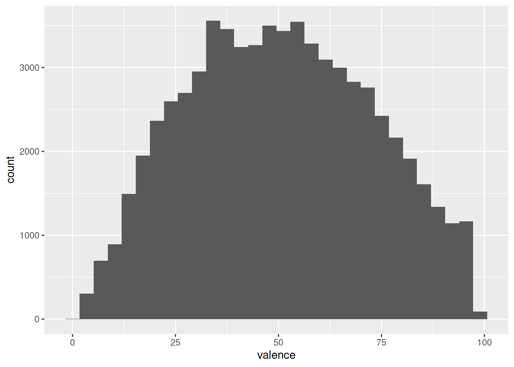

### Task 9

Create a scatter plot showing `youtube_views` and `shazam_counts` (Bonus: add a linear regression line). Interpret the plot briefly.


``` r
# provide your code here
ggplot(music_data, aes(x = youtube_views, y = shazam_counts)) +
    geom_point() + geom_smooth(method = "lm")
```

```
## `geom_smooth()` using formula = 'y ~ x'
```


On average Youtube views and Shazam counts show a positive coefficient in the linear regression. However, the relationship does not appear to be linear.

## Assignment 2


This assignment consists of four parts. When answering the questions, please remember to address the following points, where appropriate:

* Formulate the corresponding hypotheses and choose an appropriate statistical test
* Provide the reason for your choice and discuss if the assumptions of the test are met 
* Convert the variables to the appropriate type (e.g., factor variables)
* Create appropriate graphs to explore the data (e.g., plot of means incl. confidence intervals, histogram, boxplot)
* Provide appropriate descriptive statistics for the variables (e.g., mean, median, standard deviation, etc.)
* Report and interpret the test results accurately (including confidence intervals)  
* Finally, don't forget to report your research conclusion

When you are done with your analysis, click on "Knit to HTML" button above the code editor. This will create a HTML document of your results in the folder where the "assignment2.Rmd" file is stored. Open this file in your Internet browser to see if the output is correct. If the output is correct, submit the HTML file via Learn\@WU. The file name should be "assignment2_studendID_lastname.html".

### Assignment 2a

As a mobile app product manager, you are looking for ways to improve user engagement and in-app purchases. Your team has launched an A/B test to analyze the effect of a new user interface (UI) feature. You have data that contains information about user behavior within your app.

The data file contains the following variables:

* **userID:** Unique user ID.
* **exp_group:** Experimental group (indicator variable w/ 2 levels: 0 = control, 1 = treatment).
* **in_app_purchases:** Total amount spent by a user in the app in the past month (in USD).
* **time_in_app:** Average time a user spends in your app per session (in minutes).

Use R and appropriate methods to answer the following questions:

1. The finance department asks you to provide an estimate of the average amount spent by users through in-app purchases. Compute the 95% confidence interval for the mean amount spent and provide an interpretation of the interval.
2. You run an A/B test to analyze the effect of a new UI feature on in-app purchases and time spent in the app. The information regarding which group a user has been assigned to is stored in the variable "exp_group". Is there a significant difference regarding in-app purchases and time spent between users from the control and treatment groups? Please include the effect size (Cohen's d) and confidence intervals in your report.
3. Assume that you plan to run an experiment to test two different notification strategies. You randomly assign app users to the control and experimental conditions. How many users would you need to include in each group if you assume the effect size to be 0.1 for a significance level of 0.05 and power of 0.8?

### Data analysis

### Load data


``` r
app_user_data <- read.table("https://raw.githubusercontent.com/WU-RDS/MA2024/main/user_data_q1.csv",
    sep = ",", header = TRUE)  #read in data
head(app_user_data)
```

<div data-pagedtable="false">
  <script data-pagedtable-source type="application/json">
{"columns":[{"label":["userID"],"name":[1],"type":["int"],"align":["right"]},{"label":["exp_group"],"name":[2],"type":["int"],"align":["right"]},{"label":["in_app_purchases"],"name":[3],"type":["dbl"],"align":["right"]},{"label":["time_in_app"],"name":[4],"type":["dbl"],"align":["right"]}],"data":[{"1":"1","2":"0","3":"7.20","4":"18.55488"},{"1":"2","2":"0","3":"8.85","4":"23.28257"},{"1":"3","2":"0","3":"17.79","4":"17.73001"},{"1":"4","2":"0","3":"10.35","4":"17.03068"},{"1":"5","2":"0","3":"10.65","4":"11.44810"},{"1":"6","2":"0","3":"18.58","4":"18.95276"}],"options":{"columns":{"min":{},"max":[10]},"rows":{"min":[10],"max":[10]},"pages":{}}}
  </script>
</div>

``` r
str(app_user_data)
```

```
## 'data.frame':	1600 obs. of  4 variables:
##  $ userID          : int  1 2 3 4 5 6 7 8 9 10 ...
##  $ exp_group       : int  0 0 0 0 0 0 0 0 0 0 ...
##  $ in_app_purchases: num  7.2 8.85 17.79 10.35 10.65 ...
##  $ time_in_app     : num  18.6 23.3 17.7 17 11.4 ...
```


### Question 1

First, we take a look at the statistics for the amount spent for in app purchases our customers make and at the graph with the distribution of purchases made in app per customer.

To compute the confidence interval for the average customer, we will need the mean, the standard error and the critical value for a t-distribution (because we don't know exactly the variance in the population).


``` r
suppressPackageStartupMessages(library(ggplot2))
suppressPackageStartupMessages(library(psych))
suppressPackageStartupMessages(library(dplyr))
suppressPackageStartupMessages(library(ggstatsplot))
```


``` r
# First let's have a look at the purchases in the
# app in the data
psych::describe(app_user_data$in_app_purchases)
```

<div data-pagedtable="false">
  <script data-pagedtable-source type="application/json">
{"columns":[{"label":["vars"],"name":[1],"type":["dbl"],"align":["right"]},{"label":["n"],"name":[2],"type":["dbl"],"align":["right"]},{"label":["mean"],"name":[3],"type":["dbl"],"align":["right"]},{"label":["sd"],"name":[4],"type":["dbl"],"align":["right"]},{"label":["median"],"name":[5],"type":["dbl"],"align":["right"]},{"label":["trimmed"],"name":[6],"type":["dbl"],"align":["right"]},{"label":["mad"],"name":[7],"type":["dbl"],"align":["right"]},{"label":["min"],"name":[8],"type":["dbl"],"align":["right"]},{"label":["max"],"name":[9],"type":["dbl"],"align":["right"]},{"label":["range"],"name":[10],"type":["dbl"],"align":["right"]},{"label":["skew"],"name":[11],"type":["dbl"],"align":["right"]},{"label":["kurtosis"],"name":[12],"type":["dbl"],"align":["right"]},{"label":["se"],"name":[13],"type":["dbl"],"align":["right"]}],"data":[{"1":"1","2":"1600","3":"11.11889","4":"4.996944","5":"11.18","6":"11.08962","7":"4.922232","8":"0","9":"28.95","10":"28.95","11":"0.102741","12":"-0.1035079","13":"0.1249236"}],"options":{"columns":{"min":{},"max":[10]},"rows":{"min":[10],"max":[10]},"pages":{}}}
  </script>
</div>

``` r
ggplot(app_user_data, aes(in_app_purchases)) + geom_histogram(col = "white",
    fill = "lavenderblush3", bins = 50) + geom_vline(data = app_user_data %>%
    dplyr::summarise(mean = mean(in_app_purchases)),
    aes(xintercept = mean), linewidth = 0.7, color = "gray19") +
    labs(x = "Purchases", y = "Frequency") + ggtitle("Distribution of purchases per customer") +
    theme_minimal()
```


``` r
# Compute mean, standard error, and confidence
# interval for in-app purchases
mean_purchases <- mean(app_user_data$in_app_purchases)
sd_purchases <- sd(app_user_data$in_app_purchases)
n <- nrow(app_user_data)
se_purchases <- sd_purchases/sqrt(n)
df <- n - 1
t_crit <- qt(0.975, df)

# Confidence Interval
ci_lower <- mean_purchases - t_crit * se_purchases
ci_upper <- mean_purchases + t_crit * se_purchases

print(ci_lower)
```

```
## [1] 10.87386
```

``` r
print(ci_upper)
```

```
## [1] 11.36392
```

``` r
# Alternatively: get confidence interval from
# t.test
t.test(app_user_data$in_app_purchases)$conf.int
```

```
## [1] 10.87386 11.36392
## attr(,"conf.level")
## [1] 0.95
```


The confidence interval for in app purchases is CI =  [10.87;11.36]
Interpretation: If we take 100 samples and calculate the mean and confidence interval for each of them, then the true population mean would be included in 95% of these intervals. In the sample we have, this interval spans from 10.87 to 11.36.


### Question 2


We need to analyze if a new UI feature has an effect on in app purchases. We need to formulate the null hypothesis as the first step. In our case the null hypothesis is that the new UI feature has no effect on the mean in-app purchases, that there is no difference in the mean in-app purchases between two populations. The alternative hypothesis states that the new UI feature has an effect on the mean in-app purchases, meaning that there is a difference in the mean in-app purchases between the two populations.

We first transform the variable exp_group into a factor and inspect the data with descriptive statistics. It can be already seen that the mean of in app-purchases is higher in the treatment group. Next we visualize the data, for this we can use a boxplot. 

To test whether or not this difference is significant, we need to use an independent-means t-test, since we have different customers in each group, meaning that we have collected the data using a between-subjects design (the customers in one condition are independent of the customers in the other condition). The requirements are met:
1) the DV (in-app purchases) is measured on a ratio scale; 2) there are more than 30 observations in each group, so the data is normally distributed according to Central Limit Theorem; 3) the feature was assigned randomly, so the groups are independent; 4) Welch's t-test corrects for unequal variance.

We also then calculate the effect size (Cohen's d). Then we can also visualize the results of the test.


``` r
# Load necessary libraries
library(ggplot2)
library(data.table)
library(lsr)
library(pwr)
library(psych)

#making IV a factor
app_user_data$exp_group <- as.factor(app_user_data$exp_group)

#looking at descriptive statistics
describeBy(app_user_data$in_app_purchases, app_user_data$exp_group) #description of control and treatment groups
```

```
## 
##  Descriptive statistics by group 
## group: 0
##    vars   n  mean   sd median trimmed  mad min   max range skew kurtosis   se
## X1    1 800 10.08 4.84  10.05   10.05 4.75   0 26.21 26.21 0.09    -0.22 0.17
## ------------------------------------------------------------ 
## group: 1
##    vars   n  mean   sd median trimmed  mad min   max range skew kurtosis   se
## X1    1 800 12.15 4.94  12.27   12.12 4.98   0 28.95 28.95  0.1    -0.03 0.17
```

``` r
# Boxplot for In-App Purchases by Experimental Group
ggplot(app_user_data, aes(x = factor(exp_group), y = in_app_purchases, fill = factor(exp_group))) +
  geom_boxplot() +
  labs(title = "Boxplot of In-App Purchases by Experimental Group",
       x = "Group (0 = Control, 1 = Treatment)",
       y = "In-App Purchases (USD)") +
  scale_fill_manual(values = c("lightblue", "lightgreen")) +
  theme_minimal()
```


``` r
# t-test for differences in in-app purchases
t_test_purchases <- t.test(in_app_purchases ~ exp_group, data = app_user_data)
print(t_test_purchases)
```

```
## 
## 	Welch Two Sample t-test
## 
## data:  in_app_purchases by exp_group
## t = -8.4689, df = 1597.3, p-value < 2.2e-16
## alternative hypothesis: true difference in means between group 0 and group 1 is not equal to 0
## 95 percent confidence interval:
##  -2.550210 -1.591065
## sample estimates:
## mean in group 0 mean in group 1 
##        10.08357        12.15421
```

``` r
# Compute Cohen's d for in app purchases
cohen_d_purchases <- cohensD(in_app_purchases ~ exp_group, data = app_user_data)
print(cohen_d_purchases)
```

```
## [1] 0.4234454
```

``` r
#Visualization of test results
ggbetweenstats(
  data = app_user_data,
  plot.type = "box",
  x = exp_group, #2 groups
  y = in_app_purchases ,
  type = "p", #default
  effsize.type = "d", #display effect size (Cohen's d in output)
  messages = FALSE,
  bf.message = FALSE,
  mean.ci = TRUE,
  title = "Average revenue per customer by group"
) 
```


Interpretations: As we can see from the descriptive statistics and the plot for control and treatment groups, the in-app purchases are higher in the group that was exposed to the new UI feature. The t-test showed significant result because the p-value is smaller than 0,05, meaning that we can reject the null hypothesis that there is no difference in the mean of the in-app purchases. The p-value states that the probability of finding a difference of the observed magnitude or higher, if the null hypothesis was in fact true (if there was in fact no difference between the populations). For us it means that the new UI feature in fact has an effect on the average in-app purchases. Also: Since 0 (the hypothetical difference in means from H0) is not included in the interval, it confirms that we can reject the null hypothesis. The Cohen's d effect size value of 0.4234 suggests that the effect of the new UI feature is small to medium.

The plot shows us that in app purchases are higher in the treatment group (Mean = 12.15) compared to the control group (Mean = 10.08). This means that, on average, the in app purchases were 2.07 higher in the treatment group, compared to the control group. An independent-means t-test showed that this difference is significant: t(1597) = 8.47, p < .05 (95% CI = [1.59, 2.55]); effect size is small to medium = 0.42.


Now we can look at the influence of the new UI feature on the time spent in app.

First, we need to formulate the null hypothesis. In this case the null hypothesis is that the new UI feature has no effect on the mean time spent in app, that there is no difference in the mean time spent in app between two populations. The alternative hypothesis states that the new UI feature has an effect on the mean time spent in app, meaning that there is a difference in the mean time in app between the two populations. 

First, we inspect the data with descriptive statistics. It can be already seen that the mean of in app purchases is slightly higher in the treatment group. Next we visualize the data, for this we can use a boxplot. 

We can use the independent means t-test because again the necessary assumptions are met: 1) The dependent variable (time in app) is measured on an ratio scale; 2) We have more than 30 observations per group; 3) The groups are independent.

We also then calculate the effect size (Cohen's d). Then we can also visualize the results of the test.


``` r
describeBy(app_user_data$time_in_app, app_user_data$exp_group)
```

```
## 
##  Descriptive statistics by group 
## group: 0
##    vars   n  mean   sd median trimmed  mad  min   max range  skew kurtosis   se
## X1    1 800 19.99 4.98  19.83   20.02 5.03 4.76 36.45 31.69 -0.04    -0.04 0.18
## ------------------------------------------------------------ 
## group: 1
##    vars   n  mean   sd median trimmed  mad  min   max range skew kurtosis   se
## X1    1 800 21.92 5.02   21.7   21.88 4.81 7.41 39.11  31.7  0.1    -0.05 0.18
```

``` r
# Boxplot for Time Spent in the App
ggplot(app_user_data, aes(x = factor(exp_group), y = time_in_app, fill = factor(exp_group))) +
  geom_boxplot() +
  labs(title = "Boxplot of Time Spent in App by Experimental Group",
       x = "Group (0 = Control, 1 = Treatment)",
       y = "Time Spent in App (minutes)") +
  scale_fill_manual(values = c("lightblue", "lightgreen")) +
  theme_minimal()
```


``` r
# t-test for differences in time spent in app
t_test_time_in_app <- t.test(time_in_app ~ exp_group, data = app_user_data)
print(t_test_time_in_app)
```

```
## 
## 	Welch Two Sample t-test
## 
## data:  time_in_app by exp_group
## t = -7.7392, df = 1597.9, p-value = 1.762e-14
## alternative hypothesis: true difference in means between group 0 and group 1 is not equal to 0
## 95 percent confidence interval:
##  -2.426037 -1.444958
## sample estimates:
## mean in group 0 mean in group 1 
##        19.98501        21.92051
```

``` r
# Compute Cohen's d for in app purchases
cohen_d_time_in_app <- cohensD(time_in_app ~ exp_group, data = app_user_data)
print(cohen_d_time_in_app)
```

```
## [1] 0.3869598
```

``` r
#Visualization of test results
ggbetweenstats(
  data = app_user_data,
  plot.type = "box",
  x = exp_group, #2 groups
  y = time_in_app ,
  type = "p", #default
  effsize.type = "d", #display effect size (Cohen's d in output)
  messages = FALSE,
  bf.message = FALSE,
  mean.ci = TRUE,
  title = "Average revenue per customer by group"
) 
```


Interpretations: From the descriptive statistics and the boxplot, we can already see that the mean time spent in app is higher in the treatment group. However, we need to conduct the test to see if this result is significant. The t-test showed significant result because the p-value is smaller than 0,05, meaning that we can reject the null hypothesis that there is no difference in the mean of time spent in app. The p-value states that the probability of finding a difference of the observed magnitude or higher, if the null hypothesis was in fact true (if there was in fact no difference between the populations). For us it means that the new UI feature in fact has an effect on the average time spent in app. Also: Since 0 (the hypothetical difference in means from H0) is not included in the interval, it confirms that we can reject the null hypothesis. The Cohen's d effect size value of 0.387 suggests that the effect of the new UI feature is small to medium.

The plot shows us that time spent in app is higher in the treatment group (Mean = 21.92) compared to the control group (Mean = 19.99). This means that, on average, the time spent in app was 1.93 higher in the treatment group, compared to the control group. An independent-means t-test showed that this difference is significant: t(1598) = 7.74, p < .05 (95% CI = [1.45, 2.43]); effect size is small to medium = 0.387.


### Question 3

To define the number of users that should be placed in two different conditions, pwr.t.test() function should be used. If the goal of the experiment is to simply detect significant difference between the groups, the sample size definition should be based on two-sided test.

Given the effect size = 0.1, significance level = 0.05, and power = 0.8, sample size for each group will be:


``` r
# provide your code here (you can use multiple
# code chunks per question if you like)

# Power analysis for sample size calculation
sample_size <- pwr.t.test(d = 0.1, sig.level = 0.05,
    power = 0.8, type = "two.sample")
print(sample_size)
```

```
## 
##      Two-sample t test power calculation 
## 
##               n = 1570.733
##               d = 0.1
##       sig.level = 0.05
##           power = 0.8
##     alternative = two.sided
## 
## NOTE: n is number in *each* group
```

To achieve our desired effect size of 0.1, a significance level of 0.5 and a power of 0.8 we would need to include at least 1571 customers per group in the experiment.

### Assignment 2b

After conducting the experiment described above, you would like to find out whether push notifications can further improve user engagement with your mobile app. You expose a set of users, who were already exposed to the new UI feature, to push notifications and record the time they spend in the app before and after implementing the notifications.

You obtain a new data set with the following variables:

* **userID:** Unique user ID.
* **time_in_app_1:** Average time (in minutes) a user spends in your app per session before receiving push notifications.
* **time_in_app_2:** Average time (in minutes) a user spends in your app per session after receiving push notifications.

Use R and appropriate methods to answer the following question:

4. Did the push notifications lead to a significant increase in the time that users spend in the app compared to before the notifications were implemented ? Conduct an appropriate statistical test to determine if the difference is statistically significant. Please include the effect size (Cohen's d) and the confidence intervals in your report.

### Data analysis

### Load data


``` r
app_user_data_time <- read.table("https://raw.githubusercontent.com/WU-RDS/MA2024/main/user_data_q2.csv",
    sep = ",", header = TRUE)  #read in data
head(app_user_data_time)
```

<div data-pagedtable="false">
  <script data-pagedtable-source type="application/json">
{"columns":[{"label":["userID"],"name":[1],"type":["int"],"align":["right"]},{"label":["time_in_app_1"],"name":[2],"type":["dbl"],"align":["right"]},{"label":["time_in_app_2"],"name":[3],"type":["dbl"],"align":["right"]}],"data":[{"1":"1","2":"21.20","3":"29.96"},{"1":"2","2":"38.42","3":"26.40"},{"1":"3","2":"22.71","3":"27.37"},{"1":"4","2":"25.32","3":"30.71"},{"1":"5","2":"28.25","3":"30.77"},{"1":"6","2":"24.87","3":"25.69"}],"options":{"columns":{"min":{},"max":[10]},"rows":{"min":[10],"max":[10]},"pages":{}}}
  </script>
</div>

``` r
str(app_user_data_time)
```

```
## 'data.frame':	417 obs. of  3 variables:
##  $ userID       : int  1 2 3 4 5 6 7 8 9 10 ...
##  $ time_in_app_1: num  21.2 38.4 22.7 25.3 28.2 ...
##  $ time_in_app_2: num  30 26.4 27.4 30.7 30.8 ...
```
### Question 4

We want to examine if push notifications have an effect on average time a user spends in the app. The null hypothesis here is that there is no difference in the mean time spent in the app for the same customers between the presence and absence of push notifications. Because the observations come from the same population of customers (a within-subject design), we refer to the difference in the means for the same population when stating our hypotheses. The alternative hypothesis states that there is a difference between the time in app for the same customers.

We start our analysis with looking at the descriptive statistics and at the plot. Then we conduct a dependent means t-test to see if the difference is significant.


``` r
# provide your code here (you can use multiple
# code chunks per question if you like)

suppressPackageStartupMessages(library(Rmisc))
library(tidyr)

# Descriptive statistics
psych::describe(app_user_data_time[!is.na(app_user_data_time$time_in_app_2),
    c("time_in_app_1", "time_in_app_2")])
```

<div data-pagedtable="false">
  <script data-pagedtable-source type="application/json">
{"columns":[{"label":["vars"],"name":[1],"type":["int"],"align":["right"]},{"label":["n"],"name":[2],"type":["dbl"],"align":["right"]},{"label":["mean"],"name":[3],"type":["dbl"],"align":["right"]},{"label":["sd"],"name":[4],"type":["dbl"],"align":["right"]},{"label":["median"],"name":[5],"type":["dbl"],"align":["right"]},{"label":["trimmed"],"name":[6],"type":["dbl"],"align":["right"]},{"label":["mad"],"name":[7],"type":["dbl"],"align":["right"]},{"label":["min"],"name":[8],"type":["dbl"],"align":["right"]},{"label":["max"],"name":[9],"type":["dbl"],"align":["right"]},{"label":["range"],"name":[10],"type":["dbl"],"align":["right"]},{"label":["skew"],"name":[11],"type":["dbl"],"align":["right"]},{"label":["kurtosis"],"name":[12],"type":["dbl"],"align":["right"]},{"label":["se"],"name":[13],"type":["dbl"],"align":["right"]}],"data":[{"1":"1","2":"417","3":"25.20940","4":"5.125614","5":"25.27","6":"25.07236","7":"5.174274","8":"12.25","9":"40.92","10":"28.67","11":"0.24933971","12":"-0.06751811","13":"0.2510024"},{"1":"2","2":"417","3":"27.23995","4":"4.893298","5":"27.33","6":"27.32639","7":"4.892580","8":"13.52","9":"43.95","10":"30.43","11":"-0.06761595","12":"0.01387987","13":"0.2396258"}],"options":{"columns":{"min":{},"max":[10]},"rows":{"min":[10],"max":[10]},"pages":{}}}
  </script>
</div>

``` r
# Boxplot

time_data <- app_user_data_time |>
    drop_na(time_in_app_2) |>
    select(time_in_app_1, time_in_app_2) |>
    pivot_longer(cols = c(time_in_app_1, time_in_app_2),
        names_to = "push_notifications", values_to = "time_in_app")

ggplot(time_data, aes(x = push_notifications, y = time_in_app)) +
    geom_boxplot() + geom_jitter(alpha = 0.2, color = "lavenderblush4") +
    labs(x = "", y = "Time spent in app", title = "Boxplot of time in app by group") +
    theme_minimal()
```


``` r
# Paired t-test for time spent in app before and
# after push notifications
t_test_result <- t.test(app_user_data_time$time_in_app_2,
    app_user_data_time$time_in_app_1, paired = TRUE)
print(t_test_result)
```

```
## 
## 	Paired t-test
## 
## data:  app_user_data_time$time_in_app_2 and app_user_data_time$time_in_app_1
## t = 5.8341, df = 416, p-value = 1.088e-08
## alternative hypothesis: true mean difference is not equal to 0
## 95 percent confidence interval:
##  1.346398 2.714706
## sample estimates:
## mean difference 
##        2.030552
```

``` r
# Compute Cohen's d for paired samples
cohen_d_result <- cohensD(app_user_data_time$time_in_app_2,
    app_user_data_time$time_in_app_1, method = "paired")
print(cohen_d_result)
```

```
## [1] 0.2856969
```

``` r
# Visualization of the test
ggwithinstats(data = time_data, x = push_notifications,
    y = time_in_app, path.point = FALSE, path.mean = TRUE,
    title = "Time on site with or without push notifications",
    messages = FALSE, bf.message = FALSE, mean.ci = TRUE,
    effsize.type = "d"  # display effect size (Cohen's d in output)
)
```


Interpretation: It appears that there is a difference in the means from the descriptive statistics and the plots. To test whether it is significant, we need to run a t-test. This time we need a different version of the t-test because the same customers are observed for the app with and without push notifications (the same customers are shown both versions of the app). This means that we need a dependent means t-test, or paired samples t-test. The other assumptions are identical to the independent-means t-test. 

The p-value is lower than the significance level of 5% (p < .05), which means that we can reject the null hypothesis that there is no difference in the mean time in app between absence and presence of push notifications. The confidence interval confirms the conclusion to reject the null hypothesis since 0 is not contained in the range of plausible values.

The Cohen's d effect size of 0.2857 shows us that the effect is rather small.

The results of the experiment show that, on average, the same users used the app on average 2.03 minutes longer when it included the push notifications (Mean = 27.24) compared to the app without the push notifications (Mean = 25.21). This difference was significant: t(416) = 5.83, p < .05 (95% CI = [1.35, 2.72]); effect size is small = 0.29.

This means that it makes sense to include push notifications to the app as standard practice.


### Assignment 2c

As a marketing analyst for an online retailer, you're tasked with evaluating how different levels of GDPR-compliant behavioral targeting affect purchase behavior. Given the restrictions imposed by GDPR on using personal data, the retailer conducts an experiment with three levels of targeting:

1. No targeting: Users receive no targeted ads (default ad experience).
2. Segment-based targeting: Ads are tailored using aggregate-level data (e.g., based on product categories users browse, not their personal data).
3. Individual personalized behavioral targeting: Ads are personalized based on the specific behavior of individual users (using compliant first-party data).

You obtain a data set with the following variables:

* **customerID:** Unique customer ID.
* **revenue:** Total revenue generated by the customer during the experiment (in USD).
* **satisfaction:** Customer satisfaction score from a post-purchase survey (measured in 11 categories from 0 [very dissatisfied] to 10 [very satisfied]).
* **targeting:** Type of targeting the customer was exposed to (1 = no targeting, 2 = segment-based targeting, 3 = personalized behavioral targeting).

Use R and appropriate methods to answer the following question:

5. Are there significant differences in revenue between the three targeting strategies? 
6. Did the targeting strategy significantly influence customer satisfaction? 

### Data analysis

### Load data


``` r
targeting_data <- read.table("https://raw.githubusercontent.com/WU-RDS/MA2024/main/user_targeting_data.csv",
    sep = ",", header = TRUE)  #read in data
head(targeting_data)
```

<div data-pagedtable="false">
  <script data-pagedtable-source type="application/json">
{"columns":[{"label":["customerID"],"name":[1],"type":["int"],"align":["right"]},{"label":["targeting"],"name":[2],"type":["chr"],"align":["left"]},{"label":["revenue"],"name":[3],"type":["dbl"],"align":["right"]},{"label":["satisfaction"],"name":[4],"type":["int"],"align":["right"]}],"data":[{"1":"1","2":"Personalized Targeting","3":"217.03","4":"6"},{"1":"2","2":"Personalized Targeting","3":"181.27","4":"7"},{"1":"3","2":"Personalized Targeting","3":"182.09","4":"1"},{"1":"4","2":"Segment-Based Targeting","3":"180.97","4":"10"},{"1":"5","2":"Personalized Targeting","3":"142.71","4":"5"},{"1":"6","2":"Segment-Based Targeting","3":"115.86","4":"0"}],"options":{"columns":{"min":{},"max":[10]},"rows":{"min":[10],"max":[10]},"pages":{}}}
  </script>
</div>

``` r
str(targeting_data)
```

```
## 'data.frame':	300 obs. of  4 variables:
##  $ customerID  : int  1 2 3 4 5 6 7 8 9 10 ...
##  $ targeting   : chr  "Personalized Targeting" "Personalized Targeting" "Personalized Targeting" "Segment-Based Targeting" ...
##  $ revenue     : num  217 181 182 181 143 ...
##  $ satisfaction: int  6 7 1 10 5 0 10 9 5 4 ...
```

### Question 5

To answer the question of whether the type of targeting has an effect on revenue, we need to formulate the null hypothesis first. In this case, the null hypothesis is that the average level of sales is equal for all three targeting types. The alternative hypothesis states that mean revenue is not equal among three targeting types. 

The appropriate test for such a hypothesis is one-way ANOVA since we have a metric-scaled dependent variable and a categorical independent variable with more than two levels. First, we need to recode the independent variable into factor. Next we take a look at descriptive statistics for the data and create appropriate plots. 

Before we move to the formal test, we need to see if a series of assumptions are met, namely: 1) Independence of observations; 2) Distributional assumptions; 3) Homogeneity of variances.

Due to the fact that there are more than 30 observations in each group we can rely on the Central Limit Theorem to satisfy the distributional assumptions. We can still test this assumption using Shapiro-Wilk normality test and Q-Q plots. Homogeneity of variances can be checked with Levene’s test.

After checking that the assumptions are met, we can proceed with ANOVA and show also the plot for the test. Next we will briefly inspect the residuals of the ANOVA to see if the assumptions of the test really are justified.

The ANOVA result only tells us that the means of the three groups are not equal, but it does not tell us anything about which pairs of means are unequal. To find this out we need to conduct a post-hoc test.


``` r
# provide your code here (you can use multiple code chunks per question if you like)


targeting_data$targeting <- factor(targeting_data$targeting, 
                                   levels = c("Personalized Targeting", 
                                              "Segment-Based Targeting", 
                                              "No Targeting"))

#Descriptive statistics
describeBy(targeting_data$revenue, targeting_data$targeting)
```

```
## 
##  Descriptive statistics by group 
## group: Personalized Targeting
##    vars  n   mean    sd median trimmed   mad   min    max  range  skew kurtosis
## X1    1 90 158.33 27.45 159.56  159.58 28.32 79.61 217.03 137.42 -0.38    -0.33
##      se
## X1 2.89
## ------------------------------------------------------------ 
## group: Segment-Based Targeting
##    vars  n   mean    sd median trimmed   mad   min    max  range skew kurtosis
## X1    1 98 135.43 34.72 135.43  135.17 40.54 40.68 221.25 180.57 0.03    -0.29
##      se
## X1 3.51
## ------------------------------------------------------------ 
## group: No Targeting
##    vars   n   mean    sd median trimmed   mad   min    max  range skew kurtosis
## X1    1 112 117.97 30.62 121.21  117.98 29.01 28.87 193.63 164.76 -0.1    -0.05
##      se
## X1 2.89
```

``` r
#Visual inspection of data

ggplot(targeting_data,aes(x = targeting, y = revenue)) + 
  geom_boxplot() +
  geom_jitter(colour="red", alpha = 0.1) +
  theme_bw() +
  labs(x = "Targeting", y = "Revenue")+
  theme_bw() +
  theme(plot.title = element_text(hjust = 0.5,color = "#666666")) 
```

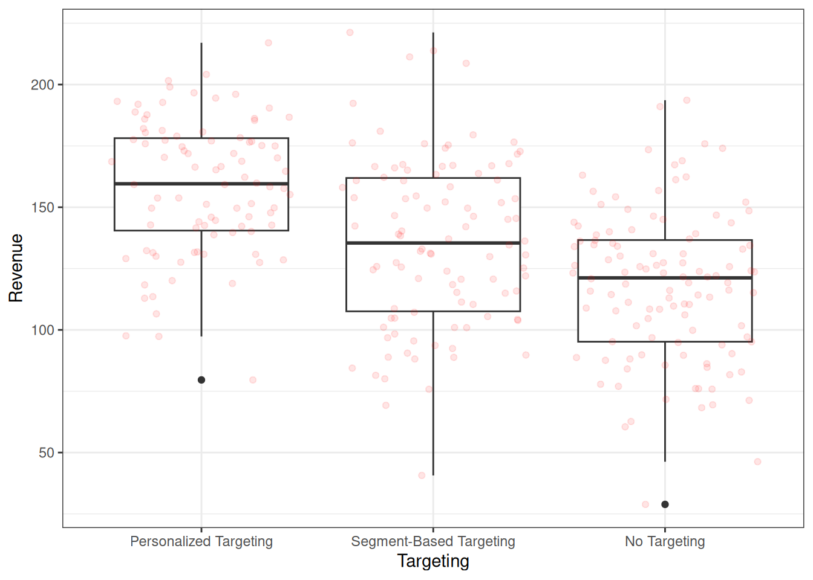

``` r
#Distributional assumptions - checking for normal distributions

#test for normal distribution of variables - Shapiro-Wilk test
by(targeting_data$revenue, targeting_data$targeting, shapiro.test)
```

```
## targeting_data$targeting: Personalized Targeting
## 
## 	Shapiro-Wilk normality test
## 
## data:  dd[x, ]
## W = 0.98123, p-value = 0.2199
## 
## ------------------------------------------------------------ 
## targeting_data$targeting: Segment-Based Targeting
## 
## 	Shapiro-Wilk normality test
## 
## data:  dd[x, ]
## W = 0.98853, p-value = 0.5629
## 
## ------------------------------------------------------------ 
## targeting_data$targeting: No Targeting
## 
## 	Shapiro-Wilk normality test
## 
## data:  dd[x, ]
## W = 0.99486, p-value = 0.9555
```

``` r
qqnorm(targeting_data[targeting_data$targeting == "Personalized Targeting", ]$revenue) 
qqline(targeting_data[targeting_data$targeting == "Personalized Targeting", ]$revenue)
```


``` r
qqnorm(targeting_data[targeting_data$targeting == "Segment-Based Targeting", ]$revenue) 
qqline(targeting_data[targeting_data$targeting == "Segment-Based Targeting", ]$revenue)
```


``` r
qqnorm(targeting_data[targeting_data$targeting == "No Targeting", ]$revenue) 
qqline(targeting_data[targeting_data$targeting == "No Targeting", ]$revenue)
```


``` r
#Homogeneity of variance

library(car)
```

```
## Loading required package: carData
```

``` r
leveneTest(revenue ~ targeting, data = targeting_data, center = mean)
```

<div data-pagedtable="false">
  <script data-pagedtable-source type="application/json">
{"columns":[{"label":["Df"],"name":[1],"type":["int"],"align":["right"]},{"label":["F value"],"name":[2],"type":["dbl"],"align":["right"]},{"label":["Pr(>F)"],"name":[3],"type":["dbl"],"align":["right"]}],"data":[{"1":"2","2":"2.617276","3":"0.07468479"},{"1":"297","2":"NA","3":"NA"}],"options":{"columns":{"min":{},"max":[10]},"rows":{"min":[10],"max":[10]},"pages":{}}}
  </script>
</div>

``` r
# Perform ANOVA for revenue across targeting strategies
anova_result <- aov(revenue ~ targeting, data = targeting_data)
summary(anova_result)
```

```
##              Df Sum Sq Mean Sq F value Pr(>F)    
## targeting     2  81290   40645    41.9 <2e-16 ***
## Residuals   297 288110     970                   
## ---
## Signif. codes:  0 '***' 0.001 '**' 0.01 '*' 0.05 '.' 0.1 ' ' 1
```

``` r
#Visualize the test
library(ggstatsplot)
ggbetweenstats(
  data = targeting_data,
  x = targeting,
  y = revenue,
  plot.type = "box",
  pairwise.comparisons = TRUE,
  pairwise.annotation = "p.value",
  p.adjust.method = "bonferroni",
  effsize.type = "eta", #if var.equal = FALSE, returns partial eta^2 
  var.equal = TRUE,
  mean.plotting = TRUE, 
  mean.ci = TRUE, 
  mean.label.size = 2.5,
  type = "parametric", 
  k = 3, 
  outlier.label.color = "darkgreen", 
  title = "Comparison of revenues between groups",
  xlab = "Experimental group", 
  ylab = "Revenue", 
  messages = FALSE,
  bf.message = FALSE,
)
```

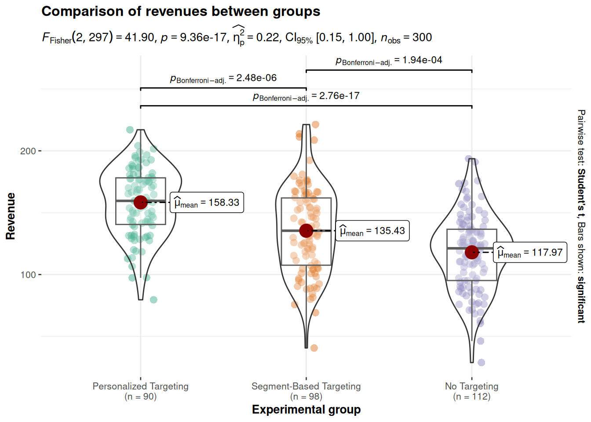

``` r
#Inspect the residuals
plot(anova_result,1)
```


``` r
plot(anova_result,2)
```

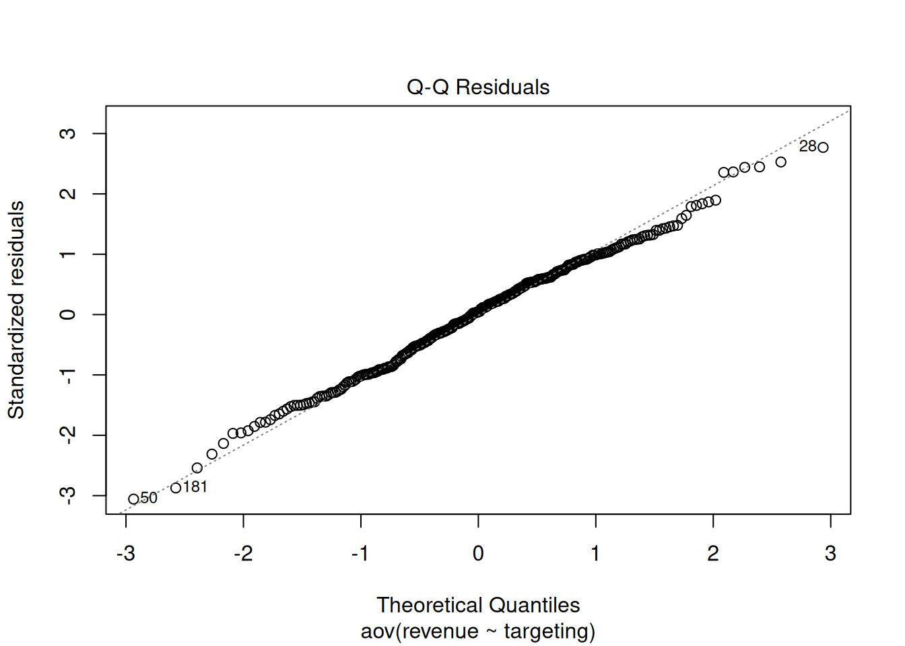

``` r
shapiro.test(resid(anova_result))
```

```
## 
## 	Shapiro-Wilk normality test
## 
## data:  resid(anova_result)
## W = 0.99499, p-value = 0.4388
```

``` r
#Effect size

summary(anova_result)[[1]]$"Sum Sq"[1]/(summary(anova_result)[[1]]$"Sum Sq"[1] +
    summary(anova_result)[[1]]$"Sum Sq"[2])
```

```
## [1] 0.2200593
```

``` r
# Tukey's post-hoc test for pairwise comparisons
tukey_result <- TukeyHSD(anova_result)
print(tukey_result)
```

```
##   Tukey multiple comparisons of means
##     95% family-wise confidence level
## 
## Fit: aov(formula = revenue ~ targeting, data = targeting_data)
## 
## $targeting
##                                                     diff       lwr       upr
## Segment-Based Targeting-Personalized Targeting -22.89817 -33.60926 -12.18709
## No Targeting-Personalized Targeting            -40.35672 -50.74238 -29.97106
## No Targeting-Segment-Based Targeting           -17.45855 -27.60645  -7.31064
##                                                    p adj
## Segment-Based Targeting-Personalized Targeting 0.0000025
## No Targeting-Personalized Targeting            0.0000000
## No Targeting-Segment-Based Targeting           0.0001909
```

``` r
plot(tukey_result)
```


``` r
# Boxplot for Revenue by Targeting Strategy
ggplot(targeting_data, aes(x = targeting, y = revenue, fill = targeting)) +
  geom_boxplot() +
  labs(title = "Boxplot of Revenue by Targeting Strategy",
       x = "Targeting Strategy",
       y = "Revenue (USD)") +
  scale_fill_manual(values = c("lightblue", "lightgreen", "lightcoral")) +
  theme_minimal()
```


Both the summary statistics and the plot show that the means are not equal among the three groups. Especially the difference between personalized targeting and no targeting seem to be quite high. 

First we check if the assumptions of ANOVA are met. The insignificant result of Shapiro-Wilk test shows that we cannot reject the null hypothesis that the residuals are normally distributed. The same we can see from the Q-Q plots.

The null hypothesis of Levene's test is that the variances are equal, with the alternative hypothesis being that the variances are not all equal. The insignificant result of this test demonstrates that variances are equal, so this assumption is also met. 

The ANOVA showed a p-value lower that 0.05, which means we can reject the null hypothesis that the mean revenue is the same for all three groups with different types of targeting. 

The Q-Q plots show us that the residuals are equally distributed, which is confirmed also by the insignificant result of the Shapiro-Wilk test. The null hypothesis for this test is that the distribution of residuals is normal. 

According to the test, the effect of different types of targeting on revenues was detected: F = 41.9, p < 0.05, with the effect size which is rather small η2 = 0.22. 

The Tukey's HSD test compares pairwise all three groups and we can see from the result that we can reject null hypothesis in all three case, which means that the revenue means are all significantly different from each other. It is clearly visible that none of the CIs cross the 0 bound, which further indicates that all differences in means are statistically significantly different from 0.

From a reporting standpoint we can say that revenue is higher when using personalized targeting. This means that personalized targeting helps us to increase sales and should thus be the preferred choice.

### Question 6

For this question we want to examine whether the customer satisfaction is significantly different for the groups with three different types of targeting. Because we are dealing with data on an ordinal scale, we cannot use ANOVA for this analysis. The non-parametric counterpart is the Kruskal-Wallis test, which tests for differences in medians between more than two groups. Hence, the null hypothesis is that the medians are equal in each group, and the alternative hypothesis is that there is a difference in medians.

First, we inspect the descriptive statistics and the plot. The only assumption for Kruskal-Wallis test is that the DV has to be at least ordinal scaled, and this assumption is met. 


``` r
# provide your code here (you can use multiple code chunks per question if you like)

#Descriptive statistics by for customer satisfaction by group
describeBy(targeting_data$satisfaction, targeting_data$targeting)
```

```
## 
##  Descriptive statistics by group 
## group: Personalized Targeting
##    vars  n mean   sd median trimmed  mad min max range  skew kurtosis   se
## X1    1 90 5.23 3.01      6    5.32 2.97   0  10    10 -0.19    -1.08 0.32
## ------------------------------------------------------------ 
## group: Segment-Based Targeting
##    vars  n mean   sd median trimmed  mad min max range  skew kurtosis   se
## X1    1 98    5 3.37      5       5 4.45   0  10    10 -0.02    -1.47 0.34
## ------------------------------------------------------------ 
## group: No Targeting
##    vars   n mean   sd median trimmed  mad min max range skew kurtosis   se
## X1    1 112 4.63 2.89      5    4.52 4.45   0  10    10 0.15    -1.14 0.27
```

``` r
# Boxplot for Satisfaction by Targeting Strategy
ggplot(targeting_data, aes(x = targeting, y = satisfaction, fill = targeting)) +
  geom_boxplot() +
  labs(title = "Boxplot of Customer Satisfaction by Targeting Strategy",
       x = "Targeting Strategy",
       y = "Satisfaction Score") +
  scale_fill_manual(values = c("lightblue", "lightgreen", "lightcoral")) +
  theme_minimal()
```


``` r
# Kruskal-Wallis test for satisfaction across targeting strategies
kruskal_result <- kruskal.test(satisfaction ~ targeting, data = targeting_data)
print(kruskal_result)
```

```
## 
## 	Kruskal-Wallis rank sum test
## 
## data:  satisfaction by targeting
## Kruskal-Wallis chi-squared = 2.0659, df = 2, p-value = 0.356
```

``` r
ggbetweenstats(
  data = targeting_data,
  plot.type = "box",
  x = targeting, #3 groups
  y = satisfaction,
  type = "nonparametric",
  pairwise.comparisons = TRUE,
  pairwise.annotation = "p.value",
  p.adjust.method = "bonferroni",
  messages = FALSE,
  title = "Median satisfaction for different targeting groups"
)
```


We can see from the descriptive statistics and from the boxplot that the median customer satisfaction for customers with personalized targeting is slightly higher (=6) than for other two targeting types (=5). 

The p-value of Kruskal-Wallis test is higher than 0.05, which indicates that we cannot reject the null hypothesis. This means that medians of customer satisfaction are not different among the targeting groups. 


### Assignment 2d

As a digital marketing manager, you want to evaluate the effectiveness of a new email subscription pop-up feature designed to increase newsletter signups. You run an A/B test where some visitors to your website see the new subscription pop-up, while others experience the regular sign-up option without a pop-up. Your goal is to compare the conversion rate (whether visitors signed up for the newsletter) between the control group (no pop-up) and the treatment group (pop-up).

You obtain a new data set with the following variables:

* **customerID:** Unique customer ID.
* **conversion:** Indicator variable for whether a visitor signed up for the newsletter (0 = no, 1 = yes).
* **exp_group:** Experimental group (0 = control, no pop-up; 1 = treatment, pop-up).

7. Did the new email subscription pop-up have a significant effect on the conversion rate? 

### Data analysis

### Load data


``` r
conversion_data <- read.table("https://raw.githubusercontent.com/WU-RDS/MA2024/main/conversion_data.csv",
    sep = ",", header = TRUE)  #read in data
head(conversion_data)
```

<div data-pagedtable="false">
  <script data-pagedtable-source type="application/json">
{"columns":[{"label":["customerID"],"name":[1],"type":["int"],"align":["right"]},{"label":["exp_group"],"name":[2],"type":["chr"],"align":["left"]},{"label":["conversion"],"name":[3],"type":["int"],"align":["right"]}],"data":[{"1":"1","2":"Control","3":"0"},{"1":"2","2":"Treatment","3":"0"},{"1":"3","2":"Treatment","3":"0"},{"1":"4","2":"Control","3":"0"},{"1":"5","2":"Control","3":"0"},{"1":"6","2":"Control","3":"0"}],"options":{"columns":{"min":{},"max":[10]},"rows":{"min":[10],"max":[10]},"pages":{}}}
  </script>
</div>

``` r
str(conversion_data)
```

```
## 'data.frame':	487 obs. of  3 variables:
##  $ customerID: int  1 2 3 4 5 6 7 8 9 10 ...
##  $ exp_group : chr  "Control" "Treatment" "Treatment" "Control" ...
##  $ conversion: int  0 0 0 0 0 0 1 1 1 1 ...
```
### Question 7

To find out if a new email subscription pop-up feature has an effect on the conversion rate, we can use a test for proportions. To test for the equality of proportions (and therefore no difference between them) we can use a Chi-squared test.

Our null hypothesis in this case states that the proportions of conversion are the same for groups with and without the subscription pop-up feature. Our alternative hypothesis states that these proportions are unequal. First, we have to recode the relevant variables into factors. Then we create a contingency table and a plot to take a look at the proportions of conversion rates in the control and treatment groups. We can then conduct the formal Chi-squared test to see if the difference in conversion rates is significant.


``` r
# provide your code here (you can use multiple code chunks per question if you like)

#Recoding variables into factors
conversion_data$exp_group <- factor(conversion_data$exp_group, 
                                   levels = c("Control", 
                                              "Treatment"))

conversion_data$conversion <- factor(conversion_data$conversion, levels = c(0,1), labels = c("no", "yes"))

# Create a contingency table for conversions
conversion_table <- table(conversion_data$exp_group, conversion_data$conversion)
print(conversion_table)
```

```
##            
##              no yes
##   Control   206  47
##   Treatment 165  69
```

``` r
prop.table(conversion_table, 1)
```

```
##            
##                    no       yes
##   Control   0.8142292 0.1857708
##   Treatment 0.7051282 0.2948718
```

``` r
#Visualization
rel_freq_table <- as.data.frame(prop.table(table(conversion_data$exp_group, conversion_data$conversion), 1))
names(rel_freq_table) <- c("exp_group", "conversion","freq") # changing names of the columns
rel_freq_table
```

<div data-pagedtable="false">
  <script data-pagedtable-source type="application/json">
{"columns":[{"label":["exp_group"],"name":[1],"type":["fct"],"align":["left"]},{"label":["conversion"],"name":[2],"type":["fct"],"align":["left"]},{"label":["freq"],"name":[3],"type":["dbl"],"align":["right"]}],"data":[{"1":"Control","2":"no","3":"0.8142292"},{"1":"Treatment","2":"no","3":"0.7051282"},{"1":"Control","2":"yes","3":"0.1857708"},{"1":"Treatment","2":"yes","3":"0.2948718"}],"options":{"columns":{"min":{},"max":[10]},"rows":{"min":[10],"max":[10]},"pages":{}}}
  </script>
</div>

``` r
ggplot(rel_freq_table, aes(x = exp_group, y = freq, fill = conversion)) + #plot data
  geom_col(width = .7) + #position
  geom_text(aes(label = paste0(round(freq*100,0),"%")), position = position_stack(vjust = 0.5), size = 4) + #add percentages
  ylab("Proportion of conversions") + xlab("Exp group") + # specify axis labels
  theme_bw()
```


``` r
# Proportion test to compare conversion rates between groups
prop_test_result <- prop.test(conversion_table)
print(prop_test_result)
```

```
## 
## 	2-sample test for equality of proportions with continuity correction
## 
## data:  conversion_table
## X-squared = 7.3844, df = 1, p-value = 0.006579
## alternative hypothesis: two.sided
## 95 percent confidence interval:
##  0.02942325 0.18877884
## sample estimates:
##    prop 1    prop 2 
## 0.8142292 0.7051282
```

``` r
table <- table(conversion_data$conversion,conversion_data$exp_group)
chisq.test(table, correct = TRUE)
```

```
## 
## 	Pearson's Chi-squared test with Yates' continuity correction
## 
## data:  table
## X-squared = 7.3844, df = 1, p-value = 0.006579
```

``` r
#effect size
test_stat <- chisq.test(conversion_table, correct = FALSE)$statistic
n <- nrow(conversion_data)
phi1 <- sqrt(test_stat/n)
phi1
```

```
## X-squared 
##  0.127962
```

We can see in the contingency table and in the plot that the conversion rate in the treatment group of 29% is higher than the conversion rate of 19% in the control group. To see if this difference is significant, we have to conduct the formal chi-squared test. It can be clearly seen from the test that p-value is lower than 0.05, so the result of the treatment on the conversion rate is statistically significant. We also calculated the effect size Phi: it is pretty small 0.128.

From the managerial perspective, it makes sense to include the new email subscription pop-up feature since it significantly increases the coversion rate, although the effect size is rather small.

## Assignment 3

### Assignment A

As a marketing manager at a consumer electronics company, you have been assigned the task of evaluating the effectiveness of various marketing activities on the sales of smart home devices (smart speakers). The company wants to understand the relative influence of leaflet promotions, in-store sales representatives, and radio advertising, as well as the impact of pricing on overall sales.

The dataset provided contains data from multiple stores over the past year. Each row in the dataset corresponds to a different store, detailing the sales performance of smart home devices alongside the store’s marketing investments and product pricing.

The following variables are available to you:

* Sales: Number of units sold in each store
* Price: Sale price of the product (in Euros)
* Marketing Contribution: Promotion costs for including the product in leaflets distributed by the store (in Euros)
* Sales Reps: Expenditure on in-store promotions managed by the company’s sales representatives (in Euros)
* Retail Media POS: Advertising expenses for marketing placements at the point of sale (in Euros)
* Region: Categorical variable indicating the region where the store is located (rural, suburban, or urban)

**Task Instructions**

Please conduct the following analyses:

1. Regression Equation: Formally state the regression equation you will use to determine the relative influence of each marketing activity and price on sales. Save the equation as a "formula" object in the R code chunk.

2. Variable Description: Describe the model variables using appropriate summary statistics and visualizations to provide a clear understanding of each variable’s distribution and scale.

3. Multiple Linear Regression Model: Estimate a multiple linear regression model to evaluate the relative influence of each variable. Before interpreting the results, assess whether the model meets the assumptions of linear regression. Use appropriate diagnostic tests and plots to evaluate these assumptions.

4. Alternative Model Specifications: If the model assumptions are not fully met, evaluate alternative model specifications using different functional forms. Justify your choice of model based on diagnostic criteria and model properties.

5. Model Interpretation: Interpret the results of the chosen model:

* Which variables have a significant influence on sales, and what do the coefficients imply about each variable’s effect?
* What is the relative importance of each predictor?
* Interpret the F-test results.
* How would you assess the fit of the model? Include a visualization of model fit for clarity.

6. Sales Prediction: Based on your chosen model, predict the sales quantity for a store planning the following marketing activities: Price: €350, Marketing Contribution: €10,000, Sales Reps: €6,000, Retail Media POS: €3,000. Provide the equation you used for the prediction.

7. Assess to what extent customers from different regions differ regarding their price sensitivity. Are customers from urban and suburban areas more or less price-sensitive compared to rural areas? Provide a detailed explanation of your analysis and results.

When you have completed your analysis, click the “Knit to HTML” button above the code editor. This will generate an HTML document of your results in the folder where the "assignment3.Rmd" file is stored. Open the HTML file in your Internet browser to verify the output. Once verified, submit the HTML file via Canvas. Name the file: “assignment3_studentID_name.html”.

### Data analysis

### Load data


``` r
sales_data <- read.csv("https://raw.githubusercontent.com/WU-RDS/MA2024/main/data/assignment3.csv",
    header = TRUE)  #read in data
head(sales_data)
```

<div data-pagedtable="false">
  <script data-pagedtable-source type="application/json">
{"columns":[{"label":["StoreID"],"name":[1],"type":["int"],"align":["right"]},{"label":["Sales"],"name":[2],"type":["int"],"align":["right"]},{"label":["Price"],"name":[3],"type":["dbl"],"align":["right"]},{"label":["MarketingContribution"],"name":[4],"type":["dbl"],"align":["right"]},{"label":["SalesReps"],"name":[5],"type":["dbl"],"align":["right"]},{"label":["RetailMediaPOS"],"name":[6],"type":["dbl"],"align":["right"]},{"label":["Region"],"name":[7],"type":["chr"],"align":["left"]}],"data":[{"1":"1","2":"89","3":"391.48","4":"8006.62","5":"2361.92","6":"1413.25","7":"Rural"},{"1":"2","2":"137","3":"393.71","4":"8964.35","5":"6236.37","6":"2711.37","7":"Rural"},{"1":"3","2":"112","3":"328.61","4":"7485.83","5":"2983.50","6":"1150.83","7":"Suburban"},{"1":"4","2":"59","3":"383.04","4":"4040.16","5":"3060.82","6":"1950.54","7":"Urban"},{"1":"5","2":"125","3":"364.17","4":"8791.86","5":"5065.14","6":"1984.27","7":"Suburban"},{"1":"6","2":"104","3":"351.91","4":"8644.35","5":"4031.30","6":"1667.79","7":"Urban"}],"options":{"columns":{"min":{},"max":[10]},"rows":{"min":[10],"max":[10]},"pages":{}}}
  </script>
</div>

``` r
str(sales_data)
```

```
## 'data.frame':	1460 obs. of  7 variables:
##  $ StoreID              : int  1 2 3 4 5 6 7 8 9 10 ...
##  $ Sales                : int  89 137 112 59 125 104 74 131 121 145 ...
##  $ Price                : num  391 394 329 383 364 ...
##  $ MarketingContribution: num  8007 8964 7486 4040 8792 ...
##  $ SalesReps            : num  2362 6236 2984 3061 5065 ...
##  $ RetailMediaPOS       : num  1413 2711 1151 1951 1984 ...
##  $ Region               : chr  "Rural" "Rural" "Suburban" "Urban" ...
```

``` r
library(tidyverse)
library(psych)
library(Hmisc)
library(ggstatsplot)
library(ggcorrplot)
library(car)
library(lmtest)
```

```
## Loading required package: zoo
```

``` r
library(lm.beta)
options(scipen = 999)
set.seed(123)
```

### Question 1


In a first step, we specify the regression equation. In this case, sales of home devices is the dependent variable, and predictors for store i are 1) price, 2) promotion costs, 3) expenditures on sales representatives, 4) costs for marketing placements at POS.


$$
Sales_i=\beta_0 + \beta_1 * Price_i + \beta_2 * MarketingContribution_i + \beta_3 * SalesReps_i + \beta_4 * RetailMediaPOS_i + \epsilon_i
$$

This equation will be used later to turn the output of the regression analysis (namely the coefficients: β0 - intersect coefficient, and β1, β2, and β3 that represent the unknown relationship between sales and Price, MarketingContribution, SalesReps, SalesMediaPOS to the “managerial” form and draw marketing conclusions.

With the following code we are saving the formula: 


``` r
formula <- Sales ~ Price + MarketingContribution +
    SalesReps + RetailMediaPOS
```


### Question 2

Inspecting the variables with descriptive statistics:


``` r
# descriptive statistics can be checked with the
# following code
psych::describe(sales_data)
```

<div data-pagedtable="false">
  <script data-pagedtable-source type="application/json">
{"columns":[{"label":["vars"],"name":[1],"type":["int"],"align":["right"]},{"label":["n"],"name":[2],"type":["dbl"],"align":["right"]},{"label":["mean"],"name":[3],"type":["dbl"],"align":["right"]},{"label":["sd"],"name":[4],"type":["dbl"],"align":["right"]},{"label":["median"],"name":[5],"type":["dbl"],"align":["right"]},{"label":["trimmed"],"name":[6],"type":["dbl"],"align":["right"]},{"label":["mad"],"name":[7],"type":["dbl"],"align":["right"]},{"label":["min"],"name":[8],"type":["dbl"],"align":["right"]},{"label":["max"],"name":[9],"type":["dbl"],"align":["right"]},{"label":["range"],"name":[10],"type":["dbl"],"align":["right"]},{"label":["skew"],"name":[11],"type":["dbl"],"align":["right"]},{"label":["kurtosis"],"name":[12],"type":["dbl"],"align":["right"]},{"label":["se"],"name":[13],"type":["dbl"],"align":["right"]}],"data":[{"1":"1","2":"1460","3":"730.500000","4":"421.6100094","5":"730.500","6":"730.500000","7":"541.14900","8":"1.00","9":"1460.00","10":"1459.00","11":"0.00000000","12":"-1.20246603","13":"11.03403825"},{"1":"2","2":"1460","3":"131.278767","4":"29.7819991","5":"128.000","6":"129.782534","7":"29.65200","8":"57.00","9":"250.00","10":"193.00","11":"0.48299957","12":"0.04463889","13":"0.77943054"},{"1":"3","2":"1460","3":"348.855219","4":"29.1391074","5":"348.070","6":"348.699675","7":"37.65063","8":"300.02","9":"399.94","10":"99.92","11":"0.04064067","12":"-1.21817760","13":"0.76260529"},{"1":"4","2":"1460","3":"7550.748096","4":"2637.6067793","5":"7650.520","6":"7557.892628","7":"3417.94897","8":"3003.36","9":"11997.87","10":"8994.51","11":"-0.03812799","12":"-1.23926459","13":"69.02932433"},{"1":"5","2":"1460","3":"5075.157644","4":"1749.5662514","5":"5081.560","6":"5088.025839","7":"2253.35185","8":"2002.30","9":"7998.99","10":"5996.69","11":"-0.04156755","12":"-1.24701453","13":"45.78824151"},{"1":"6","2":"1460","3":"3028.719418","4":"1152.8164744","5":"3074.765","6":"3033.752663","7":"1447.17327","8":"1002.75","9":"4998.96","10":"3996.21","11":"-0.04237390","12":"-1.15931275","13":"30.17058605"},{"1":"7","2":"1460","3":"1.989726","4":"0.8055862","5":"2.000","6":"1.987158","7":"1.48260","8":"1.00","9":"3.00","10":"2.00","11":"0.01858430","12":"-1.45992653","13":"0.02108315"}],"options":{"columns":{"min":{},"max":[10]},"rows":{"min":[10],"max":[10]},"pages":{}}}
  </script>
</div>

Inspecting the correlation matrix reveals that the sales variable is positively correlated with MarketingContribution, SalesReps and RetailMediaPOS.


``` r
rcorr(as.matrix(sales_data[, c("Sales", "Price", "MarketingContribution",
    "SalesReps", "RetailMediaPOS")]))
```

```
##                       Sales Price MarketingContribution SalesReps
## Sales                  1.00 -0.51                  0.52      0.43
## Price                 -0.51  1.00                 -0.01     -0.04
## MarketingContribution  0.52 -0.01                  1.00      0.01
## SalesReps              0.43 -0.04                  0.01      1.00
## RetailMediaPOS         0.32 -0.03                  0.02      0.03
##                       RetailMediaPOS
## Sales                           0.32
## Price                          -0.03
## MarketingContribution           0.02
## SalesReps                       0.03
## RetailMediaPOS                  1.00
## 
## n= 1460 
## 
## 
## P
##                       Sales  Price  MarketingContribution SalesReps
## Sales                        0.0000 0.0000                0.0000   
## Price                 0.0000        0.7766                0.1232   
## MarketingContribution 0.0000 0.7766                       0.7751   
## SalesReps             0.0000 0.1232 0.7751                         
## RetailMediaPOS        0.0000 0.2149 0.4726                0.2988   
##                       RetailMediaPOS
## Sales                 0.0000        
## Price                 0.2149        
## MarketingContribution 0.4726        
## SalesReps             0.2988        
## RetailMediaPOS
```


``` r
# Since we have continuous variables, we use
# scatterplots to investigate the relationship
# between sales and each of the predictor
# variables.

# relationship of Price and Sales
ggplot(sales_data, aes(x = Price, y = Sales)) + geom_point(shape = 1) +
    geom_smooth(method = "lm", fill = "gray", color = "lavenderblush3",
        alpha = 0.1) + theme_minimal()
```

```
## `geom_smooth()` using formula = 'y ~ x'
```

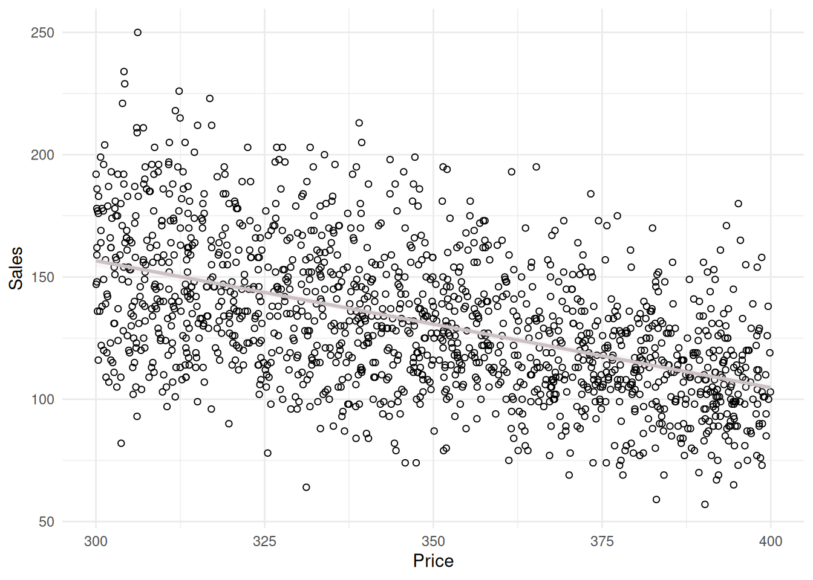

``` r
# relationship of MarketingContribution and Sales
ggplot(sales_data, aes(x = MarketingContribution, y = Sales)) +
    geom_point(shape = 1) + geom_smooth(method = "lm",
    fill = "gray", color = "lavenderblush3", alpha = 0.1) +
    theme_minimal()
```

```
## `geom_smooth()` using formula = 'y ~ x'
```


``` r
# relationship of SalesReps and Sales
ggplot(sales_data, aes(x = SalesReps, y = Sales)) +
    geom_point(shape = 1) + geom_smooth(method = "lm",
    fill = "gray", color = "lavenderblush3", alpha = 0.1) +
    theme_minimal()
```

```
## `geom_smooth()` using formula = 'y ~ x'
```


``` r
# relationship of RetailMediaPOS
ggplot(sales_data, aes(x = RetailMediaPOS, y = Sales)) +
    geom_point(shape = 1) + geom_smooth(method = "lm",
    fill = "gray", color = "lavenderblush3", alpha = 0.1) +
    theme_minimal()
```

```
## `geom_smooth()` using formula = 'y ~ x'
```

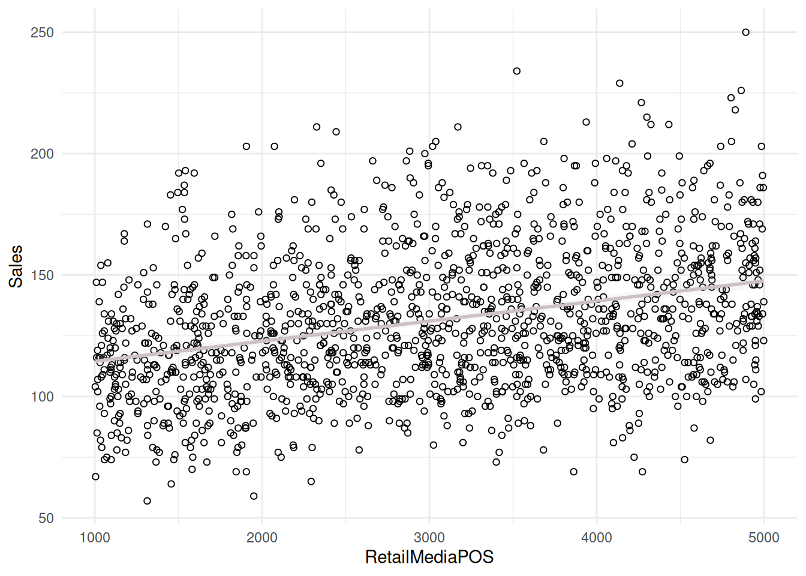


The plots including the fitted lines from a simple linear model suggest that there might be a positive relationship between sales and the predictors. However, the relationships between sales and independent variables appear to be rather weak. It appears more that the effect of independent variables is decreasing with increasing budget spent on these marketing activities. 

Further steps include estimate of a multiple linear regression model in order to determine if linear specification fits the model.


### Question 3

First, we estimate the model with the lm() function. But before we can inspect and interpret the results, we need to test if there might be potential problems with our model specification.


``` r
# Estimate linear model
linear_model <- lm(formula, data = sales_data)
summary(linear_model)
```

```
## 
## Call:
## lm(formula = formula, data = sales_data)
## 
## Residuals:
##     Min      1Q  Median      3Q     Max 
## -44.724  -9.856  -0.440   8.901  61.537 
## 
## Coefficients:
##                          Estimate  Std. Error t value            Pr(>|t|)    
## (Intercept)           201.7441553   4.9359563   40.87 <0.0000000000000002 ***
## Price                  -0.4886969   0.0129089  -37.86 <0.0000000000000002 ***
## MarketingContribution   0.0056953   0.0001425   39.98 <0.0000000000000002 ***
## SalesReps               0.0068560   0.0002150   31.89 <0.0000000000000002 ***
## RetailMediaPOS          0.0073364   0.0003262   22.49 <0.0000000000000002 ***
## ---
## Signif. codes:  0 '***' 0.001 '**' 0.01 '*' 0.05 '.' 0.1 ' ' 1
## 
## Residual standard error: 14.35 on 1455 degrees of freedom
## Multiple R-squared:  0.7685,	Adjusted R-squared:  0.7679 
## F-statistic:  1208 on 4 and 1455 DF,  p-value: < 0.00000000000000022
```


``` r
# Outliers
sales_data$stud_resid <- rstudent(linear_model)
plot(1:nrow(sales_data), sales_data$stud_resid, ylim = c(-3.3,
    3.3))  #create scatterplot 
abline(h = c(-3, 3), col = "red", lty = 2)  #add reference lines
```

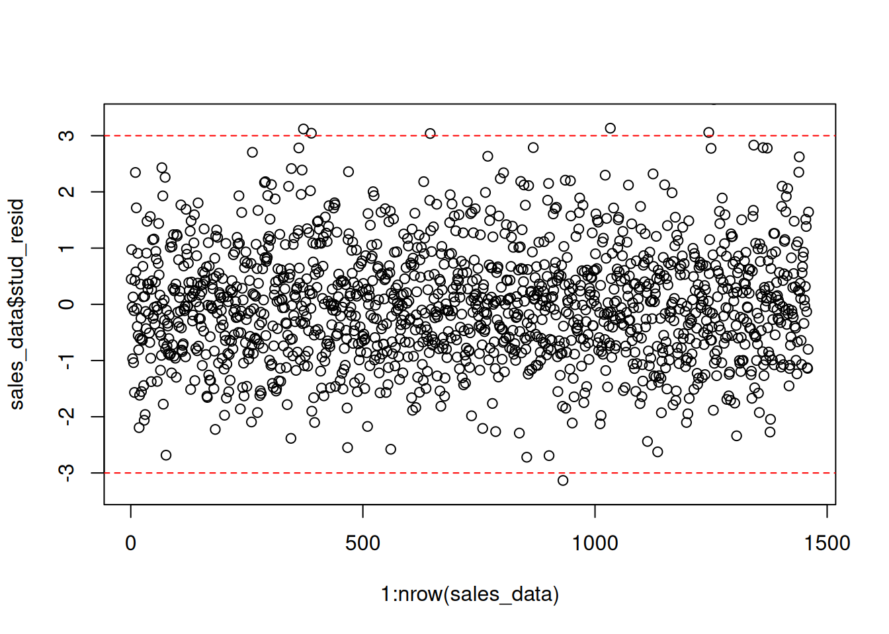

To check for outliers, we extract the studentized residuals from our model and test if there are any absolute values larger than 3. Since there are many residuals with absolute values larger than 3, we conclude that there are many outliers.


``` r
# influential observation
plot(linear_model, 4)
```


``` r
plot(linear_model, 5)
```

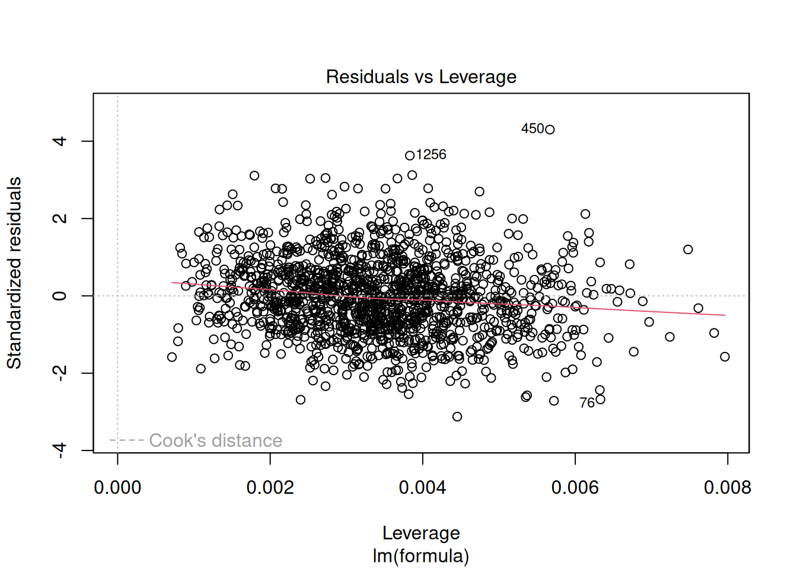

To test for influential observations, we use Cook’s Distance. To identify influential observations, we should look at values above 1 in the first plot. It is easy to see that all of the Cook’s distance values are below the cutoff of 1.  In the second plot we should watch out for the outlying values at the upper right corner or at the lower right corner of the plot. Those spots are the places where cases can be influential against a regression line. In our example, both plots show that there are no influential cases.


``` r
# Heteroscedasticity

plot(linear_model, 1)
```


``` r
# Breusch Pagan test
bptest(linear_model)
```

```
## 
## 	studentized Breusch-Pagan test
## 
## data:  linear_model
## BP = 95.594, df = 4, p-value < 0.00000000000000022
```


Next, we test if a linear specification appears feasible. We can look at the residuals plot to see if the linear specification is appropriate. This plot helps us to determine if error variances are equal, which is an assumption of the linear model. The red line is a smoothed curve through the residuals plot and if it deviates from the dashed grey horizontal line a lot, it means that the linear model specification is not a correct choice. In this example, the red line is rather far from the dashed grey line, so this assumption seems to be not met. 

Also, the residual variance (i.e., the spread of the values on the y-axis) should be similar across the scale of the fitted values on the x-axis, but we can observe a slight funnel shape, which indicates non-constant variances in the errors, so we can conduct Breusch Pagan test to confirm it. The null hypothesis for this test is that the error variances are equal, so the significant p-value <0,05 indicates that the error variances aren't equal, which indicates that the assumption of homoscedasticity is not met.


Next, we test if the residuals are approximately normally distributed using the Q-Q plot from the output and a Shapiro Wilk test.


``` r
# Non-normally distributed errors

plot(linear_model, 2)
```

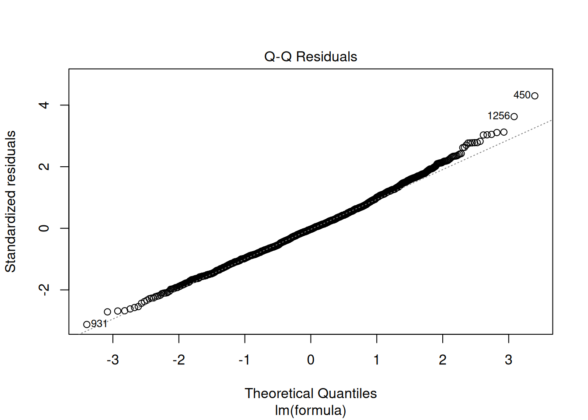

``` r
shapiro.test(resid(linear_model))
```

```
## 
## 	Shapiro-Wilk normality test
## 
## data:  resid(linear_model)
## W = 0.99521, p-value = 0.0001326
```

To check for normal distribution of the residuals, we need to conduct a Shapiro-Wilk test, the null hypothesis for it is that the residuals are normally distributed. So the significant p-value <0,05 indicates that the error variances aren't equal, which indicates that the assumption of normally distributed error term is not met.

Correlation of errors: We actually wouldn’t need to test this assumption here since there is not natural order in the data.


``` r
#Multicollinearity

rcorr(as.matrix(sales_data[,c("Price","MarketingContribution","SalesReps", "RetailMediaPOS")]))
```

```
##                       Price MarketingContribution SalesReps RetailMediaPOS
## Price                  1.00                 -0.01     -0.04          -0.03
## MarketingContribution -0.01                  1.00      0.01           0.02
## SalesReps             -0.04                  0.01      1.00           0.03
## RetailMediaPOS        -0.03                  0.02      0.03           1.00
## 
## n= 1460 
## 
## 
## P
##                       Price  MarketingContribution SalesReps RetailMediaPOS
## Price                        0.7766                0.1232    0.2149        
## MarketingContribution 0.7766                       0.7751    0.4726        
## SalesReps             0.1232 0.7751                          0.2988        
## RetailMediaPOS        0.2149 0.4726                0.2988
```

``` r
plot(sales_data[,c("Price","MarketingContribution","SalesReps", "RetailMediaPOS")])
```


``` r
ggcorrmat(
  data = sales_data[,c("Price","MarketingContribution","SalesReps", "RetailMediaPOS")],
  matrix.type = "upper",
  colors = c("skyblue4", "white", "palevioletred4")
  #title = "Correlalogram of independent variables",
)
```


``` r
vif(linear_model)
```

```
##                 Price MarketingContribution             SalesReps 
##              1.002665              1.000446              1.002351 
##        RetailMediaPOS 
##              1.002069
```

To test for linear dependence of the regressors, we first test the bivariate correlations for any extremely high correlations (i.e., >0.8). We can see that bivariate correlations are not high among independent variable, so this assumption is met.

In the next step, we compute the variance inflation factor for each predictor variable. The values should be close to 1 and values larger than 4 indicate potential problems with the linear dependence of regressors, but in our model we don't see any such values. 

### Question 4

It appears that a linear model might not represent the data well. It rather appears that the effect of an additional Euro spend on different marketing activities is decreasing with increasing levels of advertising expenditures. Thus, we can assume decreasing marginal returns.  Plus, the assumptions of linear specification like absence of outliers, homoscedasticity and normally distributed residuals.

In this case, a multiplicative model might be a better representation of the data.


``` r
log_reg <- lm(log(Sales) ~ log(Price) + log(MarketingContribution) +
    log(SalesReps) + log(RetailMediaPOS), data = sales_data)
summary(log_reg)
```

```
## 
## Call:
## lm(formula = log(Sales) ~ log(Price) + log(MarketingContribution) + 
##     log(SalesReps) + log(RetailMediaPOS), data = sales_data)
## 
## Residuals:
##      Min       1Q   Median       3Q      Max 
## -0.31586 -0.07091 -0.00092  0.06816  0.32443 
## 
## Coefficients:
##                             Estimate Std. Error t value            Pr(>|t|)    
## (Intercept)                 6.475026   0.213041   30.39 <0.0000000000000002 ***
## log(Price)                 -1.304723   0.031844  -40.97 <0.0000000000000002 ***
## log(MarketingContribution)  0.302317   0.006875   43.98 <0.0000000000000002 ***
## log(SalesReps)              0.248789   0.006984   35.62 <0.0000000000000002 ***
## log(RetailMediaPOS)         0.154664   0.006114   25.30 <0.0000000000000002 ***
## ---
## Signif. codes:  0 '***' 0.001 '**' 0.01 '*' 0.05 '.' 0.1 ' ' 1
## 
## Residual standard error: 0.1018 on 1455 degrees of freedom
## Multiple R-squared:  0.8009,	Adjusted R-squared:  0.8004 
## F-statistic:  1464 on 4 and 1455 DF,  p-value: < 0.00000000000000022
```

We can check again the assumptions to see if the multiplicative specification fits the model better and if we can interpret the results of this model.


``` r
# Outliers
sales_data$stud_resid_1 <- rstudent(log_reg)
plot(1:nrow(sales_data), sales_data$stud_resid_1, ylim = c(-3.3,
    3.3))  #create scatterplot 
abline(h = c(-3, 3), col = "red", lty = 2)  #add reference lines
```

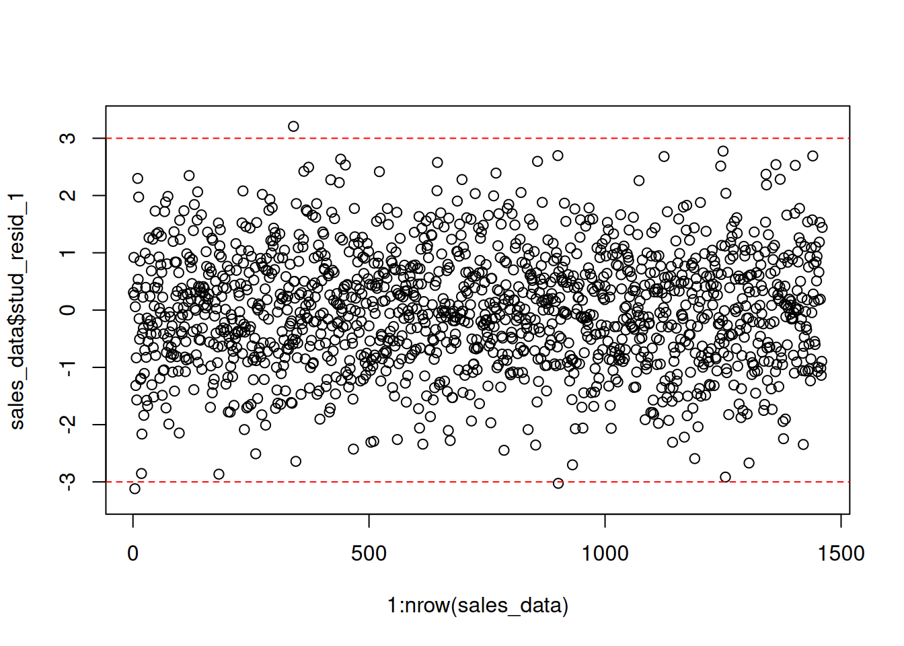

``` r
# influential observation
plot(log_reg, 4)
```


``` r
plot(log_reg, 5)
```


We can see that in comparison with the plot of the linear model, there are fewer outliers, namely values of studentized residuals more than 3 and less than -3. 


We check now if the assumption of constant variance is met, which was not the case in the linear specification.


``` r
# Heteroscedasticity

plot(log_reg, 1)
```

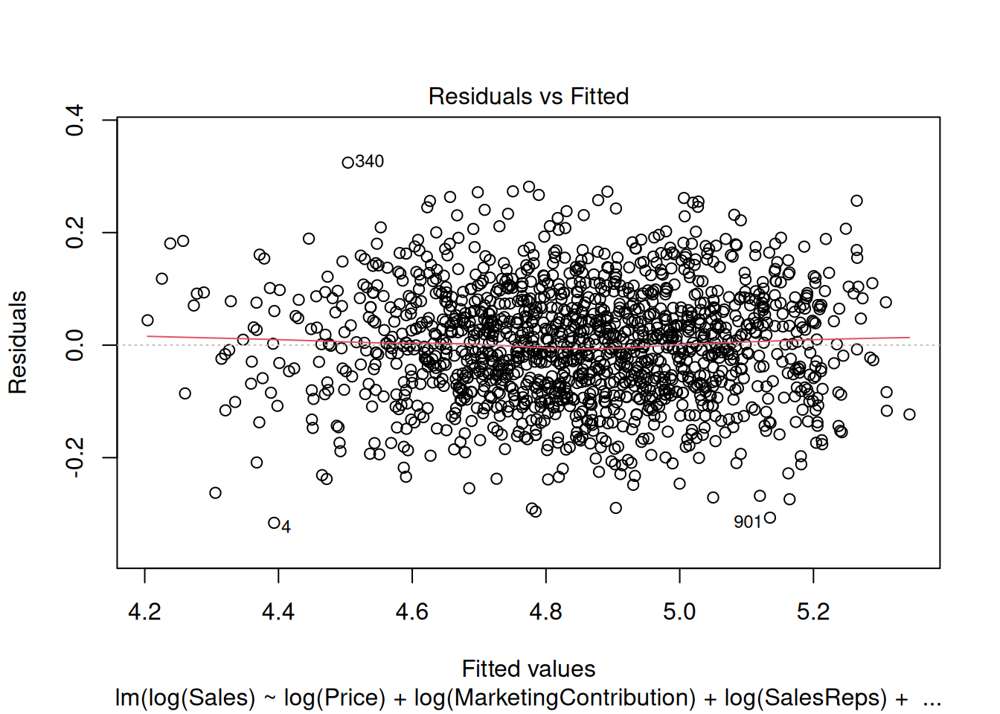

``` r
# Breusch Pagan test
bptest(log_reg)
```

```
## 
## 	studentized Breusch-Pagan test
## 
## data:  log_reg
## BP = 3.7846, df = 4, p-value = 0.4359
```

In the plot, we can now observe that the values are more equally distributed along the line. We also conduct Breusch Pagan test. The null hypothesis for this test is that the error variances are equal, so the significant p-value of 0.6857 indicates that we cannot reject the null hypothesis, so the error variances are equal, which indicates that the assumption of homoscedasticity is met for this model.

Next we check if the residuals are normally distributed, which wasn't the case in the linear model. 


``` r
# Non-normally distributed errors

plot(log_reg, 2)
```


``` r
shapiro.test(resid(log_reg))
```

```
## 
## 	Shapiro-Wilk normality test
## 
## data:  resid(log_reg)
## W = 0.99932, p-value = 0.8931
```

The null hypothesis of this Shaprio Wilk test is that the residuals are normally distributed. Since the p-value of the test is 0.8898 we cannot reject the null hypothesis, so the residuals in this model are normally distributed unlike in the linear specification.

Looking at the added variable plots, we can conclude that each predictor appears to have a unique contribution to explaining the variance in the dependent variable. 


``` r
# Non-linear relationships
avPlots(log_reg, col.lines = palette()[2])
```


And finally, we check for multicollinearity, 


``` r
# Multicollinearity

vif(log_reg)
```

```
##                 log(Price) log(MarketingContribution) 
##                   1.002559                   1.000478 
##             log(SalesReps)        log(RetailMediaPOS) 
##                   1.002574                   1.002015
```
Here, all vif values are well below the cutoff, indicating that there are no problems with multicollinearity.

All assumption are met for the multiplicative model, log-log transformed model represents our data well, so we can proceed with the interpretation.

### Question 5

In a next step, we will investigate the results from the model.


``` r
summary(log_reg)
```

```
## 
## Call:
## lm(formula = log(Sales) ~ log(Price) + log(MarketingContribution) + 
##     log(SalesReps) + log(RetailMediaPOS), data = sales_data)
## 
## Residuals:
##      Min       1Q   Median       3Q      Max 
## -0.31586 -0.07091 -0.00092  0.06816  0.32443 
## 
## Coefficients:
##                             Estimate Std. Error t value            Pr(>|t|)    
## (Intercept)                 6.475026   0.213041   30.39 <0.0000000000000002 ***
## log(Price)                 -1.304723   0.031844  -40.97 <0.0000000000000002 ***
## log(MarketingContribution)  0.302317   0.006875   43.98 <0.0000000000000002 ***
## log(SalesReps)              0.248789   0.006984   35.62 <0.0000000000000002 ***
## log(RetailMediaPOS)         0.154664   0.006114   25.30 <0.0000000000000002 ***
## ---
## Signif. codes:  0 '***' 0.001 '**' 0.01 '*' 0.05 '.' 0.1 ' ' 1
## 
## Residual standard error: 0.1018 on 1455 degrees of freedom
## Multiple R-squared:  0.8009,	Adjusted R-squared:  0.8004 
## F-statistic:  1464 on 4 and 1455 DF,  p-value: < 0.00000000000000022
```

The intercept tells us the amount of sales if all the marketing expenditures would be 0. The following variables have a significant influence on sales because for them the p-value is <0.05: log(Price), log(MarketingContribution), log(SalesReps), log(RetailMediaPOS).

The interpretation of the coefficients is as follows:
- A 1% increase in the sales price of the product leads to 1.3% decrease in sales holding other predictors constant.
- A 1% increase in promotion costs for including the product in leaflets distributed by the store leads to 0.3% increase in sales holding other predictors constant.
- A 1% increase in expenditures on in-store promotions managed by the sales reps leads to 0.25% increase in sales holding other predictors constant. 
- A 1% increase in advertising expenses for marketing placements at POS leads to 0.15% increase in sales holding other predictors constant.

We should always provide a measure of uncertainty that is associated with the estimates. You could compute the confidence intervals around the coefficients using the confint() function.

 

``` r
confint(log_reg)
```

```
##                                 2.5 %     97.5 %
## (Intercept)                 6.0571256  6.8929263
## log(Price)                 -1.3671878 -1.2422587
## log(MarketingContribution)  0.2888318  0.3158021
## log(SalesReps)              0.2350898  0.2624880
## log(RetailMediaPOS)         0.1426709  0.1666564
```

The results show that, for instance, with 95% confidence the true effect of the marketing contributions lies between 0.29 and 0.32.

Although the variables are measured on the same scale, you should still test the relative influence by inspecting the standardized coefficients that express the effects in terms of standard deviations.

 

``` r
lm.beta(log_reg)
```

```
## 
## Call:
## lm(formula = log(Sales) ~ log(Price) + log(MarketingContribution) + 
##     log(SalesReps) + log(RetailMediaPOS), data = sales_data)
## 
## Standardized Coefficients::
##                (Intercept)                 log(Price) 
##                         NA                 -0.4798452 
## log(MarketingContribution)             log(SalesReps) 
##                  0.5144836                  0.4172141 
##        log(RetailMediaPOS) 
##                  0.2961886
```
Here, we conclude that marketing contribution has the largest ROI followed by price (negative effect) and costs on sales reps.

Another significance test is the F-test. It tests the null hypothesis: H0:R-squared=0

This is equivalent to the following null hypothesis: H0:β1=β2=β3=βk=0

The result of the test is provided in the output above (F-statistic: 1464 on 4 and 1455 DF, p-value: <0,05). Since the p-value is smaller than 0.05, we reject the null hypothesis that all coefficients are zero.

Regarding the model fit, the R2 statistic tells us that approximately 80% of the variance can be explained by the model.

The results of the model and model fit can be also visualized with the following plots:


``` r
ggcoefstats(x = log_reg, k = 3, title = "Sales predicted by marketing expenditures")
```


``` r
# Create the predictions (yhat) from the log-log model
sales_data$yhat <- predict(log_reg)

# Create a scatter plot of predicted vs. observed log(Sales)
ggplot(sales_data, aes(x = yhat, y = log(Sales))) +  
  geom_point(size = 2, shape = 1) +  # scatter plot of predicted vs observed log(Sales)
  scale_x_continuous(name = "Predicted log(Sales)") +  # label for the x-axis
  scale_y_continuous(name = "Observed log(Sales)") +  # label for the y-axis
  geom_abline(intercept = 0, slope = 1, color = "red", linetype = "dashed") +  # identity line (45-degree)
  theme_minimal() +  # minimal theme
  labs(title = "Predicted vs. Observed log(Sales) - Log-Log Model")  # add title
```


### Question 6

Provide a description of your steps here! Below is a template for your equation:

$$log(Sales) = \beta_0 + \beta_1*log(Price)+ \beta_2*log(MarketingContribution)+\beta_3*log(SalesReps)+\beta_4*log(RetailMediaPOS)$$

$$log(Sales) = 6.474 + (-1.305)*log(350)+0.302*log(10000)+0.249*log(6000)+0.155+log(3000) $$

 

``` r
Price <- 350
MarketingContribution <- 10000
SalesReps <- 6000
RetailMediaPOS <- 3000

# Get the coefficients from the model summary
intercept <- summary(log_reg)$coefficients[1, 1]
coef_log_Price <- summary(log_reg)$coefficients[2,
    1]
coef_log_MarketingContribution <- summary(log_reg)$coefficients[3,
    1]
coef_log_SalesReps <- summary(log_reg)$coefficients[4,
    1]
coef_log_RetailMediaPOS <- summary(log_reg)$coefficients[5,
    1]

# Calculate the log(Sales) prediction using the
# log-log model formula
log_sales_prediction <- intercept + coef_log_Price *
    log(Price) + coef_log_MarketingContribution * log(MarketingContribution) +
    coef_log_SalesReps * log(SalesReps) + coef_log_RetailMediaPOS *
    log(RetailMediaPOS)


# Exponentiate to get the predicted sales
sales_prediction <- exp(log_sales_prediction)

# Output the predicted sales
sales_prediction
```

```
## [1] 151.2786
```

The predicted sales with the given marketing expenditures are 151 units.

### Question 7

First we visualize the relationship between the 3 variables and then formally test the effect in the model.


``` r
#boxplots of sales by regions
ggplot(sales_data, aes(x = Region, y = Sales)) +
  geom_boxplot(fill = "gray", color = "lavenderblush3") +  # Fill and color matching scatter plot
  labs(title = "Sales by Region", x = "Region", y = "Sales") +
  theme_minimal() +
  theme(legend.position = "none")
```


``` r
# Transform data to log scale for the scatter plot
sales_data$log_Sales <- log(sales_data$Sales)
sales_data$log_Price <- log(sales_data$Price)

# Create a scatter plot of log(Sales) vs log(Price) by Region
ggplot(sales_data, aes(x = log_Price, y = log_Sales, color = Region)) +
  geom_point(alpha = 0.6) +   # Scatter points with some transparency
  geom_smooth(method = "lm", se = FALSE, aes(color = Region)) +  # Add regression lines
  labs(
    title = "Log-Log Relationship Between Sales and Price by Region",
    x = "Log(Price)",
    y = "Log(Sales)",
    color = "Region"
  ) +
  theme_minimal() +
  theme(legend.position = "top")
```

```
## `geom_smooth()` using formula = 'y ~ x'
```

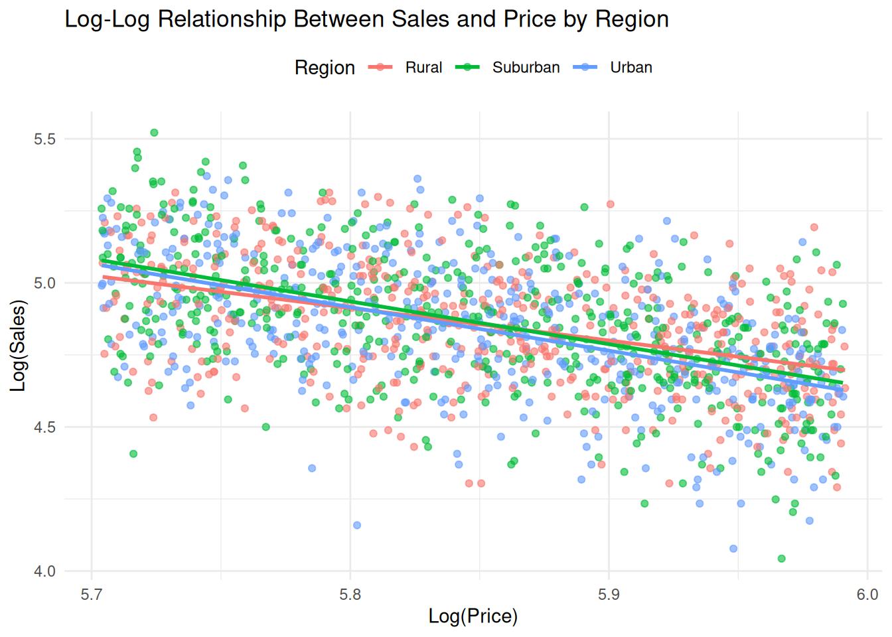

From the inspection of the plot, we can already see that there are only very slight differences in price sensitivity between regions. We can see the more exact result in the model.


``` r
log_reg_with_region <- lm(log(Sales) ~ log(Price) +
    log(MarketingContribution) + log(SalesReps) + log(RetailMediaPOS) +
    Region + log(Price) * Region, data = sales_data)

summary(log_reg_with_region)
```

```
## 
## Call:
## lm(formula = log(Sales) ~ log(Price) + log(MarketingContribution) + 
##     log(SalesReps) + log(RetailMediaPOS) + Region + log(Price) * 
##     Region, data = sales_data)
## 
## Residuals:
##      Min       1Q   Median       3Q      Max 
## -0.31230 -0.07264  0.00052  0.06944  0.31913 
## 
## Coefficients:
##                             Estimate Std. Error t value             Pr(>|t|)
## (Intercept)                 5.677941   0.342629  16.572 < 0.0000000000000002
## log(Price)                 -1.166913   0.056300 -20.727 < 0.0000000000000002
## log(MarketingContribution)  0.301407   0.006879  43.813 < 0.0000000000000002
## log(SalesReps)              0.248714   0.006978  35.645 < 0.0000000000000002
## log(RetailMediaPOS)         0.154474   0.006108  25.292 < 0.0000000000000002
## RegionSuburban              1.092507   0.450905   2.423              0.01552
## RegionUrban                 1.289724   0.467221   2.760              0.00585
## log(Price):RegionSuburban  -0.186507   0.077056  -2.420              0.01563
## log(Price):RegionUrban     -0.220242   0.079819  -2.759              0.00587
##                               
## (Intercept)                ***
## log(Price)                 ***
## log(MarketingContribution) ***
## log(SalesReps)             ***
## log(RetailMediaPOS)        ***
## RegionSuburban             *  
## RegionUrban                ** 
## log(Price):RegionSuburban  *  
## log(Price):RegionUrban     ** 
## ---
## Signif. codes:  0 '***' 0.001 '**' 0.01 '*' 0.05 '.' 0.1 ' ' 1
## 
## Residual standard error: 0.1016 on 1451 degrees of freedom
## Multiple R-squared:  0.8022,	Adjusted R-squared:  0.8011 
## F-statistic: 735.5 on 8 and 1451 DF,  p-value: < 0.00000000000000022
```
From inspecting the model, we can conclude that region indeed has an effect on price sensitivity.

The coefficient for RegionSuburban indicates that in the Suburban region the sales are expected to be 1.09% higher than in the Rural region. This effect is significant (p<0.05). Similarly, for the RegionUrban sales are expected to be 1.29% higher than in the Rural region, and this effect is also statistically significant (p<0.05).

The interaction effect: The coefficient log(Price) of -1.167 demonstrates the base price sensitivity in the rural region. This means that in the rural region a 1% increase in price will lead to a 1.167% decrease in sales. In the suburban region, customers are more price sensitive by 0.187. This means that a 1% increase in price will lead to (-1.167-0.187=) 1.354% decrease in sales. In urban region, people are the most price sensitive, by 0.22 more than in the rural region. A 1% increase in price will lead to (-1.167-0.22 =) 1.387% decrease in sales. 

This result could indicate that in urban areas consumers have access to more alternatives and hence, react stronger to price changes. 


### Assignment B

As a marketing manager of a music streaming service, you are set the task to derive insights from data using different quantitative analyses.   

The following variables are available to you:

The data set contains the following variables:

* isrc = unique song id
* artist_id = unique artist ID
* streams = the number of streams of the song received globally between 2017-2021
* weeks_in_charts = the number of weeks the song was in the top200 charts in this period
* n_regions = the number of markets where the song appeared in the top200 charts
* danceability
* energy
* speechiness
* instrumentalness
* liveness
* valence
* tempo
* song_length = the duration of the song (in minutes)
* song_age = the age of the song (in weeks since release)
* explicit = indicator for explicit lyrics
* n_playlists = number of playlists a song is featured on
* sp_popularity = the Spotify popularity index of an artist
* youtube_views = the number of views the song received on YouTube
* tiktok_counts = the number of Tiktok views the song received on TikTok
* ins_followers_artist = the number of Instagram followers of the artist
* monthly_listeners_artist = the number of monthly listeners of an artist
* playlist_total_reach_artist = the number of playlist followers of the playlists the song is on
* sp_fans_artist = the number of fans of the artist on Spotify
* shazam_counts = the number of times a song is shazamed
* artistName = name of the artist
* trackName = name of the song
* release_date = release date of song
* genre = genre associated with the song
* label = music label associated with the song
* top10 = indicator variable, indicating if a song made it to the top10

1. Build and estimate a classification model (i.e., logistic regression) to explain the success of songs in terms of the chart position (i.e., if a song made it to the top 10 or not). This means, the variable "top10"" is your dependent variable. As independent (explanatory) variables, you should include the variables "weeks_in_charts", "song_age" and "label". In addition to these 3 variables you should identify 5 more variables that have a significant effect on the chart performance. Please visualize the relationship between the top10 variable and the independent variables using appropriate plots and interpret the model coefficients.

### Data analysis

### Load data


``` r
library(ggplot2)
library(psych)
library(dplyr)
options(scipen = 999)
set.seed(123)
music_data <- read.csv2("https://raw.githubusercontent.com/WU-RDS/RMA2022/main/data/music_data_group.csv",
    sep = ";", header = TRUE, dec = ",")
music_data$genre <- as.factor(music_data$genre)
music_data$label <- as.factor(music_data$label)
str(music_data)
```

```
## 'data.frame':	66796 obs. of  30 variables:
##  $ isrc                       : chr  "BRRGE1603547" "USUM71808193" "ES5701800181" "ITRSE2000050" ...
##  $ artist_id                  : int  3679 5239 776407 433730 526471 1939 210184 212546 4938 119985 ...
##  $ streams                    : num  11944813 8934097 38835 46766 2930573 ...
##  $ weeks_in_charts            : int  141 51 1 1 7 226 13 1 64 7 ...
##  $ n_regions                  : int  1 21 1 1 4 8 1 1 5 1 ...
##  $ danceability               : num  50.9 35.3 68.3 70.4 84.2 35.2 73 55.6 71.9 34.6 ...
##  $ energy                     : num  80.3 75.5 67.6 56.8 57.8 91.1 69.6 24.5 85 43.3 ...
##  $ speechiness                : num  4 73.3 14.7 26.8 13.8 7.47 35.5 3.05 3.17 6.5 ...
##  $ instrumentalness           : num  0.05 0 0 0.000253 0 0 0 0 0.02 0 ...
##  $ liveness                   : num  46.3 39 7.26 8.91 22.8 9.95 32.1 9.21 11.4 10.1 ...
##  $ valence                    : num  65.1 43.7 43.4 49.5 19 23.6 58.4 27.6 36.7 76.8 ...
##  $ tempo                      : num  166 191.2 99 91 74.5 ...
##  $ song_length                : num  3.12 3.23 3.02 3.45 3.95 ...
##  $ song_age                   : num  228.3 144.3 112.3 50.7 58.3 ...
##  $ explicit                   : int  0 0 0 0 0 0 0 0 1 0 ...
##  $ n_playlists                : int  450 768 48 6 475 20591 6 105 547 688 ...
##  $ sp_popularity              : int  51 54 32 44 52 81 44 8 59 68 ...
##  $ youtube_views              : num  145030723 13188411 6116639 0 0 ...
##  $ tiktok_counts              : int  9740 358700 0 13 515 67300 0 0 653 3807 ...
##  $ ins_followers_artist       : int  29613108 3693566 623778 81601 11962358 1169284 1948850 39381 9751080 343 ...
##  $ monthly_listeners_artist   : int  4133393 18367363 888273 143761 15551876 16224250 2683086 1318874 4828847 3088232 ...
##  $ playlist_total_reach_artist: int  24286416 143384531 4846378 156521 90841884 80408253 7332603 24302331 8914977 8885252 ...
##  $ sp_fans_artist             : int  3308630 465412 23846 1294 380204 1651866 214001 10742 435457 1897685 ...
##  $ shazam_counts              : int  73100 588550 0 0 55482 5281161 0 0 39055 0 ...
##  $ artistName                 : chr  "Luan Santana" "Alessia Cara" "Ana Guerra" "Claver Gold feat. Murubutu" ...
##  $ trackName                  : chr  "Eu, Você, O Mar e Ela" "Growing Pains" "El Remedio" "Ulisse" ...
##  $ release_date               : chr  "2016-06-20" "2018-06-14" "2018-04-26" "2020-03-31" ...
##  $ genre                      : Factor w/ 11 levels "Classics/Jazz",..: 6 7 7 5 5 10 5 7 7 7 ...
##  $ label                      : Factor w/ 4 levels "Independent",..: 1 3 3 1 3 3 3 1 1 3 ...
##  $ top10                      : int  1 0 0 0 0 1 0 0 0 0 ...
```

### Question 1


For this model, we need to consider the logistic function, so the final mathematical representation (with three main predictors of interest so far) would look as follows:


$$f(\mathbf{X}) = P(y_i = 1) = \frac{1}{1
+ e^{-(\beta_0 + \beta_1 * x_{1,i} + \beta_2 * x_{2,i} +\beta_3 *
x_{3,i})}}$$

where β0 is the intercept coefficient, and β1, β2, and β3represent the parameters of our model: weeks in charts, age of song, and label.

We should create the model using glm() and have a look at the summary


``` r
mult_logit_model <- glm(top10 ~ weeks_in_charts + song_age +
    label, family = binomial(link = "logit"), data = music_data)
summary(mult_logit_model)
```

```
## 
## Call:
## glm(formula = top10 ~ weeks_in_charts + song_age + label, family = binomial(link = "logit"), 
##     data = music_data)
## 
## Coefficients:
##                         Estimate  Std. Error z value            Pr(>|z|)    
## (Intercept)          -3.78534560  0.03989841  -94.88 <0.0000000000000002 ***
## weeks_in_charts       0.01254730  0.00013573   92.45 <0.0000000000000002 ***
## song_age             -0.00122201  0.00009152  -13.35 <0.0000000000000002 ***
## labelSony Music       0.59344756  0.04967676   11.95 <0.0000000000000002 ***
## labelUniversal Music  0.86912676  0.04284308   20.29 <0.0000000000000002 ***
## labelWarner Music     0.52810825  0.05383487    9.81 <0.0000000000000002 ***
## ---
## Signif. codes:  0 '***' 0.001 '**' 0.01 '*' 0.05 '.' 0.1 ' ' 1
## 
## (Dispersion parameter for binomial family taken to be 1)
## 
##     Null deviance: 43430  on 66795  degrees of freedom
## Residual deviance: 27523  on 66790  degrees of freedom
## AIC: 27535
## 
## Number of Fisher Scoring iterations: 6
```


``` r
confint(mult_logit_model)
```

```
## Waiting for profiling to be done...
```

```
##                             2.5 %       97.5 %
## (Intercept)          -3.864138137 -3.707725224
## weeks_in_charts       0.012282716  0.012814786
## song_age             -0.001404812 -0.001046036
## labelSony Music       0.496029832  0.690783386
## labelUniversal Music  0.785399531  0.953358727
## labelWarner Music     0.422364414  0.633423323
```

From the summary of the model we can see that weeks in charts, age of song, and label can be used to predict if a song will end up in top-10 or not. We can also assess the model fit:


``` r
logisticPseudoR2s <- function(LogModel) {
    dev <- LogModel$deviance
    nullDev <- LogModel$null.deviance
    modelN <- length(LogModel$fitted.values)
    R.l <- 1 - dev/nullDev
    R.cs <- 1 - exp(-(nullDev - dev)/modelN)
    R.n <- R.cs/(1 - (exp(-(nullDev/modelN))))
    cat("Pseudo R^2 for logistic regression\n")
    cat("Hosmer and Lemeshow R^2  ", round(R.l, 3),
        "\n")
    cat("Cox and Snell R^2        ", round(R.cs, 3),
        "\n")
    cat("Nagelkerke R^2           ", round(R.n, 3),
        "\n")
}
# Inspect Pseudo R2s
logisticPseudoR2s(mult_logit_model)
```

```
## Pseudo R^2 for logistic regression
## Hosmer and Lemeshow R^2   0.366 
## Cox and Snell R^2         0.212 
## Nagelkerke R^2            0.443
```

To make conclusions about the effect that predictors have on success, we should convert the log-odds ratios to odds ratios using exp() function:


``` r
exp(coef(mult_logit_model))
```

```
##          (Intercept)      weeks_in_charts             song_age 
##           0.02270102           1.01262635           0.99877873 
##      labelSony Music labelUniversal Music    labelWarner Music 
##           1.81021850           2.38482742           1.69572138
```


The results tell us, for example, that for each extra week in charts, the odds of the song to be in the top 10 are 1.0126 times higher, or equivalently, the likelihood of the outcome is increased by 1.26%. Or songs from Universal are 2.38 times more likely to appear in the top-10 chart in comparison with songs from independent labels, or equivalently, the likelihood of the outcome is increased by 138.5% compared to independent labels. 

We should visualize the relationship between IVs and DV:


``` r
# Relationship of weeks in charts and top10

ggplot(music_data, aes(weeks_in_charts, top10)) + geom_point(shape = 1) +
    geom_smooth(method = "glm", method.args = list(family = "binomial"),
        se = FALSE, color = "lavenderblush3") + theme_minimal()
```

```
## `geom_smooth()` using formula = 'y ~ x'
```


``` r
# Relationship of song age and top10

ggplot(music_data, aes(song_age, top10)) + geom_point(shape = 1) +
    geom_smooth(method = "glm", method.args = list(family = "binomial"),
        se = FALSE, color = "lavenderblush3") + theme_minimal()
```

```
## `geom_smooth()` using formula = 'y ~ x'
```

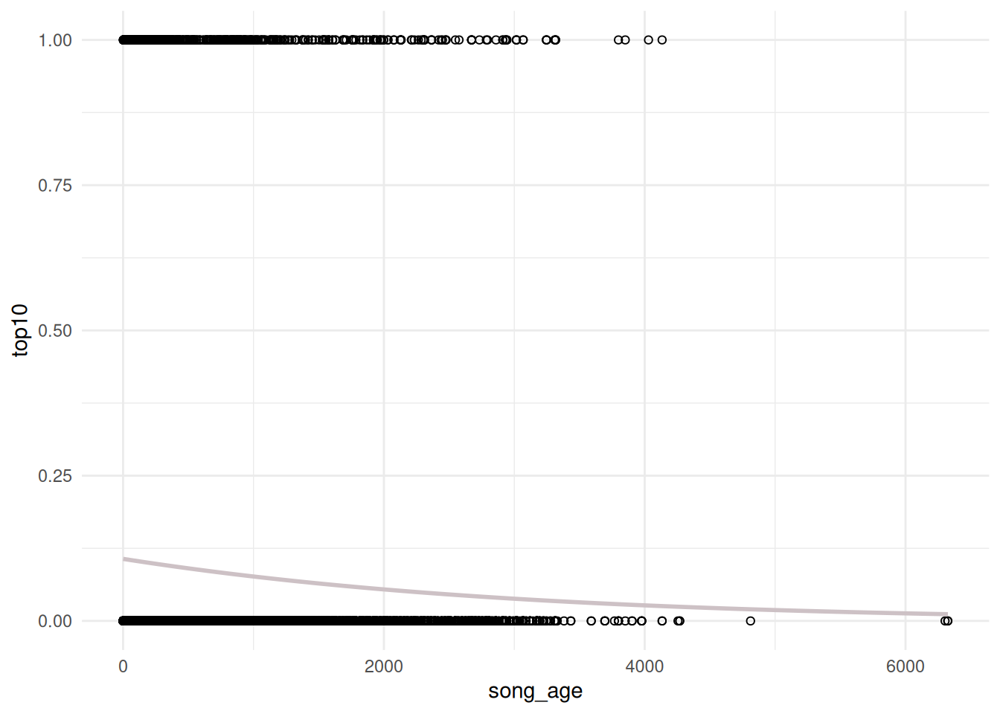


``` r
# Relationship of label and top10

library(forcats)
labels <- as.factor(c("Warner Music", "Sony Music",
    "Independent", "Universal Music"))
top10_predictions <- data.frame(pred = predict(glm(top10 ~
    label, data = music_data), data.frame(label = labels),
    type = "response"), label = labels)
top10_counts <- table(music_data$top10, music_data$label)
top10_share <- prop.table(top10_counts, margin = 2)
data.frame(top10_share) |>
    filter(Var1 == 1) |>
    left_join(top10_predictions, by = c(Var2 = "label")) |>
    dplyr::rename(`Top 10 share` = Freq) |>
    ggplot(aes(fct_reorder(Var2, `Top 10 share`), `Top 10 share`)) +
    geom_bar(stat = "identity", fill = "lavenderblush3") +
    geom_point(aes(x = Var2, y = pred), color = "red4") +
    theme_minimal() + theme(axis.title.x = element_blank())
```


To find out which other variables might have a significant effect on the chart performance, we can either load variables one-by-one manually or use a step-wise approach. For the latter, we basically need a model to start with (usually it’s a “null” model, however, we already have a model that works for us, i.e., mult_logit_model) and the most loaded model that includes all the variables (we will only drop all character and date variables). Let’s create it in the next step (please note that we already drop some variables that potentially might be influenced if a song appears in top-10: streams, sp_popularity, n_regions, etc.)


``` r
music_data$explicit <- factor(music_data$explicit, 
                                    levels = c(0,1), labels = c("not explicit", "explicit"))

full_model <- glm(top10 ~ weeks_in_charts + song_age + label + #our basic model. Next we add the rest of the variables to it:
                    danceability + energy + speechiness + instrumentalness + liveness + valence + tempo +
                    song_length + explicit + n_playlists + genre,
                  family = binomial(link = 'logit'), data = music_data)
```

Let’s have a look at the fullest model possible:


``` r
summary(full_model)
```

```
## 
## Call:
## glm(formula = top10 ~ weeks_in_charts + song_age + label + danceability + 
##     energy + speechiness + instrumentalness + liveness + valence + 
##     tempo + song_length + explicit + n_playlists + genre, family = binomial(link = "logit"), 
##     data = music_data)
## 
## Coefficients:
##                          Estimate   Std. Error z value             Pr(>|z|)    
## (Intercept)          -8.234476683  6.600555763  -1.248               0.2122    
## weeks_in_charts       0.012805679  0.000146602  87.350 < 0.0000000000000002 ***
## song_age             -0.001926650  0.000114801 -16.783 < 0.0000000000000002 ***
## labelSony Music       0.309879886  0.053399277   5.803        0.00000000651 ***
## labelUniversal Music  0.499093803  0.048106669  10.375 < 0.0000000000000002 ***
## labelWarner Music     0.258651532  0.057686712   4.484        0.00000733501 ***
## danceability          0.013853338  0.001511801   9.163 < 0.0000000000000002 ***
## energy               -0.005334606  0.001202794  -4.435        0.00000919959 ***
## speechiness          -0.003606707  0.001622321  -2.223               0.0262 *  
## instrumentalness     -0.002757251  0.002982653  -0.924               0.3553    
## liveness              0.005200933  0.001189734   4.372        0.00001233918 ***
## valence               0.001499900  0.000934395   1.605               0.1084    
## tempo                 0.002969109  0.000619852   4.790        0.00000166755 ***
## song_length          -0.290130550  0.026500912 -10.948 < 0.0000000000000002 ***
## explicitexplicit     -0.704911363  0.073710237  -9.563 < 0.0000000000000002 ***
## n_playlists           0.000268906  0.000008005  33.593 < 0.0000000000000002 ***
## genreCountry          6.047536675  6.599669764   0.916               0.3595    
## genreElectro/Dance    4.619610060  6.598946035   0.700               0.4839    
## genreGerman Folk      3.391558357  6.604926105   0.513               0.6076    
## genreHipHop/Rap       4.562287429  6.598559475   0.691               0.4893    
## genreother            5.425089472  6.598558812   0.822               0.4110    
## genrePop              4.004199096  6.598387935   0.607               0.5440    
## genreR&B              5.016578570  6.598943542   0.760               0.4471    
## genreReggae           4.454352459  6.610053417   0.674               0.5004    
## genreRock             4.145180994  6.598981122   0.628               0.5299    
## genreSoundtrack       4.901752648  6.601845142   0.742               0.4578    
## ---
## Signif. codes:  0 '***' 0.001 '**' 0.01 '*' 0.05 '.' 0.1 ' ' 1
## 
## (Dispersion parameter for binomial family taken to be 1)
## 
##     Null deviance: 43430  on 66795  degrees of freedom
## Residual deviance: 24891  on 66770  degrees of freedom
## AIC: 24943
## 
## Number of Fisher Scoring iterations: 9
```

We can pick five significant factors from the summary above. For example, we can proceed with the model as follows:


``` r
final_model <- glm(top10 ~ weeks_in_charts + song_age + label + #our basic model. Next we add the rest of the variables to it:
                   danceability + liveness + tempo + song_length + n_playlists,
                   family = binomial(link = 'logit'), data = music_data)

summary(final_model)
```

```
## 
## Call:
## glm(formula = top10 ~ weeks_in_charts + song_age + label + danceability + 
##     liveness + tempo + song_length + n_playlists, family = binomial(link = "logit"), 
##     data = music_data)
## 
## Coefficients:
##                          Estimate   Std. Error z value             Pr(>|z|)    
## (Intercept)          -4.490099261  0.172198935 -26.075 < 0.0000000000000002 ***
## weeks_in_charts       0.012594243  0.000141167  89.215 < 0.0000000000000002 ***
## song_age             -0.001977611  0.000117389 -16.847 < 0.0000000000000002 ***
## labelSony Music       0.441955048  0.050888299   8.685 < 0.0000000000000002 ***
## labelUniversal Music  0.624039605  0.044146953  14.136 < 0.0000000000000002 ***
## labelWarner Music     0.376806825  0.055148947   6.833   0.0000000000083430 ***
## danceability          0.017307850  0.001345825  12.860 < 0.0000000000000002 ***
## liveness              0.008612684  0.001138928   7.562   0.0000000000000397 ***
## tempo                 0.003637005  0.000610442   5.958   0.0000000025536638 ***
## song_length          -0.315709255  0.025965257 -12.159 < 0.0000000000000002 ***
## n_playlists           0.000260104  0.000007804  33.330 < 0.0000000000000002 ***
## ---
## Signif. codes:  0 '***' 0.001 '**' 0.01 '*' 0.05 '.' 0.1 ' ' 1
## 
## (Dispersion parameter for binomial family taken to be 1)
## 
##     Null deviance: 43430  on 66795  degrees of freedom
## Residual deviance: 25856  on 66785  degrees of freedom
## AIC: 25878
## 
## Number of Fisher Scoring iterations: 7
```


``` r
logisticPseudoR2s(final_model)
```

```
## Pseudo R^2 for logistic regression
## Hosmer and Lemeshow R^2   0.405 
## Cox and Snell R^2         0.231 
## Nagelkerke R^2            0.484
```

We can see from the table above that the model explains 50% of the variability in the likelihood of the song being in top 10 (according to Nagelkerke R-squared).


``` r
exp(coef(final_model))
```

```
##          (Intercept)      weeks_in_charts             song_age 
##           0.01121953           1.01267388           0.99802434 
##      labelSony Music labelUniversal Music    labelWarner Music 
##           1.55574581           1.86645257           1.45762271 
##         danceability             liveness                tempo 
##           1.01745850           1.00864988           1.00364363 
##          song_length          n_playlists 
##           0.72927145           1.00026014
```

Interpretation: The results tell us, for example, that for each one minute increase in song length, the odds of the song to be in the top 10 are 0.73 times lower, or equivalently, the likelihood of the song to be in top 10 is decreased by 27%. For each one unit increase in danceability, the odds of the song to be in top 10 are 1.02 times higher, or equivalently, the likelihood of the song being in top 10 is increased by 2%.

Alternatively, average partial effect as means of model interpretation can be used:

``` r
library(mfx)
```

```
## Loading required package: sandwich
```

```
## Loading required package: MASS
```

```
## Loading required package: betareg
```

``` r
# Average partial effect
logitmfx(final_model, data = music_data, atmean = FALSE)
```

```
## Call:
## logitmfx(formula = final_model, data = music_data, atmean = FALSE)
## 
## Marginal Effects:
##                               dF/dx      Std. Err.        z
## weeks_in_charts       0.00065127618  0.00001374186  47.3936
## song_age             -0.00010226667  0.00000631172 -16.2027
## labelSony Music       0.02493232144  0.00312422560   7.9803
## labelUniversal Music  0.03427289513  0.00257631776  13.3031
## labelWarner Music     0.02113194448  0.00334627810   6.3151
## danceability          0.00089502724  0.00007104537  12.5980
## liveness              0.00044538097  0.00005937804   7.5008
## tempo                 0.00018807759  0.00003171436   5.9304
## song_length          -0.01632602458  0.00136992030 -11.9175
## n_playlists           0.00001345055  0.00000046827  28.7241
##                                      P>|z|    
## weeks_in_charts      < 0.00000000000000022 ***
## song_age             < 0.00000000000000022 ***
## labelSony Music        0.00000000000000146 ***
## labelUniversal Music < 0.00000000000000022 ***
## labelWarner Music      0.00000000027005798 ***
## danceability         < 0.00000000000000022 ***
## liveness               0.00000000000006344 ***
## tempo                  0.00000000302271850 ***
## song_length          < 0.00000000000000022 ***
## n_playlists          < 0.00000000000000022 ***
## ---
## Signif. codes:  0 '***' 0.001 '**' 0.01 '*' 0.05 '.' 0.1 ' ' 1
## 
## dF/dx is for discrete change for the following variables:
## 
## [1] "labelSony Music"      "labelUniversal Music" "labelWarner Music"
```


Interpretation of average partial effects: If a song is one week older, the probability of this song appearing in top-10 chart decreases by 0.01 percentage points.

If we still want to choose a parsimonious model using step-wise comparisons, we can do it as follows: the function below takes the “base” model, adds variables from the fullest model one-by-one to it, and shows the new models’ performance.

AIC values can be compared, we want the model with lowest possible AIC. As a second measure for variable selection, we can use the pseudo R-squared, that gives a value for explanatory power of the model.


``` r
step(mult_logit_model, #our base model
     scope = list(upper = full_model), 
     direction = "both",
     test = "Chisq",
     data = music_data)
```

```
## Start:  AIC=27535.11
## top10 ~ weeks_in_charts + song_age + label
## 
##                    Df Deviance   AIC     LRT              Pr(>Chi)    
## + n_playlists       1    26335 26349  1187.9 < 0.00000000000000022 ***
## + genre            10    26504 26536  1019.5 < 0.00000000000000022 ***
## + danceability      1    27256 27270   267.1 < 0.00000000000000022 ***
## + song_length       1    27335 27349   187.9 < 0.00000000000000022 ***
## + explicit          1    27376 27390   146.8 < 0.00000000000000022 ***
## + valence           1    27445 27459    77.7 < 0.00000000000000022 ***
## + liveness          1    27480 27494    42.9      0.00000000005728 ***
## + tempo             1    27504 27518    19.4      0.00001085601584 ***
## + speechiness       1    27510 27524    12.9             0.0003209 ***
## + instrumentalness  1    27516 27530     7.2             0.0071563 ** 
## + energy            1    27519 27533     3.8             0.0523575 .  
## <none>                   27523 27535                                  
## - song_age          1    27781 27791   258.3 < 0.00000000000000022 ***
## - label             3    27963 27969   439.7 < 0.00000000000000022 ***
## - weeks_in_charts   1    43159 43169 15635.8 < 0.00000000000000022 ***
## ---
## Signif. codes:  0 '***' 0.001 '**' 0.01 '*' 0.05 '.' 0.1 ' ' 1
## 
## Step:  AIC=26349.16
## top10 ~ weeks_in_charts + song_age + label + n_playlists
## 
##                    Df Deviance   AIC     LRT              Pr(>Chi)    
## + genre            10    25312 25346  1023.2 < 0.00000000000000022 ***
## + song_length       1    26086 26102   248.7 < 0.00000000000000022 ***
## + danceability      1    26112 26128   222.7 < 0.00000000000000022 ***
## + explicit          1    26175 26191   160.3 < 0.00000000000000022 ***
## + valence           1    26240 26256    95.2 < 0.00000000000000022 ***
## + liveness          1    26293 26309    41.7       0.0000000001046 ***
## + tempo             1    26314 26330    21.4       0.0000036320174 ***
## + speechiness       1    26322 26338    13.0             0.0003193 ***
## + instrumentalness  1    26329 26345     6.3             0.0118075 *  
## <none>                   26335 26349                                  
## + energy            1    26334 26350     1.1             0.2954805    
## - label             3    26565 26573   230.1 < 0.00000000000000022 ***
## - song_age          1    27044 27056   708.7 < 0.00000000000000022 ***
## - n_playlists       1    27523 27535  1187.9 < 0.00000000000000022 ***
## - weeks_in_charts   1    40541 40553 14206.0 < 0.00000000000000022 ***
## ---
## Signif. codes:  0 '***' 0.001 '**' 0.01 '*' 0.05 '.' 0.1 ' ' 1
## 
## Step:  AIC=25345.92
## top10 ~ weeks_in_charts + song_age + label + n_playlists + genre
## 
##                    Df Deviance   AIC     LRT              Pr(>Chi)    
## + song_length       1    25133 25169   178.5 < 0.00000000000000022 ***
## + danceability      1    25185 25221   127.3 < 0.00000000000000022 ***
## + explicit          1    25206 25242   106.0 < 0.00000000000000022 ***
## + valence           1    25278 25314    34.4        0.000000004499 ***
## + tempo             1    25301 25337    11.4              0.000753 ***
## + liveness          1    25302 25338     9.8              0.001713 ** 
## <none>                   25312 25346                                  
## + energy            1    25310 25346     1.7              0.195014    
## + instrumentalness  1    25310 25346     1.6              0.202913    
## + speechiness       1    25312 25348     0.0              0.884998    
## - label             3    25474 25502   161.7 < 0.00000000000000022 ***
## - song_age          1    25913 25945   600.6 < 0.00000000000000022 ***
## - genre            10    26335 26349  1023.2 < 0.00000000000000022 ***
## - n_playlists       1    26504 26536  1191.7 < 0.00000000000000022 ***
## - weeks_in_charts   1    39511 39543 14199.3 < 0.00000000000000022 ***
## ---
## Signif. codes:  0 '***' 0.001 '**' 0.01 '*' 0.05 '.' 0.1 ' ' 1
## 
## Step:  AIC=25169.45
## top10 ~ weeks_in_charts + song_age + label + n_playlists + genre + 
##     song_length
## 
##                    Df Deviance   AIC     LRT              Pr(>Chi)    
## + explicit          1    25029 25067   104.2 < 0.00000000000000022 ***
## + danceability      1    25050 25088    83.6 < 0.00000000000000022 ***
## + valence           1    25119 25157    14.6             0.0001309 ***
## + tempo             1    25121 25159    12.6             0.0003769 ***
## + liveness          1    25125 25163     8.1             0.0045244 ** 
## + instrumentalness  1    25131 25169     2.3             0.1276459    
## + energy            1    25131 25169     2.2             0.1340637    
## <none>                   25133 25169                                  
## + speechiness       1    25132 25170     1.4             0.2289231    
## - label             3    25273 25303   139.3 < 0.00000000000000022 ***
## - song_length       1    25312 25346   178.5 < 0.00000000000000022 ***
## - song_age          1    25647 25681   513.9 < 0.00000000000000022 ***
## - genre            10    26086 26102   953.0 < 0.00000000000000022 ***
## - n_playlists       1    26385 26419  1251.7 < 0.00000000000000022 ***
## - weeks_in_charts   1    39507 39541 14373.3 < 0.00000000000000022 ***
## ---
## Signif. codes:  0 '***' 0.001 '**' 0.01 '*' 0.05 '.' 0.1 ' ' 1
## 
## Step:  AIC=25067.21
## top10 ~ weeks_in_charts + song_age + label + n_playlists + genre + 
##     song_length + explicit
## 
##                    Df Deviance   AIC     LRT              Pr(>Chi)    
## + danceability      1    24948 24988    81.3 < 0.00000000000000022 ***
## + valence           1    25016 25056    13.6             0.0002280 ***
## + tempo             1    25017 25057    11.8             0.0005785 ***
## + liveness          1    25022 25062     7.4             0.0067056 ** 
## + energy            1    25026 25066     3.6             0.0574725 .  
## <none>                   25029 25067                                  
## + speechiness       1    25028 25068     1.6             0.2008558    
## + instrumentalness  1    25028 25068     1.3             0.2576454    
## - label             3    25130 25162   100.3 < 0.00000000000000022 ***
## - explicit          1    25133 25169   104.2 < 0.00000000000000022 ***
## - song_length       1    25206 25242   176.7 < 0.00000000000000022 ***
## - song_age          1    25542 25578   513.2 < 0.00000000000000022 ***
## - genre            10    25933 25951   904.0 < 0.00000000000000022 ***
## - n_playlists       1    26278 26314  1248.5 < 0.00000000000000022 ***
## - weeks_in_charts   1    39340 39376 14311.0 < 0.00000000000000022 ***
## ---
## Signif. codes:  0 '***' 0.001 '**' 0.01 '*' 0.05 '.' 0.1 ' ' 1
## 
## Step:  AIC=24987.94
## top10 ~ weeks_in_charts + song_age + label + n_playlists + genre + 
##     song_length + explicit + danceability
## 
##                    Df Deviance   AIC     LRT              Pr(>Chi)    
## + tempo             1    24928 24970    19.6           0.000009785 ***
## + liveness          1    24934 24976    13.5             0.0002356 ***
## + energy            1    24940 24982     8.3             0.0039206 ** 
## + speechiness       1    24945 24987     2.5             0.1106956    
## <none>                   24948 24988                                  
## + valence           1    24947 24989     0.7             0.4151639    
## + instrumentalness  1    24947 24989     0.6             0.4396889    
## - danceability      1    25029 25067    81.3 < 0.00000000000000022 ***
## - explicit          1    25050 25088   101.9 < 0.00000000000000022 ***
## - label             3    25059 25093   111.5 < 0.00000000000000022 ***
## - song_length       1    25081 25119   133.5 < 0.00000000000000022 ***
## - song_age          1    25405 25443   456.7 < 0.00000000000000022 ***
## - genre            10    25804 25824   856.0 < 0.00000000000000022 ***
## - n_playlists       1    26155 26193  1206.9 < 0.00000000000000022 ***
## - weeks_in_charts   1    39182 39220 14233.6 < 0.00000000000000022 ***
## ---
## Signif. codes:  0 '***' 0.001 '**' 0.01 '*' 0.05 '.' 0.1 ' ' 1
## 
## Step:  AIC=24970.39
## top10 ~ weeks_in_charts + song_age + label + n_playlists + genre + 
##     song_length + explicit + danceability + tempo
## 
##                    Df Deviance   AIC     LRT              Pr(>Chi)    
## + liveness          1    24915 24959    13.1             0.0002929 ***
## + energy            1    24917 24961    11.1             0.0008776 ***
## + speechiness       1    24925 24969     3.8             0.0510498 .  
## <none>                   24928 24970                                  
## + instrumentalness  1    24928 24972     0.5             0.4726447    
## + valence           1    24928 24972     0.2             0.6876102    
## - tempo             1    24948 24988    19.6           0.000009785 ***
## - danceability      1    25017 25057    89.0 < 0.00000000000000022 ***
## - explicit          1    25029 25069   100.8 < 0.00000000000000022 ***
## - label             3    25042 25078   113.1 < 0.00000000000000022 ***
## - song_length       1    25061 25101   133.0 < 0.00000000000000022 ***
## - song_age          1    25379 25419   450.2 < 0.00000000000000022 ***
## - genre            10    25771 25793   842.2 < 0.00000000000000022 ***
## - n_playlists       1    26134 26174  1205.9 < 0.00000000000000022 ***
## - weeks_in_charts   1    39149 39189 14220.7 < 0.00000000000000022 ***
## ---
## Signif. codes:  0 '***' 0.001 '**' 0.01 '*' 0.05 '.' 0.1 ' ' 1
## 
## Step:  AIC=24959.27
## top10 ~ weeks_in_charts + song_age + label + n_playlists + genre + 
##     song_length + explicit + danceability + tempo + liveness
## 
##                    Df Deviance   AIC     LRT              Pr(>Chi)    
## + energy            1    24899 24945    16.2            0.00005738 ***
## + speechiness       1    24911 24957     4.2             0.0393970 *  
## <none>                   24915 24959                                  
## + instrumentalness  1    24915 24961     0.6             0.4557895    
## + valence           1    24915 24961     0.0             0.9239797    
## - liveness          1    24928 24970    13.1             0.0002929 ***
## - tempo             1    24934 24976    19.1            0.00001211 ***
## - danceability      1    25010 25052    95.2 < 0.00000000000000022 ***
## - explicit          1    25015 25057    99.8 < 0.00000000000000022 ***
## - label             3    25029 25067   114.2 < 0.00000000000000022 ***
## - song_length       1    25045 25087   129.7 < 0.00000000000000022 ***
## - song_age          1    25363 25405   447.3 < 0.00000000000000022 ***
## - genre            10    25719 25743   803.4 < 0.00000000000000022 ***
## - n_playlists       1    26117 26159  1201.8 < 0.00000000000000022 ***
## - weeks_in_charts   1    39140 39182 14224.6 < 0.00000000000000022 ***
## ---
## Signif. codes:  0 '***' 0.001 '**' 0.01 '*' 0.05 '.' 0.1 ' ' 1
## 
## Step:  AIC=24945.09
## top10 ~ weeks_in_charts + song_age + label + n_playlists + genre + 
##     song_length + explicit + danceability + tempo + liveness + 
##     energy
## 
##                    Df Deviance   AIC     LRT              Pr(>Chi)    
## + speechiness       1    24894 24942     4.7               0.02962 *  
## + valence           1    24896 24944     2.6               0.10756    
## <none>                   24899 24945                                  
## + instrumentalness  1    24898 24946     0.8               0.36187    
## - energy            1    24915 24959    16.2            0.00005738 ***
## - liveness          1    24917 24961    18.2            0.00001954 ***
## - tempo             1    24922 24966    22.5            0.00000212 ***
## - explicit          1    25002 25046   102.5 < 0.00000000000000022 ***
## - danceability      1    25003 25047   104.1 < 0.00000000000000022 ***
## - label             3    25013 25053   113.8 < 0.00000000000000022 ***
## - song_length       1    25028 25072   128.9 < 0.00000000000000022 ***
## - song_age          1    25353 25397   454.3 < 0.00000000000000022 ***
## - genre            10    25711 25737   811.9 < 0.00000000000000022 ***
## - n_playlists       1    26103 26147  1204.0 < 0.00000000000000022 ***
## - weeks_in_charts   1    39113 39157 14214.1 < 0.00000000000000022 ***
## ---
## Signif. codes:  0 '***' 0.001 '**' 0.01 '*' 0.05 '.' 0.1 ' ' 1
## 
## Step:  AIC=24942.35
## top10 ~ weeks_in_charts + song_age + label + n_playlists + genre + 
##     song_length + explicit + danceability + tempo + liveness + 
##     energy + speechiness
## 
##                    Df Deviance   AIC     LRT              Pr(>Chi)    
## + valence           1    24892 24942     2.7               0.10031    
## <none>                   24894 24942                                  
## + instrumentalness  1    24893 24943     1.0               0.31346    
## - speechiness       1    24899 24945     4.7               0.02962 *  
## - energy            1    24911 24957    16.7          0.0000443660 ***
## - liveness          1    24913 24959    18.9          0.0000139497 ***
## - tempo             1    24918 24964    24.0          0.0000009465 ***
## - explicit          1    24997 25043   102.8 < 0.00000000000000022 ***
## - danceability      1    25001 25047   106.3 < 0.00000000000000022 ***
## - label             3    25006 25048   111.4 < 0.00000000000000022 ***
## - song_length       1    25027 25073   132.4 < 0.00000000000000022 ***
## - song_age          1    25353 25399   458.5 < 0.00000000000000022 ***
## - genre            10    25707 25735   813.0 < 0.00000000000000022 ***
## - n_playlists       1    26100 26146  1205.9 < 0.00000000000000022 ***
## - weeks_in_charts   1    39038 39084 14143.7 < 0.00000000000000022 ***
## ---
## Signif. codes:  0 '***' 0.001 '**' 0.01 '*' 0.05 '.' 0.1 ' ' 1
## 
## Step:  AIC=24941.65
## top10 ~ weeks_in_charts + song_age + label + n_playlists + genre + 
##     song_length + explicit + danceability + tempo + liveness + 
##     energy + speechiness + valence
## 
##                    Df Deviance   AIC     LRT              Pr(>Chi)    
## <none>                   24892 24942                                  
## - valence           1    24894 24942     2.7               0.10031    
## + instrumentalness  1    24891 24943     0.9               0.34466    
## - speechiness       1    24896 24944     4.8               0.02777 *  
## - liveness          1    24910 24958    18.5           0.000016707 ***
## - energy            1    24911 24959    19.4           0.000010799 ***
## - tempo             1    24915 24963    23.0           0.000001661 ***
## - danceability      1    24978 25026    86.0 < 0.00000000000000022 ***
## - explicit          1    24995 25043   102.9 < 0.00000000000000022 ***
## - label             3    25003 25047   111.1 < 0.00000000000000022 ***
## - song_length       1    25018 25066   126.5 < 0.00000000000000022 ***
## - song_age          1    25351 25399   459.3 < 0.00000000000000022 ***
## - genre            10    25694 25724   802.2 < 0.00000000000000022 ***
## - n_playlists       1    26100 26148  1208.5 < 0.00000000000000022 ***
## - weeks_in_charts   1    39018 39066 14126.6 < 0.00000000000000022 ***
## ---
## Signif. codes:  0 '***' 0.001 '**' 0.01 '*' 0.05 '.' 0.1 ' ' 1
```

```
## 
## Call:  glm(formula = top10 ~ weeks_in_charts + song_age + label + n_playlists + 
##     genre + song_length + explicit + danceability + tempo + liveness + 
##     energy + speechiness + valence, family = binomial(link = "logit"), 
##     data = music_data)
## 
## Coefficients:
##          (Intercept)       weeks_in_charts              song_age  
##            -8.250268              0.012811             -0.001929  
##      labelSony Music  labelUniversal Music     labelWarner Music  
##             0.310207              0.500078              0.259754  
##          n_playlists          genreCountry    genreElectro/Dance  
##             0.000269              6.052952              4.617654  
##     genreGerman Folk       genreHipHop/Rap            genreother  
##             3.393965              4.565679              5.429574  
##             genrePop              genreR&B           genreReggae  
##             4.007876              5.019629              4.456428  
##            genreRock       genreSoundtrack           song_length  
##             4.142870              4.896580             -0.289024  
##     explicitexplicit          danceability                 tempo  
##            -0.707333              0.013872              0.002971  
##             liveness                energy           speechiness  
##             0.005182             -0.005303             -0.003541  
##              valence  
##             0.001534  
## 
## Degrees of Freedom: 66795 Total (i.e. Null);  66771 Residual
## Null Deviance:	    43430 
## Residual Deviance: 24890 	AIC: 24940
```


## Assignment 4

### Assignment A

The data-set `influencer` contains the following variables to assess the success of influencer marketing campaigns:

  - `follower_count`: the number of followers of the influencer
  - `engagement_rate`: the engagement rate measured as the number of interations divided by the influencers reach
  - `content_quality`: an index measuring the quality of the influencer's posts
  - `post_frequency`: the number of times the influencer posted about the brand
  - `sales`: the number of units sold during the campaign
  - `brand_awareness`: an index measuring how many people became aware of the brand during the campaign

**Task Instructions**

#### Task 1: Omitted Variable Bias


``` r
influencer <- readr::read_csv("https://github.com/WU-RDS/MA2024/raw/refs/heads/main/data/influencer.csv")
```

```
## Rows: 1000 Columns: 6
## ── Column specification ────────────────────────────────────────────────────────
## Delimiter: ","
## dbl (6): follower_count, engagement_rate, sales, post_frequency, content_qua...
## 
## ℹ Use `spec()` to retrieve the full column specification for this data.
## ℹ Specify the column types or set `show_col_types = FALSE` to quiet this message.
```

``` r
str(influencer)
```

```
## spc_tbl_ [1,000 × 6] (S3: spec_tbl_df/tbl_df/tbl/data.frame)
##  $ follower_count : num [1:1000] 295 790 415 884 941 ...
##  $ engagement_rate: num [1:1000] 0.0732 0.0406 0.0998 0.0708 0.0228 ...
##  $ sales          : num [1:1000] 2643 3239 3375 4498 3898 ...
##  $ post_frequency : num [1:1000] 3 11 6 6 3 2 4 5 7 4 ...
##  $ content_quality: num [1:1000] 5.45 6.87 4.75 5.5 8.2 ...
##  $ brand_awareness: num [1:1000] 45.2 72.9 52.5 36.7 36.7 ...
##  - attr(*, "spec")=
##   .. cols(
##   ..   follower_count = col_double(),
##   ..   engagement_rate = col_double(),
##   ..   sales = col_double(),
##   ..   post_frequency = col_double(),
##   ..   content_quality = col_double(),
##   ..   brand_awareness = col_double()
##   .. )
##  - attr(*, "problems")=<externalptr>
```

``` r
set.seed(1234)
```

We are interested in modeling the sales during the campaigns. 

a) Draw a DAG that shows how you would model the causal influence of of `follower_count` on `sales` (feel free to draw it by hand and insert an image. You can add images with ``)


``` r
base_model <- lm(sales ~ follower_count, data = influencer)
summary(base_model)
```

```
## 
## Call:
## lm(formula = sales ~ follower_count, data = influencer)
## 
## Residuals:
##      Min       1Q   Median       3Q      Max 
## -2236.06  -470.71    18.01   424.89  2232.78 
## 
## Coefficients:
##                  Estimate Std. Error t value            Pr(>|t|)    
## (Intercept)    3053.54262   41.89236   72.89 <0.0000000000000002 ***
## follower_count    0.90074    0.07257   12.41 <0.0000000000000002 ***
## ---
## Signif. codes:  0 '***' 0.001 '**' 0.01 '*' 0.05 '.' 0.1 ' ' 1
## 
## Residual standard error: 652.8 on 998 degrees of freedom
## Multiple R-squared:  0.1337,	Adjusted R-squared:  0.1329 
## F-statistic: 154.1 on 1 and 998 DF,  p-value: < 0.00000000000000022
```


``` r
engagement_model <- lm(sales ~ follower_count + engagement_rate,
    data = influencer)
summary(engagement_model)
```

```
## 
## Call:
## lm(formula = sales ~ follower_count + engagement_rate, data = influencer)
## 
## Residuals:
##      Min       1Q   Median       3Q      Max 
## -1493.87  -319.65    -9.01   346.75  1624.26 
## 
## Coefficients:
##                    Estimate  Std. Error t value            Pr(>|t|)    
## (Intercept)       887.57799    84.49382   10.51 <0.0000000000000002 ***
## follower_count      1.99892     0.06756   29.59 <0.0000000000000002 ***
## engagement_rate 21485.81618   777.56864   27.63 <0.0000000000000002 ***
## ---
## Signif. codes:  0 '***' 0.001 '**' 0.01 '*' 0.05 '.' 0.1 ' ' 1
## 
## Residual standard error: 491.5 on 997 degrees of freedom
## Multiple R-squared:  0.5094,	Adjusted R-squared:  0.5084 
## F-statistic: 517.6 on 2 and 997 DF,  p-value: < 0.00000000000000022
```

``` r
frequency_model <- lm(sales ~ follower_count + post_frequency,
    data = influencer)
summary(frequency_model)
```

```
## 
## Call:
## lm(formula = sales ~ follower_count + post_frequency, data = influencer)
## 
## Residuals:
##      Min       1Q   Median       3Q      Max 
## -2213.03  -468.92    15.37   429.23  2233.67 
## 
## Coefficients:
##                  Estimate Std. Error t value            Pr(>|t|)    
## (Intercept)    2997.48090   63.37709  47.296 <0.0000000000000002 ***
## follower_count    0.90208    0.07257  12.431 <0.0000000000000002 ***
## post_frequency   10.94625    9.28712   1.179               0.239    
## ---
## Signif. codes:  0 '***' 0.001 '**' 0.01 '*' 0.05 '.' 0.1 ' ' 1
## 
## Residual standard error: 652.7 on 997 degrees of freedom
## Multiple R-squared:  0.1349,	Adjusted R-squared:  0.1332 
## F-statistic: 77.75 on 2 and 997 DF,  p-value: < 0.00000000000000022
```


``` r
content_model <- lm(sales ~ follower_count + content_quality,
    data = influencer)
summary(content_model)
```

```
## 
## Call:
## lm(formula = sales ~ follower_count + content_quality, data = influencer)
## 
## Residuals:
##      Min       1Q   Median       3Q      Max 
## -2239.57  -472.04    18.92   423.88  2235.21 
## 
## Coefficients:
##                   Estimate Std. Error t value            Pr(>|t|)    
## (Intercept)     3064.32650  121.24197  25.274 <0.0000000000000002 ***
## follower_count     0.90091    0.07263  12.404 <0.0000000000000002 ***
## content_quality   -1.81099   19.10544  -0.095               0.925    
## ---
## Signif. codes:  0 '***' 0.001 '**' 0.01 '*' 0.05 '.' 0.1 ' ' 1
## 
## Residual standard error: 653.1 on 997 degrees of freedom
## Multiple R-squared:  0.1337,	Adjusted R-squared:  0.132 
## F-statistic: 76.95 on 2 and 997 DF,  p-value: < 0.00000000000000022
```


``` r
awareness_model <- lm(sales ~ follower_count + brand_awareness,
    data = influencer)
summary(awareness_model)
```

```
## 
## Call:
## lm(formula = sales ~ follower_count + brand_awareness, data = influencer)
## 
## Residuals:
##      Min       1Q   Median       3Q      Max 
## -2221.64  -465.95    10.36   426.80  2228.69 
## 
## Coefficients:
##                   Estimate Std. Error t value            Pr(>|t|)    
## (Intercept)     2994.48247   88.14965  33.970 <0.0000000000000002 ***
## follower_count     0.89808    0.07267  12.358 <0.0000000000000002 ***
## brand_awareness    1.21243    1.59209   0.762               0.447    
## ---
## Signif. codes:  0 '***' 0.001 '**' 0.01 '*' 0.05 '.' 0.1 ' ' 1
## 
## Residual standard error: 653 on 997 degrees of freedom
## Multiple R-squared:  0.1342,	Adjusted R-squared:  0.1325 
## F-statistic: 77.28 on 2 and 997 DF,  p-value: < 0.00000000000000022
```

We ran several models, starting with a base model with one independent variable follower_count and sales as dependent variable. Then we added different variables in this model to see if some of them add explanatory power, and it's the case only for the variable engagement_rate. The effect of follower count on sales increases when engagement rate is added to the model from 0.9 to 1.9, suggesting that engagement rate is acting as a confounder, influencing both follower_count and sales.


b) Describe briefly what roles each of the variables in you DAG play (mediator, moderator, collider)


``` r
# Engagement rate is a confounder

library(DiagrammeR)

mermaid("
graph LR
   engagement_rate --> follower_count
   engagement_rate --> sales
   follower_count --> sales
")
```

```{=html}
<div class="DiagrammeR html-widget html-fill-item" id="htmlwidget-f99564eb6e8884a58f83" style="width:672px;height:480px;"></div>
<script type="application/json" data-for="htmlwidget-f99564eb6e8884a58f83">{"x":{"diagram":"\ngraph LR\n   engagement_rate --> follower_count\n   engagement_rate --> sales\n   follower_count --> sales\n"},"evals":[],"jsHooks":[]}</script>
```


c) Calculate the correlation coefficients of the variables you expect to be correlated based on your answer in a). Briefly explain any changes (if any) you would like to make to your DAG based on the results.


``` r
# Load necessary libraries
library(ggplot2)
library(corrplot)
```

```
## corrplot 0.95 loaded
```

``` r
# Variable selection
variables <- influencer[, c("follower_count", "sales",
    "engagement_rate", "brand_awareness", "content_quality",
    "post_frequency")]

# Calculate correlation matrix
cor_matrix <- cor(variables, use = "complete.obs",
    method = "pearson")

# Print the correlation matrix
print(cor_matrix)
```

```
##                 follower_count       sales engagement_rate brand_awareness
## follower_count      1.00000000 0.365678342     -0.58822421      0.04798687
## sales               0.36567834 1.000000000      0.28058517      0.03996302
## engagement_rate    -0.58822421 0.280585165      1.00000000      0.02201733
## brand_awareness     0.04798687 0.039963019      0.02201733      1.00000000
## content_quality     0.02521806 0.006428507     -0.01827486      0.55365563
## post_frequency     -0.01568093 0.028980269      0.03287448      0.51086960
##                 content_quality post_frequency
## follower_count      0.025218064    -0.01568093
## sales               0.006428507     0.02898027
## engagement_rate    -0.018274863     0.03287448
## brand_awareness     0.553655632     0.51086960
## content_quality     1.000000000     0.39864862
## post_frequency      0.398648616     1.00000000
```

``` r
# Visualize the correlation matrix using corrplot
corrplot(cor_matrix, method = "circle", type = "upper",
    tl.col = "black", tl.srt = 45, addCoef.col = "black")
```


d) Run and interpret the appropriate model given your answers in a) - c) (hint: you don't need anything we did not do in class)


``` r
# Confounder - engagement rate

base_model <- lm(sales ~ follower_count, data = influencer)
summary(base_model)
```

```
## 
## Call:
## lm(formula = sales ~ follower_count, data = influencer)
## 
## Residuals:
##      Min       1Q   Median       3Q      Max 
## -2236.06  -470.71    18.01   424.89  2232.78 
## 
## Coefficients:
##                  Estimate Std. Error t value            Pr(>|t|)    
## (Intercept)    3053.54262   41.89236   72.89 <0.0000000000000002 ***
## follower_count    0.90074    0.07257   12.41 <0.0000000000000002 ***
## ---
## Signif. codes:  0 '***' 0.001 '**' 0.01 '*' 0.05 '.' 0.1 ' ' 1
## 
## Residual standard error: 652.8 on 998 degrees of freedom
## Multiple R-squared:  0.1337,	Adjusted R-squared:  0.1329 
## F-statistic: 154.1 on 1 and 998 DF,  p-value: < 0.00000000000000022
```

``` r
engagement_model <- lm(sales ~ follower_count + engagement_rate,
    data = influencer)
summary(engagement_model)
```

```
## 
## Call:
## lm(formula = sales ~ follower_count + engagement_rate, data = influencer)
## 
## Residuals:
##      Min       1Q   Median       3Q      Max 
## -1493.87  -319.65    -9.01   346.75  1624.26 
## 
## Coefficients:
##                    Estimate  Std. Error t value            Pr(>|t|)    
## (Intercept)       887.57799    84.49382   10.51 <0.0000000000000002 ***
## follower_count      1.99892     0.06756   29.59 <0.0000000000000002 ***
## engagement_rate 21485.81618   777.56864   27.63 <0.0000000000000002 ***
## ---
## Signif. codes:  0 '***' 0.001 '**' 0.01 '*' 0.05 '.' 0.1 ' ' 1
## 
## Residual standard error: 491.5 on 997 degrees of freedom
## Multiple R-squared:  0.5094,	Adjusted R-squared:  0.5084 
## F-statistic: 517.6 on 2 and 997 DF,  p-value: < 0.00000000000000022
```


All the coefficients have a p-value lower than 0.05, which means they are all significant, so we can proceed with the interpretations. 

The coefficient for follower count is now 1.99, meaning for each additional follower, sales increase by 1.99 units, holding another predictor constant. This is higher than the previous value of 0.9 in the base model. After adjusting for engagement rate, the effect of follower count on sales becomes stronger. The coefficient for engagement rate is 2.1, meaning for each unit increase in engagement rate, sales increase by 2.1 units, holding another predictor constant.

The R-squared of the model increased from 0.13 in the base model to 0.5 in the model including engagement rate. So, this model explains 50% of the variance in sales. 

#### Task 2: Selection Bias


``` r
influencer2 <- readr::read_csv("https://github.com/WU-RDS/MA2024/raw/refs/heads/main/data/influencer2.csv")
```

```
## Rows: 100 Columns: 3
## ── Column specification ────────────────────────────────────────────────────────
## Delimiter: ","
## dbl (3): authenticity, sales_impact, selected
## 
## ℹ Use `spec()` to retrieve the full column specification for this data.
## ℹ Specify the column types or set `show_col_types = FALSE` to quiet this message.
```

``` r
str(influencer2)
```

```
## spc_tbl_ [100 × 3] (S3: spec_tbl_df/tbl_df/tbl/data.frame)
##  $ authenticity: num [1:100] 72.2 28.9 21.7 45.8 56.5 ...
##  $ sales_impact: num [1:100] 60.2 79.7 59 49.1 73.9 ...
##  $ selected    : num [1:100] 1 0 0 0 0 1 1 0 1 1 ...
##  - attr(*, "spec")=
##   .. cols(
##   ..   authenticity = col_double(),
##   ..   sales_impact = col_double(),
##   ..   selected = col_double()
##   .. )
##  - attr(*, "problems")=<externalptr>
```

The data-set `influencer2` contains data from an experiment run by a company to assess whether their selection criteria for influencer campaigns are suitable to assess the impact authenticity of their posts have on sales. Instead of their usual selection criteria they select influencers at random to check if their usual selection criteria change the relationship between authenticit and sales. The data contains the following variables:

 - `sales_impact`: the measured sales impact of an influencer
 - `authenticity`: an index measuring the perceived authenticity of the influencer's posts
 - `selected`: an indicator of whether this influencer would have been selected according to the companies usual criteria

Since their usual selection criteria include the expected sales impact of a campaign as well as the authenticity index the company suspects that the selection is a collider.

a) Please estimate and interpret a model that shows the causal impact of authenticity on sales assuming the company is correct and their selection is a collider


``` r
# provide your code here

model_correct <- lm(sales_impact ~ authenticity, influencer2)
model_collider <- lm(sales_impact ~ authenticity +
    selected, influencer2)

summary(model_correct)
```

```
## 
## Call:
## lm(formula = sales_impact ~ authenticity, data = influencer2)
## 
## Residuals:
##     Min      1Q  Median      3Q     Max 
## -53.349 -10.443   0.159  13.554  45.399 
## 
## Coefficients:
##              Estimate Std. Error t value      Pr(>|t|)    
## (Intercept)   43.4479     6.4702   6.715 0.00000000124 ***
## authenticity   0.3215     0.1209   2.658       0.00917 ** 
## ---
## Signif. codes:  0 '***' 0.001 '**' 0.01 '*' 0.05 '.' 0.1 ' ' 1
## 
## Residual standard error: 19.46 on 98 degrees of freedom
## Multiple R-squared:  0.06726,	Adjusted R-squared:  0.05774 
## F-statistic: 7.067 on 1 and 98 DF,  p-value: 0.009171
```

``` r
summary(model_collider)
```

```
## 
## Call:
## lm(formula = sales_impact ~ authenticity + selected, data = influencer2)
## 
## Residuals:
##     Min      1Q  Median      3Q     Max 
## -47.618 -11.940   0.009  13.048  39.966 
## 
## Coefficients:
##              Estimate Std. Error t value       Pr(>|t|)    
## (Intercept)   47.4128     6.1883   7.662 0.000000000014 ***
## authenticity   0.1275     0.1256   1.015       0.312514    
## selected      15.2177     4.1430   3.673       0.000392 ***
## ---
## Signif. codes:  0 '***' 0.001 '**' 0.01 '*' 0.05 '.' 0.1 ' ' 1
## 
## Residual standard error: 18.33 on 97 degrees of freedom
## Multiple R-squared:  0.1812,	Adjusted R-squared:  0.1643 
## F-statistic: 10.73 on 2 and 97 DF,  p-value: 0.0000617
```

b) Draw the DAG for the model (feel free to draw it by hand and insert an image)


``` r
# collider
library(DiagrammeR)

## Model the situation assumed by the company
## (=collider)
mermaid("
graph LR
   authenticity--> select
   sales--> select
   authenticity-->sales
")
```

```{=html}
<div class="DiagrammeR html-widget html-fill-item" id="htmlwidget-6166d559454ecd730d7d" style="width:672px;height:480px;"></div>
<script type="application/json" data-for="htmlwidget-6166d559454ecd730d7d">{"x":{"diagram":"\ngraph LR\n   authenticity--> select\n   sales--> select\n   authenticity-->sales\n"},"evals":[],"jsHooks":[]}</script>
```

#### Task 3: Moderation


``` r
in_app_purchases <- readr::read_csv("https://github.com/WU-RDS/MA2024/raw/refs/heads/main/data/in_app_purchases.csv")
```

```
## Rows: 1000 Columns: 3
## ── Column specification ────────────────────────────────────────────────────────
## Delimiter: ","
## chr (2): gender, campaign_exposure
## dbl (1): in_app_purchases
## 
## ℹ Use `spec()` to retrieve the full column specification for this data.
## ℹ Specify the column types or set `show_col_types = FALSE` to quiet this message.
```

``` r
str(in_app_purchases)
```

```
## spc_tbl_ [1,000 × 3] (S3: spec_tbl_df/tbl_df/tbl/data.frame)
##  $ gender           : chr [1:1000] "Male" "Female" "Male" "Female" ...
##  $ campaign_exposure: chr [1:1000] "Exposed" "Exposed" "Exposed" "Not Exposed" ...
##  $ in_app_purchases : num [1:1000] 6 16 7 5 5 8 5 10 11 11 ...
##  - attr(*, "spec")=
##   .. cols(
##   ..   gender = col_character(),
##   ..   campaign_exposure = col_character(),
##   ..   in_app_purchases = col_double()
##   .. )
##  - attr(*, "problems")=<externalptr>
```


The data-set `in_app_purchases` includes data on a marketing campaign aimed at boosting in-app purchases. It contains the variables:

- `in_app`: the number of in-app purchases of a user
- `gender`: the gender of the user
- `campaign_exposure`: indicator whether the user was exposed to the campaign

a) Provide an appropriate visualization showing whether the effect of the campaign is moderated by gender


``` r
library(ggplot2)

ggplot(in_app_purchases, aes(x = campaign_exposure, y = in_app_purchases, fill = gender)) +
  geom_boxplot(alpha = 0.7, position = position_dodge(width = 0.8)) +  # Adjusted dodge for separation
  labs(
    title = "In-App Purchases by Campaign Exposure and Gender",
    x = "Campaign Exposure",
    y = "In-App Purchases",
    fill = "Gender"
  ) +
  theme_minimal() +
  theme(
    legend.position = "top",
    axis.text = element_text(size = 12),      # Improves text size
    plot.title = element_text(size = 16, face = "bold")  # Enhances title appearance
  )
```


From the boxplots we can already see that gender moderates the effect of the campaign. This campaign works much better on women than on men. We can check it formally by running the regression and looking at the coefficients. 


a) Calculate and interpret all of the coefficients in the appropriate model given your answer in a)


``` r
moderation_gender <- lm(in_app_purchases ~ campaign_exposure *
    gender, data = in_app_purchases)
summary(moderation_gender)
```

```
## 
## Call:
## lm(formula = in_app_purchases ~ campaign_exposure * gender, data = in_app_purchases)
## 
## Residuals:
##      Min       1Q   Median       3Q      Max 
## -10.9128  -1.9393   0.0607   2.0607  13.1297 
## 
## Coefficients:
##                                         Estimate Std. Error t value
## (Intercept)                              12.9128     0.1643   78.58
## campaign_exposureNot Exposed             -7.7965     0.2782  -28.02
## genderMale                               -4.0425     0.2379  -16.99
## campaign_exposureNot Exposed:genderMale   3.8654     0.3841   10.06
##                                                    Pr(>|t|)    
## (Intercept)                             <0.0000000000000002 ***
## campaign_exposureNot Exposed            <0.0000000000000002 ***
## genderMale                              <0.0000000000000002 ***
## campaign_exposureNot Exposed:genderMale <0.0000000000000002 ***
## ---
## Signif. codes:  0 '***' 0.001 '**' 0.01 '*' 0.05 '.' 0.1 ' ' 1
## 
## Residual standard error: 2.944 on 996 degrees of freedom
## Multiple R-squared:  0.5589,	Adjusted R-squared:  0.5576 
## F-statistic: 420.7 on 3 and 996 DF,  p-value: < 0.00000000000000022
```

From the model we can see that all the coefficients are significant (p<0.05), so we can proceed with interpreting them.

campaign_exposureNot Exposed - When the female customers are not exposed to the campaign, their in app purchases fall by 7.8 units in comparison with customers exposed to the campaign.
genderMale - Men who are exposed to the campaign make 4.04 fewer in-app purchases on average compared to women who are exposed to the campaign.
campaign_exposureNot Exposed:genderMale - Men are less negatively affected by not being exposed to the campaign compared to women. 

-7.8 + 3.9 = -3.9: If men are not exposed to the campaign, their in app purchases fall by 3.9 units in comparison with decrease of 7.8 among women. 


#### Task 4: The IKEA effect


``` r
ikea <- readr::read_csv("https://github.com/WU-RDS/MA2024/raw/refs/heads/main/data/ikea.csv")
```

```
## Rows: 500 Columns: 3
## ── Column specification ────────────────────────────────────────────────────────
## Delimiter: ","
## dbl (3): self_assembly, accomplishment, valuation
## 
## ℹ Use `spec()` to retrieve the full column specification for this data.
## ℹ Specify the column types or set `show_col_types = FALSE` to quiet this message.
```

``` r
str(ikea)
```

```
## spc_tbl_ [500 × 3] (S3: spec_tbl_df/tbl_df/tbl/data.frame)
##  $ self_assembly : num [1:500] 1 2 1 2 2 1 2 2 2 1 ...
##  $ accomplishment: num [1:500] 4.62 6.44 4.66 7.09 8.6 ...
##  $ valuation     : num [1:500] 79.3 73.2 69.1 78.4 78.9 ...
##  - attr(*, "spec")=
##   .. cols(
##   ..   self_assembly = col_double(),
##   ..   accomplishment = col_double(),
##   ..   valuation = col_double()
##   .. )
##  - attr(*, "problems")=<externalptr>
```

The IKEA effect describes a psychological process through which consumers value products more because they feel a sense of accomplishment after assembling the something themselves. Using the following data, analyze whether you can replicate these results. The data was created through an experiment in which some consumers were randomly given fully assembled furniture while others had to assemble it themselves (it is otherwise the same furniture; variable: `self_assembly`). The researchers asked consumers about their sense of accomplishment (variable: `accomplishment`) and how much they value the final product (variable: `valuation`). Discuss the relative magnitude of the direct and mediated effect of self assembly.


``` r
# provide your code here

# Mediation - engagement rate

# Step 1: Run regression just with X and Y
total_effect_ikea <- lm(valuation ~ self_assembly,
    data = ikea)

# Step 2: Run regression just with M1
X_on_M_ikea <- lm(accomplishment ~ self_assembly, data = ikea)


# Step 3: Run regression with Y on X and M1
avg_direct_effect_M_ikea <- lm(valuation ~ self_assembly +
    accomplishment, data = ikea)

summary(total_effect_ikea)
```

```
## 
## Call:
## lm(formula = valuation ~ self_assembly, data = ikea)
## 
## Residuals:
##     Min      1Q  Median      3Q     Max 
## -30.597  -7.481  -0.368   6.408  34.087 
## 
## Coefficients:
##               Estimate Std. Error t value            Pr(>|t|)    
## (Intercept)    53.4978     1.4707   36.38 <0.0000000000000002 ***
## self_assembly  11.5394     0.9473   12.18 <0.0000000000000002 ***
## ---
## Signif. codes:  0 '***' 0.001 '**' 0.01 '*' 0.05 '.' 0.1 ' ' 1
## 
## Residual standard error: 10.57 on 498 degrees of freedom
## Multiple R-squared:  0.2295,	Adjusted R-squared:  0.228 
## F-statistic: 148.4 on 1 and 498 DF,  p-value: < 0.00000000000000022
```

``` r
summary(X_on_M_ikea)
```

```
## 
## Call:
## lm(formula = accomplishment ~ self_assembly, data = ikea)
## 
## Residuals:
##      Min       1Q   Median       3Q      Max 
## -2.77413 -0.64394  0.01379  0.70961  2.72736 
## 
## Coefficients:
##               Estimate Std. Error t value            Pr(>|t|)    
## (Intercept)    2.84229    0.13974   20.34 <0.0000000000000002 ***
## self_assembly  2.12206    0.09001   23.57 <0.0000000000000002 ***
## ---
## Signif. codes:  0 '***' 0.001 '**' 0.01 '*' 0.05 '.' 0.1 ' ' 1
## 
## Residual standard error: 1.005 on 498 degrees of freedom
## Multiple R-squared:  0.5274,	Adjusted R-squared:  0.5265 
## F-statistic: 555.8 on 1 and 498 DF,  p-value: < 0.00000000000000022
```

``` r
summary(avg_direct_effect_M_ikea)
```

```
## 
## Call:
## lm(formula = valuation ~ self_assembly + accomplishment, data = ikea)
## 
## Residuals:
##      Min       1Q   Median       3Q      Max 
## -25.9883  -6.9040  -0.2609   5.9800  31.6184 
## 
## Coefficients:
##                Estimate Std. Error t value             Pr(>|t|)    
## (Intercept)      45.287      1.915  23.644 < 0.0000000000000002 ***
## self_assembly     5.410      1.327   4.078       0.000052866717 ***
## accomplishment    2.889      0.454   6.363       0.000000000449 ***
## ---
## Signif. codes:  0 '***' 0.001 '**' 0.01 '*' 0.05 '.' 0.1 ' ' 1
## 
## Residual standard error: 10.18 on 497 degrees of freedom
## Multiple R-squared:  0.2876,	Adjusted R-squared:  0.2847 
## F-statistic: 100.3 on 2 and 497 DF,  p-value: < 0.00000000000000022
```

``` r
# Indirect effect: self_assembly ->
# accomplishment -> valuation
indirect_effect <- coef(X_on_M_ikea)["self_assembly"] *
    coef(avg_direct_effect_M_ikea)["accomplishment"]

# Print the indirect effect
indirect_effect
```

```
## self_assembly 
##      6.129904
```


The coefficients in all 3 models are significant (p<0.05), so we can proceed with the interpretations. 

First model with just the effect of self assembly on valuation: 11.54 (p<0.05) If consumers assemble the product themselves (as opposed to receiving it fully assembled), their valuation of the product increases by 11.54 units.

Second model with the effect of the self assembly on the sense of accomplishment: If the furniture is self assembled, it increases the sense of accomplishment by approximately 2.12 units in comparison with furniture that doesn't have to be assembled. 

Third model with the effect of both self assembly and accomplishment on valuation: After including the accomplishment variable in the model, self assembly still has a positive effect on valuation, but now the effect is reduced compared to the total effect in the first step. The reduction suggests part of the effect of self assembly on valuation is mediated by accomplishment.

As the next step, we calculate the indirect effect of the self assembly on valuation through sense of accomplishment by multiplying the coefficients from the first and second models: 2.122 * 2.889 = 6.13

The mediated effect via accomplishment (=6.13) is slightly larger than the direct effect (5.41), suggesting that the IKEA effect (the increased valuation due to self assembly) is largely driven by the sense of accomplishment that consumers feel when assembling the product themselves.
